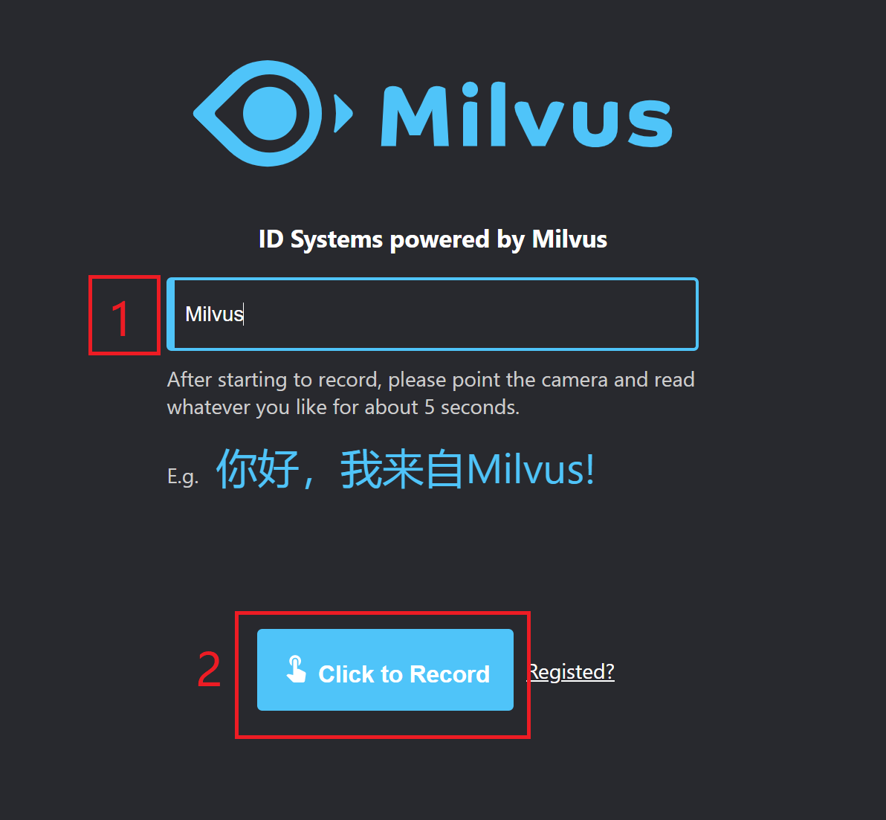

# Biological multi-factor authentication system

The biological multi-factor authentication system presented in this paper uses [InsightFace](https://github.com/deepinsight/insightface) to extract the voice features and then does hybrid authentication in [Milvus](https://milvus.io/).

## Preparation

- #### [Milvus 0.10.0](https://milvus.io/cn/docs/v0.10.0/install_milvus.md)

- #### postgres

## Build System

Before setting up a biological multi-factor authentication system, **start the Milvus service** and deploy the system and build an image using Docker as described below.

### Deploy with Docker

- #### Run MFA-demo

```bash
$ docker run -td -p 5003:5000 -e API_URL=https://192.168.1.85:5003 -e "MILVUS_HOST=192.168.1.85" -e "MILVUS_PORT=19530" -e "PG_HOST=192.168.1.85" -e "PG_PORT=5432" milvusbootcamp/mfa-demo:0.2.0
```

Description of parameters related to the above start command.

| Parameter                            | Description                                                  |
| ------------------------------------ | ------------------------------------------------------------ |
| -p 5003:5000                         | -p represents the port mapping between the host and the image |
| -e API_URL=https://192.168.1.85:5003 | -e represents the system parameter mapping between the host and the image <br />Change `192.168.1.85` to the IP address of the server where MFA-demo is currently started, and 5003 is the port mapped to the host. |
| -e "MILVUS_HOST=192.168.1.85"        | Please change `192.168.1.85` to the IP address of the server where Milvus docker starts. |
| -e "MILVUS_PORT=19530"               | Please change `19530` to the server port number to start Milvus docker. |
| -e "PG_HOST=192.168.1.85"            | Please change `192.168.1.85` to the IP address of the server where Postgres is started. |
| -e "PG_PORT=5432"                    | Please change `5432` to the server port for starting Postgres. |

### Build mirror deployments

```bash
# Pull mfa code 
$ git clone https://github.com/milvus-io/bootcamp.git
$ cd bootcamp/solutions/MFA/webserver
# Build mfa-demo image
$ docker build -t mfa-demo:0.2.0 .
# Run mfa-demo,for startup commands, see "Deploying with Docker".
$ docker run -td -p 5003:5000 -e API_URL=https://192.168.1.85:5003 -e "MILVUS_HOST=192.168.1.85" -e "MILVUS_PORT=19533" -e "PG_HOST=192.168.1.85" -e "PG_PORT=5432" mfa-demo:0.2.0
```

> Note：To build the image, you need to download the face_embedding model, download link: [https://pan.baidu.com/s/18EWcP5YJmeDrY1A8_k09pw](https://pan.baidu.com/s/18EWcP5YJmeDrY1A8_k09pw) , Extraction code: 82ht; to download the deep speaker model, download link: [https://pan. baidu.com/s/16_moPcoUGah1dqdDtEQreQ](https://pan. baidu.com/s/16_moPcoUGah1dqdDtEQreQ), Retrieval Code: 11vv.
>
> After Downloading, unzip mfa-models，and move the `models` folder to `bootcamp/solutions/MFA/webserver/face-embedding` ; move `ResCNN_triplet_training_checkpoint_265.h5` to `bootcamp/solutions/MFA/webserver/src/deep_speaker/checkpoints`.


## System Usage

Type `https://192.168.1.85:5003` (the API_URL specified by the launch MFA-demo) into your mobile or client browser (Google Chrome is recommended) to start the biological multi-factor authentication.

- #### New User Registration

  First, click `New User` to enter the information in the system.


​		Then fill in the box with your nickname, e.g. `Milvus`, and click on `Click to Record` to record the video, if the browser pops up and you need **access to the camera and microphone**, select Yes, then you will record about 5 seconds of video in the system.



​		The following GUI will appear after a successful system entry.


- #### System authentication

  Clicking `Click To Identify` will authenticate and also record the video in the system for about 5s.


​		Successful system authentication is shown below, with the image showing the verifier's face. The Milvus logo has been replaced here.


