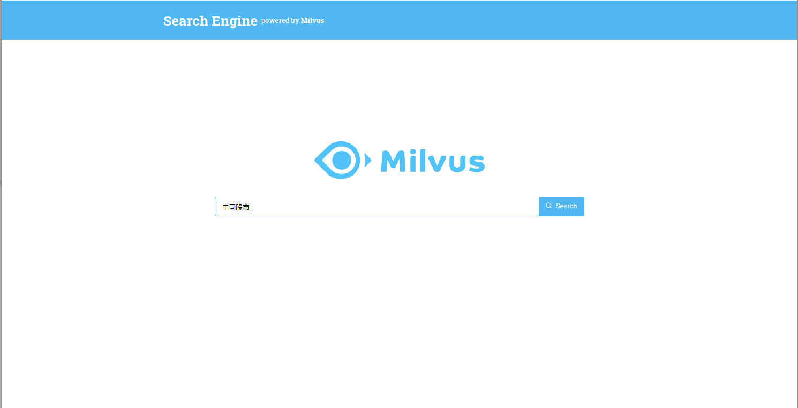
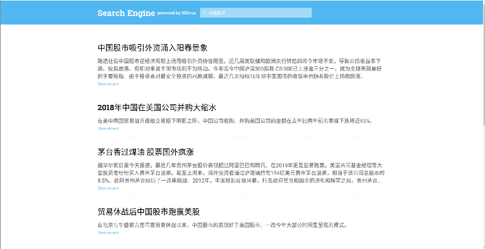

## README

This project uses Milvus and Bert to build a Text Search Engine. In this project, Bert is used to convert the text into a fixed-length vector and store it in Milvus, and then combine Milvus to search for similar text in the text entered by the user.

## Data description

 The data set is stored in the **Milvus-bert-server/data** directory

## Script description

**Milvus-bert-client**

This directory is the script of the front page

**Milvus-bert-server**

Under this directory is the script to start the back-end service

app.py: The script provides an interface for the front page

main.py: The script can perform operations such as data import and query

**Parameter description:**

| Parameter  | Description                                                  |
| ---------- | ------------------------------------------------------------ |
| --table    | This parameter specifies the table name when executing the script |
| --title    | This parameter specifies the path where the title data set is located when the script is executed |
| --version  | This parameter specifies the path where the version data set is located when the script is executed |
| --load     | This parameter performs data import operations               |
| --sentence | This parameter gives the question in the query               |
| --search   | This parameter performs a query operation                    |

config.py：The script is a configuration file and needs to be modified according to the specific environment

| Parameter     | Description              | Default setting |
| ------------- | ------------------------ | --------------- |
| MILVUS_HOST   | milvus service ip        | 127.0.0.1       |
| MILVUS_PORT   | milvus service port      | 19530           |
| PG_HOST       | postgresql service ip    | 127.0.0.1       |
| PG_PORT       | postgresql service port  | 5432            |
| PG_USER       | postgresql user name     | postgres        |
| PG_PASSWORD   | postgresql password      | postgres        |
| PG_DATABASE   | postgresql datebase name | testdb          |
| DEFAULT_TABLE | default  table name      | test11          |

## Steps to build a project

1、Install Milvus
-------------------

Milvus provides two release versions: CPU version and GPU version. In order to get better query performance, the GPU version reference link is used in the project:

https://www.milvus.io/cn/docs/v0.10.0/gpu_milvus_docker.md

2、Install PostgreSQL
-------------------------
PostgreSQL is a powerful, open source object-relational database system. PostgreSQL performs well in terms of reliability, stability, and data consistency. 
For specific installation methods, please refer to the PostgreSQL official website link:https://www.postgresql.org/

3、Install python package
-------------------------------------
    $ pip install --ignore-installed --upgrade tensorflow==1.10
    $ pip install -r requriment.txt

4、Start Bert service
---------------------

The way to install Bert-as-service is as follows. You can also refer to the official website link of the Github repository of Bert-as-service:

https://github.com/hanxiao/bert-as-service

    #Download model
    $ cd model
    $ wget https://storage.googleapis.com/bert_models/2018_11_03/english_L-12_H-768_A-12.zip
    #start service
    $ bert-serving-start -model_dir / tmp / english_L-12_H-768_A-12 / -num_worker = 4 

## 5、Import Data

In the main.py text data import script of the Milvus-bert-server file in the project, you only need to modify the path of the title set file and the path of the version set in the script to import text data

    $ cd Milvus-bert-server
    $ python main.py --collection test11 --title data/title.txt --version data/version.txt --load

> Note: **data/title.txt** is the path where the imported title set is located, **data/version.txt** is the path where the imported version set is located

6、Start query service
---------------------

    $ python app.py

7、Start the UI client
----------------------  
Install  [Node.js 12+](https://nodejs.org/en/download/) and [Yarn](https://classic.yarnpkg.com/en/docs/install/).

```
$ cd  Milvus-bert-client/client 
#Install dependencies
$ yarn install 
#start yarn 
$ yarn start   
open localhost:3001/search  
```

> Note: If you change the port of the server, please modify the parameters on line 17 **/src/shared/Constants.ts** for your own environment

## 8、Web Presentation

Enter 127.0.0.1:3001/search in the browser to open the search page and enter the search text.



Get the search results of the input text, as shown in the figure



