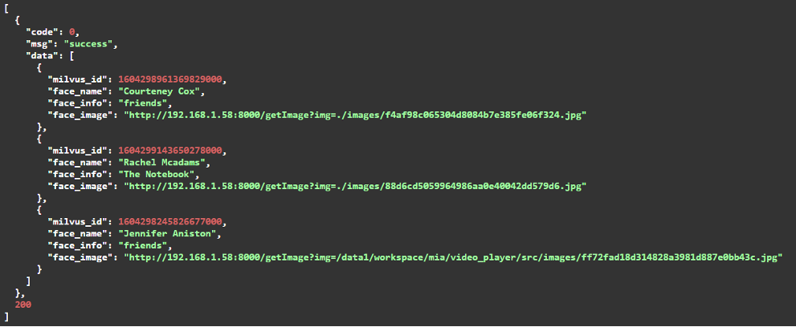

# Video analysis based on Milvus

Common video analytics systems can automatically identify and track the types of moving targets that appear in the video area, and can monitor multiple targets in the same scene simultaneously. The analyzed video can be used in a wide range of applications, such as advertising recommendations, security and entertainment industries. This project uses [YOLOv3](https://pjreddie.com/darknet/yolo/) and [insightface](https://github.com/deepinsight/insightface), combined with frame capturing technique of OpenCV, to recognize logos on objects that appear in the video and track and identify faces.

## Environmental preparation

- pymilvus 0.11.0
- pymilvus 0.3.0
- tensorflow==1.14.0
- opencv-python==4.2.0.34

## Parameter description

This project contains webservice and webclient. Webservice provides the code for the backend service. Webclient provides the scripts for the frontend interface.

The following describes the important parameters of webservice.

**common/config.py**

| Parameter        | Description               | Default      |
| ---------------- | ------------------------- | ------------ |
| MILVUS_HOST      | Milvus service IP         | 192.168.1.58 |
| MILVUS_PORT      | Milvus service port       | 19666        |
| LOGO_DIMENSION   | Dimension of logo         | 256          |
| FACE_DIMENSION   | Dimension of face         | 512          |
| MYSQL_USER       | MySql user name           | root         |
| MYSQL_PASSWORD   | MySql password            | 123456       |
| MYSQL_DB         | MySql database name       | mysql        |
| COCO_MODEL_PATH  | Path of YOLOv3 model      | None         |
| YOLO_CONFIG_PATH | Path of config file       | None         |
| FACE_MODEL_PATH  | Path of insightface model | None         |

## Steps

1. Install Milvus 0.11.0 as described in [installation overview](https://milvus.io/docs/install_milvus.md).

2. Install MySQL.

3. Pull the source code.

   ```bash
   $ git clone https://github.com/milvus-io/bootcamp.git
   $ cd bootcamp/solution/Video_analysis
   ```

4. Installation dependencies.

   ```bash
   $ pip install -r requirements.txt
   ```

5. Download YOLOv3 model.

   ```bash
   $ cd webservice/yolov3_detector/data
   $ ./prepare_model.sh
   ```

6. Start service.

   ```bash
   $ cd ../..
   $ python main.py
   # You are expected to see the following outputs.
   ...
   INFO:     Started server process [71037]
   INFO:     Waiting for application startup.
   INFO:     Application startup complete.
   INFO:     Uvicorn running on http://127.0.0.1:8000 (Press CTRL+C to quit)
   ...
   ```

   > Now, get the API by visiting http://127.0.0.1.58:8000/docs in your browser.

## Results display

Logo recognition


Who is he/she?



Only him/her


