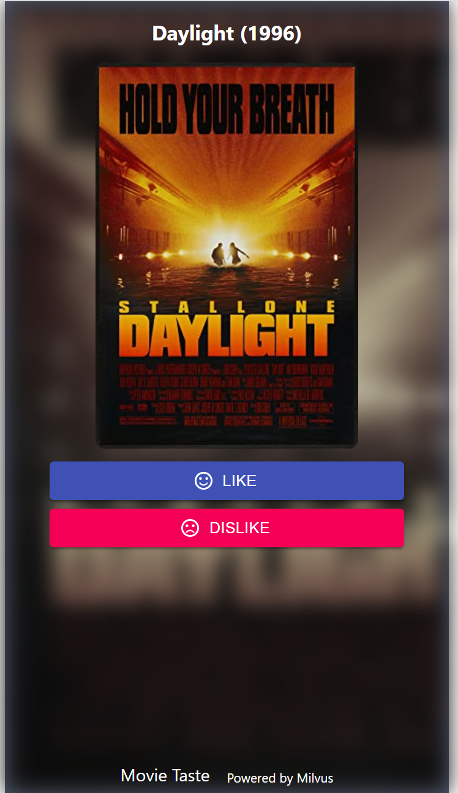

# Graph-based Recommendation System with Milvus

This project uses graph convolutional neural networks to generate embeddings, and then uses Milvus retrieval to implement a recommendation system. It provides flask services and a front-end interface.

## Prerequisite

- **[Milvus 0.10.2](https://milvus.io/docs/v0.10.2/milvus_docker-cpu.md)**
- **[DGL](https://github.com/dmlc/dgl)**
- **MySQL**


## Data preparation

The data source is [MovieLens million-scale dataset (ml-1m)](http://files.grouplens.org/datasets/movielens/ml-1m.zip), created by GroupLens Research. Refer to [ml-1m-README](http://files.grouplens.org/datasets/movielens/ml-1m-README.txt) for more information.

1. Clone the code.

   ```bash
   $ git clone https://github.com/milvus-io/bootcamp.git
   ```
   
2. Downland and extract the MovieLens-1M dataset.

   ```bash
   # Make sure you are in the pinsage folder
   $ cd bootcamp/solutions/graph_based_recommend/webserver/src/pinsage
   $ wget http://files.grouplens.org/datasets/movielens/ml-1m.zip
   $ unzip ml-1m.zip
   ```

3. Processing data as a pickle file.

   ```bash
   # Install the requirements
   $ pip install -r ../../requirements.txt
   $ mkdir output
   $ python process_movielens1m.py ./ml-1m ./output
   ```

   You can see that two files in the **output** directory: **data.pkl** and **mov_id.csv**.


## Run model with DGL

This model returns items embedding that are K nearest neighbors of the latest item the user has interacted. The distance between two items are measured by inner product distance of item embeddings, which are learned as outputs of [PinSAGE](https://arxiv.org/pdf/1806.01973.pdf).

```bash
$ python model.py output --num-epochs 100 --num-workers 2 --hidden-dims 256
```

It will generate the **h_item.npy** file in the **output** directory.

 

## Load data

Before running the script, please modify the parameters in **webserver/src/common/config.py**:

| Parameter    | Description               | Default setting  |
| ------------ | ------------------------- | ---------------- |
| MILVUS_HOST  | milvus service ip address | 127.0.0.1        |
| MILVUS_PORT  | milvus service port       | 19530            |
| MYSQL_HOST   | postgresql service ip     | 127.0.0.1        |
| MYSQL_PORT   | postgresql service port   | 3306             |
| MYSQL_USER   | postgresql user name      | root             |
| MYSQL_PWD    | postgresql password       | 123456           |
| MYSQL_DB     | postgresql datebase name  | mysql            |
| MILVUS_TABLE | default table name        | milvus_recommend |

Please modify the parameters of Milvus and MySQL based on your environment.

```bash
# Make sure you are in the src folder
$ cd ..
$ python insert_milvus.py ./pinsage/output
```


## Run webserver

1. Download and extract  the movies_poster file.

   ```bash
   # Make sure you are in the src folder
   $ wget https://github.com/shiyu22/user_base_recommend/raw/master/webserver/src/movies_poster.zip
   $ unzip movies_poster.zip
   ```

2. Start recommend service.

    ```bash
    $ python main.py
    # You are expected to see the following output.
    Using backend: pytorch
    INFO:     Started server process [2415]
    INFO:     Waiting for application startup.
    INFO:     Application startup complete.
    INFO:     Uvicorn running on http://127.0.0.1:8000 (Press CTRL+C to quit)
    ```
    
    > You can get the API by typing http://127.0.0.1:8000/docs into your browser.


## Run webclient

```bash
$ docker run -d -p 8001:80 -e API_URL=http://127.0.0.1:8000 tumao/movie-taste-demo
```

> Note: The API_URL parameter is the webserver address.


## System Usage

Type `http://127.0.0.1:8001` into your mobile or client browser to get started with the movie recommendation system.

- Mark movies

  Mark your favorite or disliked movies from 16 random movies.

  

- Movie recommendations

  Recommend movies based on your marked favorites.

  

- Movie info

  Get more information with movie.

  