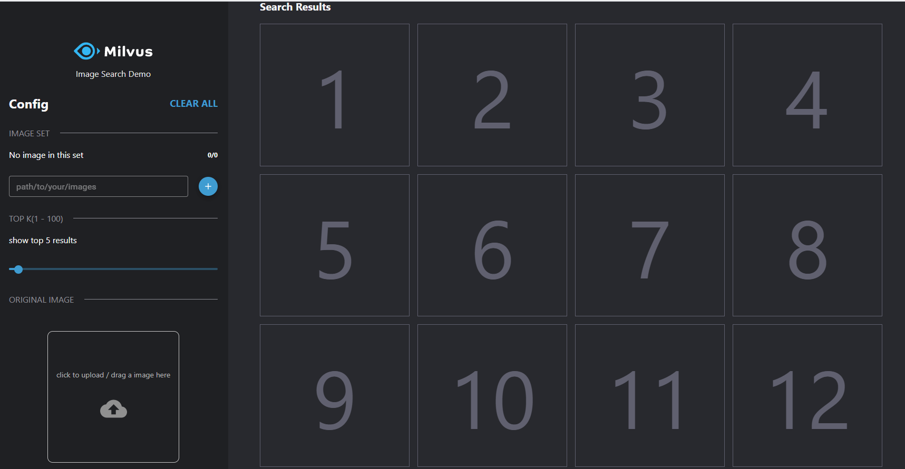

# Reverse Image Search Based on Milvus （v2.0）

This demo is an updated from the one about reverse image search based on Milvus and VGG. We replace the original image feature extraction model, VGG, with ResNet-50 to perform target detection for images and build a reverse image search system based on Milvus.

Below is the system architecture.


### Environment requirements

The following tables show recommended configurations for reverse image search. These configurations haven been tested.


| Component     | Recommended Configuration                                                    |
| -------- | ------------------------------------------------------------ |
| CPU      | Intel(R) Core(TM) i7-7700K CPU @ 4.20GHz                     |
| Memory   | 32GB                                                         |
| OS       | Ubuntu 18.04                                                 |
| Software | Milvus 1.0<br />pic_search_webclient  0.2.0            |

### Data source

This demo uses PASCAL VOC image set, which contains 17125 images that can be divided into 20 categories: human, animals (birds, cats, cows, dogs, horses, sheep, and more), means of transport (planes, bikes, boats, buses, cars, motorcycles, trains, and more), furniture and household appliances (bottles, chairs, tables, potted plants, sofas, TVs, and more)

Dataset size: ~ 2 GB.

Url for download: https://pan.baidu.com/s/1MjACqsGiLo3oiTMcxodtdA extraction code: v78m

> Note: You can also use other images for testing. This system supports images in formats of .jpg and .png.

### How to deploy the system

### GPU method

#### 1. Run Milvus Docker

This demo uses Milvus 1.0. Refer to the [Install Milvus](https://milvus.io/cn/docs/v1.0.0/milvus_docker-gpu.md) for how to run Milvus docker.

#### **2.Install the Python packages you need**

```
cd /image_search/webserver
pip install -r requirements.txt

```
#### 3.Modify configuration file

```
vim  /image_search_v2/webserver/src/common/config.py

```
Need to modify the **milvus port** or **milvus ip** parameters corresponding to the Milvus installation
| Parameter        | Description                             | Default setting                               |
| ---------------- | --------------------------------------- | --------------------------------------------- |
| MILVUS_HOST      | milvus service ip                       | 127.0.0.1                                     |
| MILVUS_PORT      | milvus service port                     | 19512                                         |
| VECTOR_DIMENSION | Dimensionality of the vectors           | 2048                                          |
| DATA_PATH        | Path to save images                     | /data/jpegimages                              |
| DEFAULT_TABLE    | The milvus default collection           | milvus_183                                    |
| UPLOAD_PATH      | Storage path for uploaded images        | /tmp/search-images                            |
| COCO_MODEL_PATH  | Path of the target detection model      | /yolov3_detector/data/yolov3_darknet          |
| YOLO_CONFIG_PATH | Profile path for target detection model | /yolov3_detector/data/yolov3_darknet/yolo.yml |

#### 4.Start query service

```
cd  /image_search/webserver/src
python app.py
```
If your yolo model is not downloaded automatically, you need to go to the **image_search_v2/webserver/src/yolov3_detector/data/** path and run the **paprepare_model.sh** script

#### 5. Run pic-search-webclient docker

```bash
$ docker run --name zilliz_search_images_demo_web -d --rm -p 8001:80 \
-e API_URL=http://${WEBSERVER_IP}:5000 \
milvusbootcamp/pic-search-webclient:0.2.0
```

In the previous command line, WEBSERVER_IP specifies the server IP address that runs pic-search-webserver docker.

### How to perform reverse image search

After deployment, enter ` ${WEBCLIENT_IP}:8001` in the browser to open the interface for reverse image search. 



Enter the path to the images folder, e.g. /data/images. Click Load to load the images. The following screenshot shows the loading process.


> Note: After clicking the Load button, you need to wait for a while for the system to respond. Please do not make mulitple clicks.

It may take several minutes to load the images. The following screenshot shows the interface when image loading is successful.


Select the image you want to search for.


To load images from other directories, specify the path in the text box.

