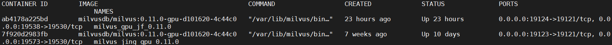

# Using Nginx to load balance Milvus

This example shows how to implement load balancing for Milvus using Nginx. The most common function of Nginx is server load balancing configuration, which is achieved by distributing requests to multiple Milvus using Nginx to distribute different requests.

## Preparation

1、Nginx 1.18.0

2、More than two Milvus

## Implementation

### 一、Nginx Install

1.First, download the software package from the [Nginx website](http://nginx.org/en/download.html) and decompress it.

```
wget http://nginx.org/download/nginx-1.18.0.tar.gz
tar -zxvf nginx-1.18.0.tar.gz
cd nginx-1.18.0
```

2.After entering the unpacked software directory, you need to install the dependent libraries

```
#Update source
sudo apt-get update

#Install C++ dependency libraries
sudo apt-get install build-essential
sudo apt-get install libtool

#Install openssl dependencies
sudo apt-get install openssl

#Install pcre dependency library
sudo apt-get install libpcre3 libpcre3-dev

#Installing zlib dependencies
sudo apt-get install zlib1g-dev 
```

3、Before compiling, you need to configure and install nginx to the **/usr/local/ngnix** directory

```
./configure --prefix=/usr/local/nginx
```

 *Note: --prefix: Configure the installation directory*

4、Compile and install, and switch to Root if you don't have permission

```
su root
make  #Compile
make install #Install
```

5、Start nginx with the following command, and then test if ngnix is installed successfully

```
/usr/local/nginx/sbin/nginx 
```

Check if there is nginx process started, if there is process started, it means the installation is successful

```
ps -ef | grep nginx
```

You can also input *<localhost(local IP address):port(default port is 80)>* in your browser, and you will see welcome to nginx as a successful installation.


## 二、Nginx Configuration

1.This example installs two Milvus, the two Milvus versions are required to be the same, this example installs two 0.11 version Milvus, refer to the [Milvus official website](https://www.milvus.io/cn/docs/v0.11.0/milvus_docker-gpu.md) for installation, this example The example has been successfully installed Milvus by default, as shown below, one of the Milvus 1 ip 192.168.1.85:19573, the other Milvus 2 ip 192.168.1.85:19538



2、Then modify the Nginx configuration file at **/usr/local/nginx/conf/nginx.conf** and add the following code at the end of the configuration file, the load balancing policy used in this example is polling

```
stream {
    log_format proxy '$remote_addr [$time_local] '
                 '$protocol $status $bytes_sent $bytes_received '
                 '$session_time "$upstream_addr" '
                 '"$upstream_bytes_sent" "$upstream_bytes_received" "$upstream_connect_time"';
    #Log format configuration
    access_log /var/log/nginx/access.log proxy ;
    open_log_file_cache off; #Log cache settings, set to disabled here
    
    server {
       listen 19585;   #The port number to listen on cannot conflict with Milvus' port number
       proxy_pass milvus;

    }
    upstream milvus {
       server 192.168.1.85:19573; #IP address for Milvus1
       server 192.168.1.85:19538; #IP address for Milvus2
    }

}

```

*Note: The code cannot be written inside **http{}***

3、After modifying the Nginx configuration file, test whether the configuration file is correct by first stopping the Nginx service and then restarting it

```
/usr/local/nginx/sbin/nginx -t          #Test if the configuration file is correct
/usr/local/nginx/sbin/nginx  -s stop    #Stop the Nginx service
/usr/local/nginx/sbin/nginx             #Start the Nginx service
```

4、Create a virtual environment, install Milvus corresponding version of pymilvus, run the **python3 test.py** script for testing, and then use the following command to view the nginx log file

```
tail /var/log/nginx/access.log
```

The Ip address and port of Milvus in the test.py script needs to be changed to the IP address and port configured by nginx

```
client = Milvus(host='localhost', port='19585')
```

Finally, the result of the ngnix log query is shown in the figure below, where you can see that nginx distributes the requests to different Milvus


