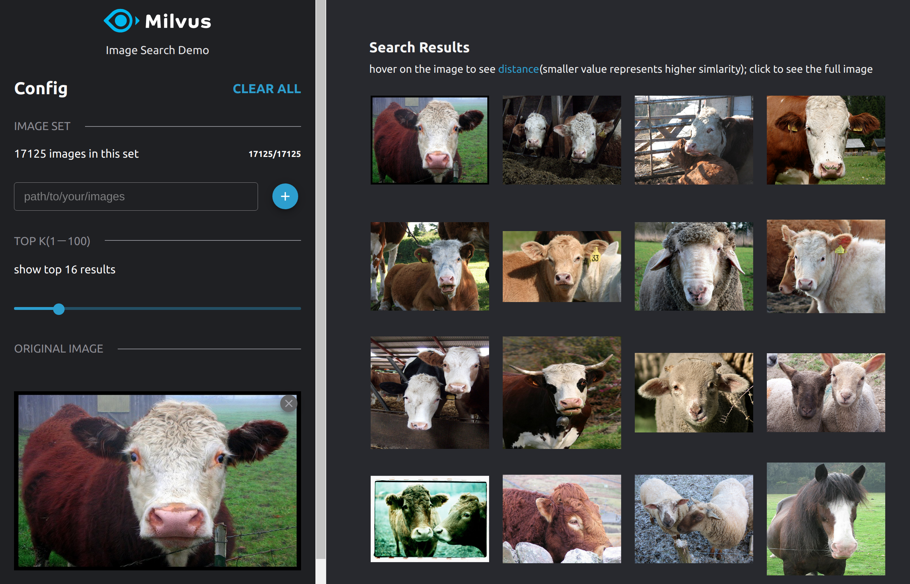

# Reverse Image Search Based on Milvus and VGG

This demo uses VGG, an image feature extraction model, and Milvus to build a system that can perform reverse image search.

The system architecture is displayed as follows:


This demo introduces two methods: GPU and CPU. The performance of the GPU method is better than that of the CPU method.

### Environment requirements

The following tables show recommended configurations for reverse image search. These configurations haven been tested.

#### GPU method

| Component     | Recommended Configuration                                                     |
| -------- | ------------------------------------------------------------ |
| CPU      | Intel(R) Core(TM) i7-7700K CPU @ 4.20GHz                     |
| GPU      | GeForce GTX 1050 Ti 4GB                                      |
| Memory   | 32GB                                                         |
| OS       | Ubuntu 18.04                                                 |
| Software | Milvus 0.6.0 (GPU-supported) <br />pic_search_demo 0.5.0<br />pic_search_demo_web 0.2.0 |

#### CPU method

| Component     | Recommended Configuration                                                    |
| -------- | ------------------------------------------------------------ |
| CPU      | Intel(R) Core(TM) i7-7700K CPU @ 4.20GHz                     |
| Memory   | 32GB                                                         |
| OS       | Ubuntu 18.04                                                 |
| Software | Milvus 0.6.0 (CPU-only）<br />pic_search_demo 0.5.1<br />pic_search_demo_web 0.2.0 |

### Data source

This demo uses the PASCAL VOC image set, which contains 17125 images with 20 categories: human; animals (birds, cats, cows, dogs, horses, sheep); transportation (planes, bikes,boats, buses, cars, motorcycles, trains); household (bottles, chairs, tables, pot plants, sofas, TVs)

Dataset size: ~ 2 GB.

Download location: http://host.robots.ox.ac.uk/pascal/VOC/voc2012/VOCtrainval_11-May-2012.tar

> Note: You can also use other images for testing. This system supports the following formats: .jpg and .png.

### How to deploy the system

#### GPU method

##### 1. Run Milvus Docker

This demo uses GPU-supported Milvus 0.6.0. Refer to the [Install Milvus](https://github.com/milvus-io/docs/blob/0.6.0/userguide/install_milvus.md) for how to run Milvus docker.

##### 2. Run pic_search_demo docker

```bash
$ docker run -d --name zilliz_search_images_demo \
-v IMAGE_PATH1:/tmp/pic1 \
-v IMAGE_PATH2:/tmp/pic2 \
-p 35000:5000 \
-e "DATA_PATH=/tmp/images-data" \
-e "MILVUS_HOST=192.168.1.123" \
chenglong555/pic_search_demo:0.5.0
```

In the previous command, `IMAGE_PATH1` and `IMAGE_PATH2` specify the path where images are located. These locations are mapped to the docker container. After deployment, you can use `/tmp/pic1` and `/tmp/pic2` to load images. `MILVUS_HOST` specifies the IP address of the Milvus Docker host. Do not use backloop address "127.0.0.1". You do not have to modify other parts of the command.

##### 3. Run pic_search_demo_web docker

```bash
$ docker run --name zilliz_search_images_demo_web -d --rm -p 8001:80 \
-e API_URL=http://192.168.1.123:35000 \
chenglong555/pic_search_demo_web:0.2.0
```

In the previous command, `192.168.1.123` specifies the server IP address that runs the Milvus docker.

#### CPU method

##### 1. Run Milvus Docker

This demo uses CPU-only Milvus 0.6.0. Refer to the [Install Milvus](https://github.com/milvus-io/docs/blob/0.6.0/userguide/install_milvus.md) for how to run Milvus docker.

##### 2. Run pic_search_demo docker

```bash
$ docker run -d --name zilliz_search_images_demo \
-v IMAGE_PATH1:/tmp/pic1 \
-v IMAGE_PATH2:/tmp/pic2 \
-p 35000:5000 \
-e "DATA_PATH=/tmp/images-data" \
-e "MILVUS_HOST=192.168.1.123" \
chenglong555/pic_search_demo:0.5.1
```

In the previous command, `IMAGE_PATH1` and `IMAGE_PATH2` specify the path of the images. These locations are mapped to the docker container. After deployment, you can use `/tmp/pic1` and `/tmp/pic2` to load images. `MILVUS_HOST` specifies the IP address of the Milvus Docker host. Do not use backloop address "127.0.0.1". You do not have to modify other parts of the command.

##### 3. Run pic_search_demo_web docker

```bash
$ docker run --name zilliz_search_images_demo_web -d --rm -p 8001:80 \
-e API_URL=http://192.168.1.123:35000 \
chenglong555/pic_search_demo_web:0.2.0
```

In the previous command, `192.168.1.123` specifies the server IP address that runs the Milvus docker.


### How to perform reverse image search

After deployment, enter `localhost:8001` in the browser to open the interface for reverse image search.


Enter the path of an image folder in the pic_search_demo docker container, such as /tmp/pic1. Click Load to load the pictures. The following screenshot shows the loading process:


> Note: After clicking the Load button, it will take 1 to 2 seconds for the system to response. Please do not click again.

The loading process may take several minutes. The following screenshot shows the interface with images loaded.


Select an image to search.



It has been tested tha the system can complete reverse image search within 1 second using the recommended configuration. To load images in other directories of the pic_search_demo docker, specify the path in the textbox.
