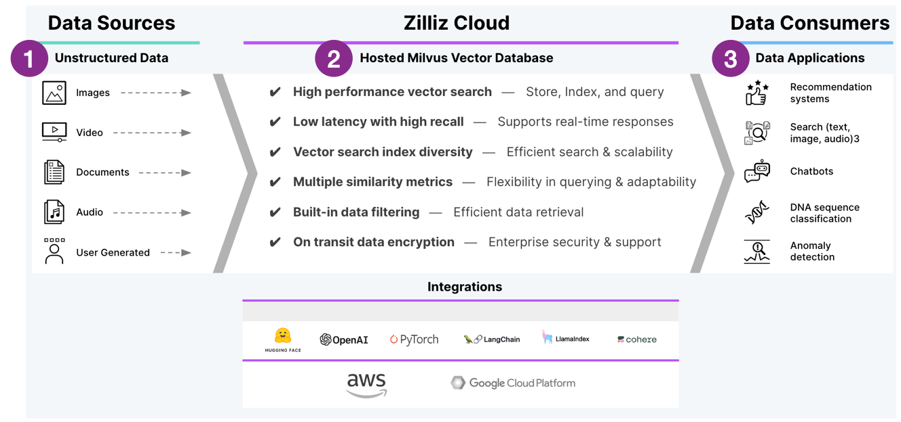
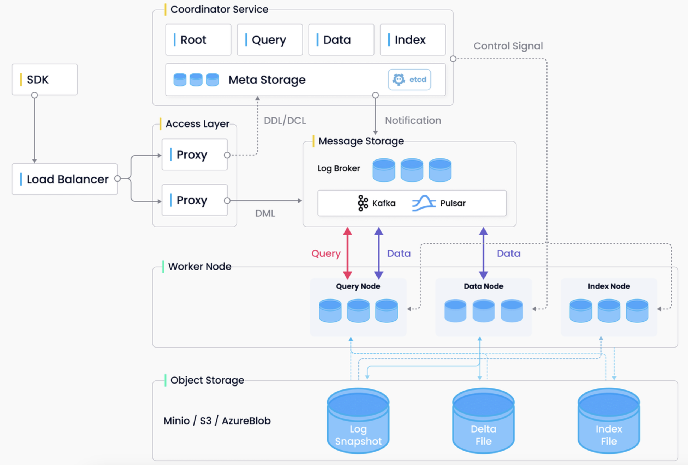

# Milvus Introduction, Best Practices, and Cheat Sheet Tutorial

- Table of Contents
  - [Milvus Introduction](#milvus-introduction)
    - [Quick Start](#quick-start)
    - [Architecture](#architecture)
    - [Documentation & Releases](#documentation--releases)
  - [Getting Started with Milvus Tutorial](#getting-started-with-milvus-tutorial)
    - [Connecting to Milvus](#start-up-milvus-server)
    - [Chunking & Embedding](#chunking--embedding)
    - [Collections, Schema, & Partitions](#collections-schema--partitions)
    - [Build an Index](#index)
    - [Distance Metric](#metric)
    - [Consistency](#consistency)
    - [Insert Data](#insert-data)
    - [Search](#search)
    - [Upsert](#upsert)
    - [Query](#query)
  - [Example Notebooks](#example-notebooks)
  - [Learning Resources](#learning-resources)
  - [Community & Help](#community--help)

<div>

</div>

## Milvus Introduction

🐦 [Milvus](https://zilliz.com/what-is-milvus) is an open-source (Apache License 2.0) vector database. It's a powerful tool to store, index, and manage [unstructured data](https://zilliz.com/learn/introduction-to-unstructured-data) as embedding vectors generated by deep neural networks and other machine learning (ML) models. Unstructured data includes webpages, text files, pdfs, videos, images, or audio files.

✴ [Zilliz Cloud](https://zilliz.com/) is a proprietary, managed service for Milvus.

1. **Successful AI applications requires good utilization of data.**  Embedding model is the state-of-the-art tool for understanding and retrieving unstructured data.  

2. **Unstructured data is embedded into vectors, Milvus is purposed built database for vector data.**  🤖  The AI jargon term for this is [*vector database*](https://www.infoworld.com/article/3711281/how-to-evaluate-a-vector-database.html). 

3. **Vector retrieval is at the heart of many AI applications such as Retrieval Augmented Generation.**

**Integrations** for Zilliz include AWS, GCP, and Azure clouds.  [Milvus](https://github.com/milvus-io/milvus) philosophy is to be a low-level "shovel" in the AI stack.  🦙✨𑗗🤗 You should be able to choose independently for yourself which embedding, fusion, LLM, or generation models you want.  🦜⛓️ Milvus is also agnostic to the choice of RAG framework, such as LlamaIndex or LangChain.  

> Models and tools in the AI space are changing rapidly! ⬱ As a vector database company, we will have our opinions, but you should be free to choose the latest, best AI tools for your use case. 

### Quick Start
💡[Zilliz Pipelines](https://github.com/milvus-io/bootcamp/blob/master/bootcamp/RAG/zilliz_pipeline_rag.ipynb) is a quick way to try out Milvus. It's also integrated into [LlamaIndex](https://docs.llamaindex.ai/en/latest/examples/managed/zcpDemo.html). It has built-in:
- Open-source embedding model *[bge-large-en-v1.5](https://huggingface.co/BAAI/bge-large-en-v1.5)* and *[bge-large-zh-v1.5](https://huggingface.co/BAAI/bge-large-zh-v1.5)*
- Good out-of-box retrieval quality backed by our research on doc parsing and chunking strategy
- [AUTOINDEX](https://docs.zilliz.com/docs/autoindex-explained), Zilliz proprietary
- Metadata filtering capability


### Architecture   

Milvus uses a shared-storage [architecture](https://milvus.io/docs/architecture_overview.md) with 4  layers which are mutually independent for scaling or disaster recovery: 1)access layer, 2)coordinator service, 3)worker nodes, and 4)storage. Milvus also includes data sharding, logs-as-data persistence, and streaming data ingestion.  

<div>

</div>

### Documentation & Releases
- Open-source [Milvus documentation](https://milvus.io/docs)
- Open-source [Milvus Client documentation](https://pymilvus.readthedocs.io/en/latest/_modules/milvus/client/stub.html) (no-schema wrapper around Milvus collection)
- Commercial-source [Zilliz documentation](https://docs.zilliz.com/docs/quick-start)
- [Zilliz release notes](https://docs.zilliz.com/docs/release-notes-230)
- [Zilliz serverless free tier](https://zilliz.com/zilliz-cloud-free-tier)
  - Max 1 cluster
  - Max 2 collections per cluster
  - Max 1 million vectors per collection
  - To upgrade to beta, you can contact Zilliz support for help, they will need your cluster's id
- [Zilliz enterprise tier](https://zilliz.com/pricing) for production use cases:
  - 99.9% uptime availability
  - Multiple availability zones
  - Enterprise-grade encryption in transit and at rest
  - [SOC 2 Type 2 compliant](https://zilliz.com/security)
  - RBAC (Role-Based Access Control) at org and project levels
  - Resource monitors and alert notifications
  - Self-upgrade to beta, click the "try beta" button to upgrade a cluster
  - 24/7/365 Email and Discord support with response time SLAs (Urgent: 1 hour; High: 4 hours; Normal: 1 business day)
  - Zilliz bring-your-own-cloud is planned Q2 2024

<br>

## Getting Started with Milvus Tutorial

Following are Best Practices for getting your data into Milvus so you can start developing AI applications.

1. **Start up Milvus server and [connect](https://milvus.io/docs/manage_connection.md).** <a class="anchor" id="start-up-milvus-server"></a>
   
- 💡👉🏼The easiest way is to use [Zilliz serverless free tier](https://zilliz.com/zilliz-cloud-free-tier).  No need to worry abut sufficient *.wait()* to connect, it's always there! 
   
- Milvus can run locally.  Milvus flavors include lite, docker, or k8s.
  
- Zilliz run Milvus in the cloud.  Zilliz flavors include free tier (serverless) or paid (managed aws, google, azure).	

- See [Example connection notebook](#example-notebooks) at the bottom of this page. <br><br>

<a class="anchor" id="chunking--embedding"></a>
2. **Choose your chunking strategy based on the type of data.**  Unstructured data needs to be chunked, embedded (converted into vectors), and the vectors stored as tensors, which are vectors tied to specific compute hardware (CPU, GPU, TPU, etc).  Tensors are the lingua franca of AI.  

- Good [backgrounder on chunking strategies](https://learn.deeplearning.ai/building-evaluating-advanced-rag).  <br>
   
- Most, general NLP tasks work best with chunk size 512 and 10-15% overlap.
  
- **Web page data** performs best with chunking strategy that adds headers to chunks.  Since headers are short, the added context per chunk is usually worth it.  
  - In LangChain, see [ParentDocumentRetriever](https://python.langchain.com/docs/modules/data_connection/retrievers/parent_document_retriever) and HTMLHeaderTextSplitter.  
  - In LlamaIndex, see [AutoMergingRetriever](https://docs.llamaindex.ai/en/latest/examples/retrievers/auto_merging_retriever.html) and HierarchicalNodeParser.<br><br>

3. **Use 1 embedding model per collection.** The collection's vector space often comes from the next-to-last hidden layer of a deep neural network model.  The weights (numbers) from this layer are used as a transformation function to map your input unstructured data to a vector of numbers (often 1024 dimensions).  In order for vector similarity to work, all the data, including the questions need to be tokenized (mapped inputs to outputs) into the same vector space.  That way concepts in that space can be searched.  For this reason, it is best practice to use just 1 embedding model per collection.

- 💡👉🏼**Open source embedding models perform on par with commercial embedding models.** OSS models have the benefits of high recall and free access to your own data.  For example, to use the [MTEB leaderboard](https://huggingface.co/spaces/mteb/leaderboard) > sort descending by column "Retrieval Average". Notice *[UAE-Large-V1](https://huggingface.co/WhereIsAI/UAE-Large-V1)* is ranked 4th best and takes only 1.34 MB memory.  Compare this to OpenAI's *ada-002* which is ranked 25th.  (website accessed on Dec 30, 2023.)
  
- Fine-tune your embedding model using your data and your task for potentially 10-15% improved retrieval.  Only OSS embedding models can be tuned.<br><br>

<a class="anchor" id="collections-schema--partitions"></a>
4. **[Create](https://milvus.io/docs/create_collection.md) a collection.** A collection is like a database table. Each collection has a name, index, schema, and consistency-level.
   
- 💡👉🏼The easiest approach is to use [Milvus Client no-schema](https://milvus.io/docs/using_milvusclient.md). Milvus Client is a wrapper around the Milvus collection object which uses flexible json *key:value* format to allow collection creation without needing a schema up front.  This is the least error-prone approach for getting started.  See [Example search notebook](#example-notebooks) at the bottom of this page.

<div font size="1">

```python
from pymilvus import MilvusClient

COLLECTION_NAME = "MilvusDocs"
EMBEDDING_LENGTH = 1024

INDEX_PARAMS = dict({
    'M': 16,               
    "efConstruction": M * 2 })
index_params = {
    "index_type": "HNSW", 
    "metric_type": "COSINE", 
    "params": INDEX_PARAMS
    }

# Use no-schema Milvus client uses flexible json key:value format.
mc = MilvusClient(
    uri=CLUSTER_ENDPOINT,
    # API key or a colon-separated cluster username and password
    token=TOKEN)

# Check if collection already exists, if so drop it.
has = utility.has_collection(COLLECTION_NAME)
if has:
    drop_result = utility.drop_collection(COLLECTION_NAME)

# Create the collection.
mc.create_collection(COLLECTION_NAME, 
                     EMBEDDING_LENGTH,
                     consistency_level="Eventually", 
                     auto_id=True,  
                     overwrite=True,
                     # skip setting params below, if using AUTOINDEX
                     params=index_params
                    )
print(mc.describe_collection(COLLECTION_NAME))
```
</div>

- Metadata limit:  64 fields per row.  These are the extra fields besides "pk" and "vector".

- If you define your schema up front, check docs for [schema types](https://milvus.io/docs/schema.md).
    - primary key (usually called "pk"), default type INT64 (Note: LangChain expects "pk" to be type string.)
    - embeddings *usually called "vector"), type list of `numpy.ndarray` of `numpy.float32` numbers
    - Strings, type VARCHAR, Max Length 65535 characters.  Best practice: Use max length in schema.  Actual data won't use that much space.
```python
EMBEDDING_LENGTH = 1024
MAX_LENGTH = 65535
fields = [
  FieldSchema("pk", DataType.INT64, is_primary=True, auto_id=True), 
  FieldSchema("vector", DataType.FLOAT_VECTOR, dim=EMBEDDING_LENGTH),
  FieldSchema(name='url', dtype=DataType.VARCHAR, max_length=MAX_LENGTH),
]
```

- **Partitions** are meant to isolate entities in different physical paths to restrict search scope.

- **Milvus supports 2 types of partitions. Both types are equally as fast! So the choice is up to you!** <br><br>a) MANUAL - only use this if you can ensure approximately equal 20-100K rows per partition. Users specify which entity belongs to which partition.  Partitions can be added or deleted at any time. Partition name needs to be included as a search parameter.<br><br>b) AUTOMATIC - Milvus automatically distributes entities into different partitions. No need to specify partition name when searching, milvus will automatically translate your metadata filter expression to find data from paritions.

- Partitioning Tips:
  - 💡👉🏼 Best practice is leave it to Milvus to automatically partition data and translate metadata filters into search mappings.
  - For now, RBAC is only at the collection or project level, so it is not possible to control visibility of partitions to different users.
  - For manual partitions, 20-100K rows per partition is recommended, otherwise search speed will be slower than with automatic partitions.
  - The max number of partitions in a collection is 4096.<br><br>

<a class="anchor" id="index"></a>
5. **[Build an index](https://milvus.io/docs/build_index.md) (i.e. search algorithm used to find nearest-neighbors across tensors).**  Data is saved in data structures according to the particular [search algorithm index](https://milvus.io/docs/index.md) - hashes, trees, or graphs.<br>

- [Blog: Choosing the right index](https://zilliz.com/learn/choosing-right-vector-index-for-your-project) for your project.

- 💡👉🏼**With Milvus Client, you will need to define your own [HNSW index](https://github.com/milvus-io/knowhere/blob/main/src/index/hnsw/hnsw.cc).**  Otherwise search might be slow (Milvus Client uses [IVF_Flat](https://milvus.io/docs/index.md) index by default). 
  
- [HNSW best practice params](https://github.com/nmslib/hnswlib/blob/master/ALGO_PARAMS.md).  Start with M: 4~64, larger M for larger data and larger embedding lengths.  Then ef = efConstruction = M * 2.
 
- **Pro tip: Use [AUTOINDEX](https://docs.zilliz.com/docs/autoindex-explained), except if you are using Milvus Client.**  AUTOINDEX defaults to HNSW in Milvus.  In Zilliz, AUTOINDEX will choose the best index automatically based on your data and type of compute running on the cluster.<br><br>

<a class="anchor" id="metric"></a>
6. **Choose the [distance metric](https://milvus.io/docs/metric.md).**

- 💡👉🏼"COSINE" works best for most use cases.

- Most search algorithms work best with normalized embeddings data.  This means L2 metric is useless (since all vectors have same length). **"IP" (inner product) and "COSINE" are equivalent when the vectors are normalized.**

- Only choose metric="L2" if you plan to keep your embeddings unnormalized.
  
- For more speed, fine tune your search index parameters.
  
- For more speed with big data, choose an index with vector compression, search 'Quantization-based index' on the [index doc page](https://milvus.io/docs/index.md).<br><br>

<a class="anchor" id="consistency"></a>
7. **Choose the [consistency level](https://milvus.io/docs/consistency.md).**  
   
- 💡👉🏼**For typical useage (e.g. tables updated every 30 minutes or longer), use "Eventually" for fastest performance.**
  
- The 4 available levels of consistency:
  - Strong - Real-time everyone sees the same thing.
  - Eventually - Soon everyone sees the same thing.
  - Session - Per session, data is up to date with all writes within session.
  - Bounded - Within a shorter amount of time than eventually, everyone sees the same thing.

- You specify consistency in 2 places:
  - In collection.create_collection() - Set the default value.
  - In collection.search() - Possible to override the default value.<br><br>

<a class="anchor" id="insert-data"></a>
8. **[Insert data](https://milvus.io/docs/insert_data.md) into the collection.** 

- Milvus supports loading data from:
  - pandas dataframes, or 
  - list of dictionaries

- 💡👉🏼Milvus Client wrapper can only handle loading data from a list of dictionaries.

<div font size="1">

```python
# Convert DataFrame to a list of dictionaries.
dict_list = []
for _, row in batch.iterrows():
    dictionary = row.to_dict()
    dict_list.append(dictionary)

print("Start inserting entities")
start_time = time.time()
insert_result = mc.insert(
    COLLECTION_NAME,
    data=dict_list,
    progress_bar=True)
end_time = time.time()
print(f"Milvus insert time for {batch.shape[0]} vectors: {end_time - start_time} seconds")
# After final entity is inserted, call flush to stop growing segments left in memory.
mc.flush(COLLECTION_NAME)
```
</div>
<br>

<a class="anchor" id="search"></a>
9. **[Search](https://milvus.io/docs/search.md) across all your data**.  Milvus search default is semantic search across tensors using approximate nearest neighbor distances in vector space.  Or stochastic fuzzy search.  The search algorithm used is based on the index you chose when you set up your collection. 

- Link to [Milvus search API](https://milvus.io/api-reference/pymilvus/v2.3.x/Collection/search().md) docs.
- Link to [Milvus Client search API](https://pymilvus.readthedocs.io/en/latest/_modules/milvus/client/stub.html).  API and search result objects are slightly different.

<div font size="1">

```python
# Embed the question using the same encoder.
query_embeddings = _utils.embed_query(encoder, [SAMPLE_QUESTION])

# Return top k results with HNSW index.
SEARCH_PARAMS = dict({
    "ef": INDEX_PARAMS['efConstruction']
    })

# Define output fields to return.
OUTPUT_FIELDS = ["h1", "h2", "source", "chunk"]

# Run semantic vector search using your query and the vector database.
start_time = time.time()
results = mc.search(
    COLLECTION_NAME,
    data=query_embeddings, 
    search_params=SEARCH_PARAMS,
    output_fields=OUTPUT_FIELDS, 
    # Milvus can utilize metadata in boolean expressions to filter search.
    # filter="pk >= 0",
    limit=3,  # Default top_k = 10
    consistency_level="Eventually"
    )
elapsed_time = time.time() - start_time
print(f"Milvus Client search time for {len(chunk_list)} vectors: {elapsed_time} seconds")

# Inspect search result.
print(f"type: {type(results[0])}, count: {len(results[0])}")
```
</div>

- Similar in concept to SQL databases, in addition to vector search, scalar ([metadata filtering](https://milvus.io/docs/hybridsearch.md)) can be specified using [boolean expressions](2022-08-08-How-to-use-string-data-to-empower-your-similarity-search-applications.md).
  - "filter": "boolean_expression"
  ```python
  "filter": "email == 'tom@zilliz.com' "
  ```
  - Surround any string literals with single '. 
  - Chain together boolean_expressions using && (and) or || (or).
  - String match only works on **anchored strings**.
  ```python
  "filter":"((DatePublished >= 2000) && (RatingValue > 6.8)) || (MovieName != 'Deepsea Challenge%')"
  ```
  - String match using "in" and "like" also supported with **anchored strings**.
    - "my_string in 'prefix%'"
    - "my_string like 'prefix%'"
  - Array metadata supported >= Milvus v2.3
    - A in ["str1", "str2"]  

- For manual control of semantic search, use [range (specific vector distances)](https://milvus.io/docs/search.md#Prepare-search-parameters) search.
  
- When dealing with large datasets that do not fit in memory, Milvus offers [DiskANN](https://zilliz.com/learn/DiskANN-and-the-Vamana-Algorithm).<br><br>

<a class="anchor" id="upsert"></a>
10.   **Update data using ["upsert"](https://milvus.io/docs/upsert_entities.md) operation.**  Either insert a new vector if it does not already exist or update data that already exists in the database.  

- Upsert support began with milvus v2.3.  

- AutoID [cannot be True](https://milvus.io/docs/upsert_entities.md#Limits)!  Your pk must be manual, that is:
id_field = FieldSchema(name="id", dtype=DataType.INT64, is_primary=True, auto_id=False,)

- The data you upsert must have new, unique pks, otherwise the upserted data will [overwrite existing data if the pks match](https://github.com/milvus-io/milvus/discussions/28744).
  
- If [Strong "read-after-write"](https://github.com/milvus-io/milvus/blob/f3f46d3bb2dcae2de0bdb7bc0f7b20a72efceaab/docs/developer_guides/how-guarantee-ts-works.md) consistency is required, [upsert](https://milvus.io/docs/upsert_entities.md#Upsert-Entities) with [ignore_growing segments](https://milvus.io/docs/search.md#Prepare-search-parameters) set to True. <br><br>

<a class="anchor" id="query"></a>
11.    **["Query"](https://milvus.io/docs/query.md) operation does not use fuzzy search (semantic search).**  

- Example you want to see if a certain productID already exists. 
res = collection.query(expr = "ProductID == 100")
If the len(res) is 0, we can know no item's product id is 100.

## Example Notebooks

1. Getting started connecting to Milvus:  https://github.com/milvus-io/bootcamp/blob/master/bootcamp/milvus_connect.ipynb
2. Loading and searching IMDB Movie data with Milvus Client:  https://github.com/milvus-io/bootcamp/blob/master/bootcamp/Retrieval/imdb_milvus_client.ipynb
3. Building a RAG Chatbot on website data using open source LLMs (& also using OpenAI): https://github.com/milvus-io/bootcamp/blob/master/bootcamp/RAG/readthedocs_zilliz_langchain.ipynb
4. Evaluating RAG using Ragas and OpenAI:  https://github.com/milvus-io/bootcamp/blob/master/evaluation/evaluate_fiqa_customized_RAG.ipynb
5. Building an OpenAI agent using LlamaIndex:  https://github.com/milvus-io/bootcamp/blob/master/bootcamp/OpenAIAssistants/milvus_agent_llamaindex.ipynb

## Learning Resources

- **[OSSChat demo](https://osschat.io/):** and [code](https://github.com/zilliztech/akcio) on github
- **[Vector Database 101](https://zilliz.com/learn/what-is-vector-database)** blog series
- **[Milvus bootcamp](https://github.com/milvus-io/bootcamp/tree/master/bootcamp)** tutorials
- **[VectorDBBench](https://github.com/zilliztech/VectorDBBench)**, an open-source benchmark tool, allowing users to measure the performance of Milvus or Zilliz Cloud against other offerings with your data.
  - [Milvus vs PgVector](https://medium.com/@zilliz_learn/getting-started-with-pgvector-a-guide-for-developers-exploring-vector-databases-9c2295bb13e5) (Postgres vector plugin) - scroll to bottom to see charts
  - [Milvus vs Qdrant vs Elastic vs Weaviate](https://zilliz.com/vector-database-benchmark-tool?database=ZillizCloud%2CMilvus%2CPgVector%2CElasticCloud%2CPinecone%2CQdrantCloud%2CWeaviateCloud&dataset=medium&filter=none%2Clow%2Chigh)

## Community & Help

- [Milvus public Discord](https://discord.gg/8uyFbECzPX) - Chat publicly visible to everyone.
- [Milvus github discussion & issues](https://github.com/milvus-io/milvus/discussions) - Open source milvus github discussions and issues.  Click "New discussion" or issue from there.
- [Zilliz cloud issues](https://support.zilliz.com/hc/en-us/requests/new) - Zilliz paid tier support tickets get more attention and higher priority. Create one from [Zilliz session UI](https://cloud.zilliz.com/).
- Zilliz private support Slack - Contact your Zilliz sales person for an invite.
- [Unstructured Data Meetups in-person SF & Seattle](https://www.meetup.com/unstructured-data/) - Every month, we learn from each other as a community, topics related to unstructured data and AI.
- [YouTube channel](https://www.youtube.com/@MilvusVectorDatabase/playlists)
- [Social media: Milvus on Linkedin](https://www.linkedin.com/company/the-milvus-project/)
- [Social media: Zilliz on Linkedin](https://www.linkedin.com/company/zilliz/)
- [Social media: Milvus on Twitter](https://twitter.com/milvusio)
- [Social media: Zilliz on Twitter](hhttps://twitter.com/zilliz_universe)
