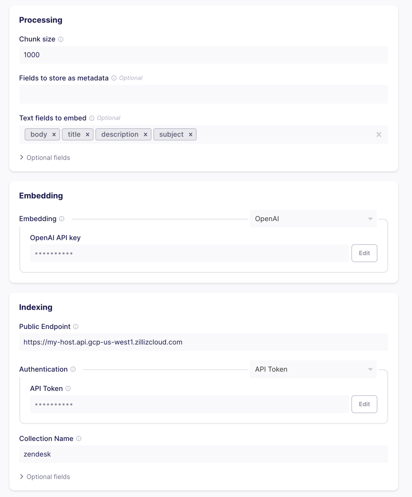
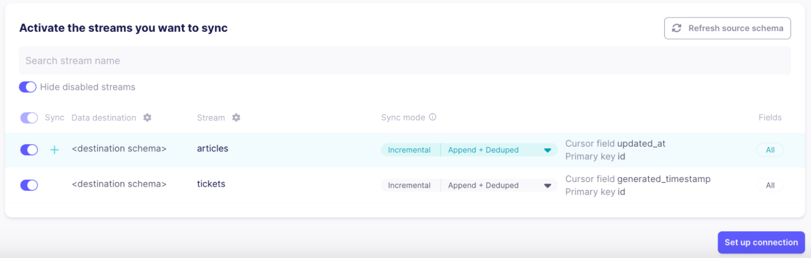
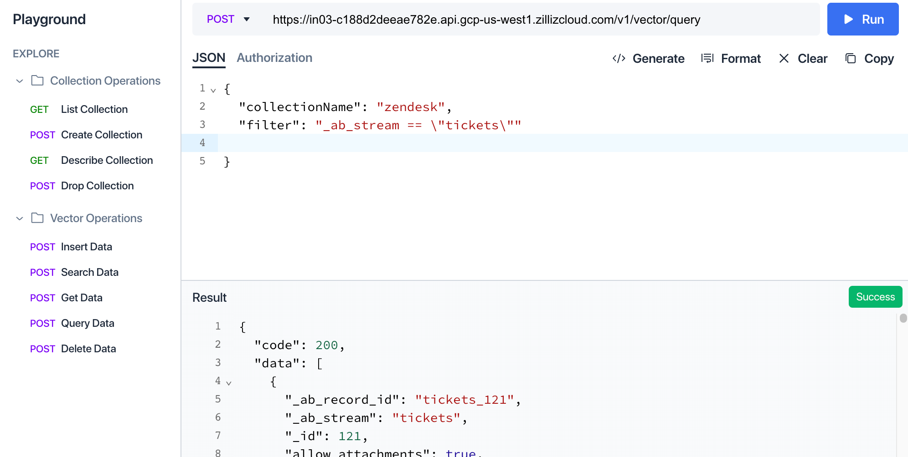
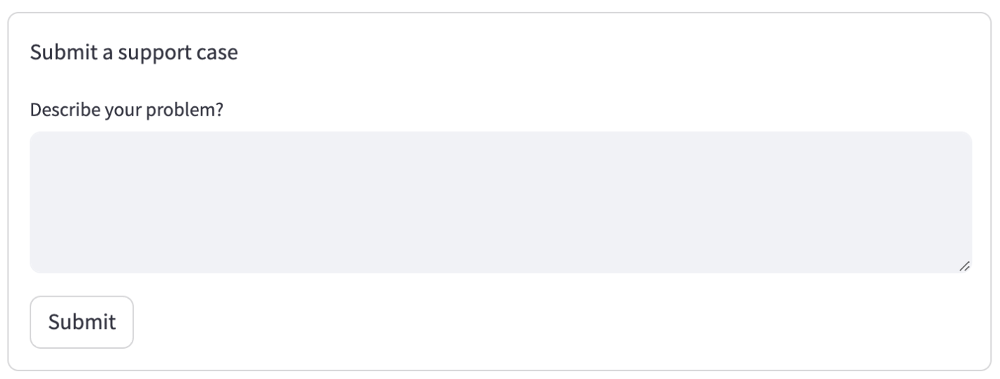
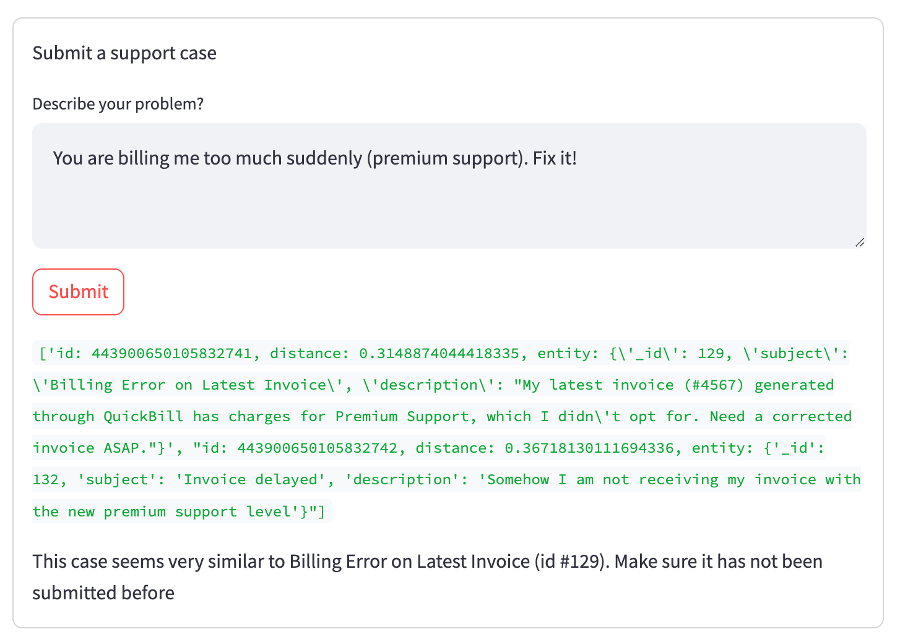
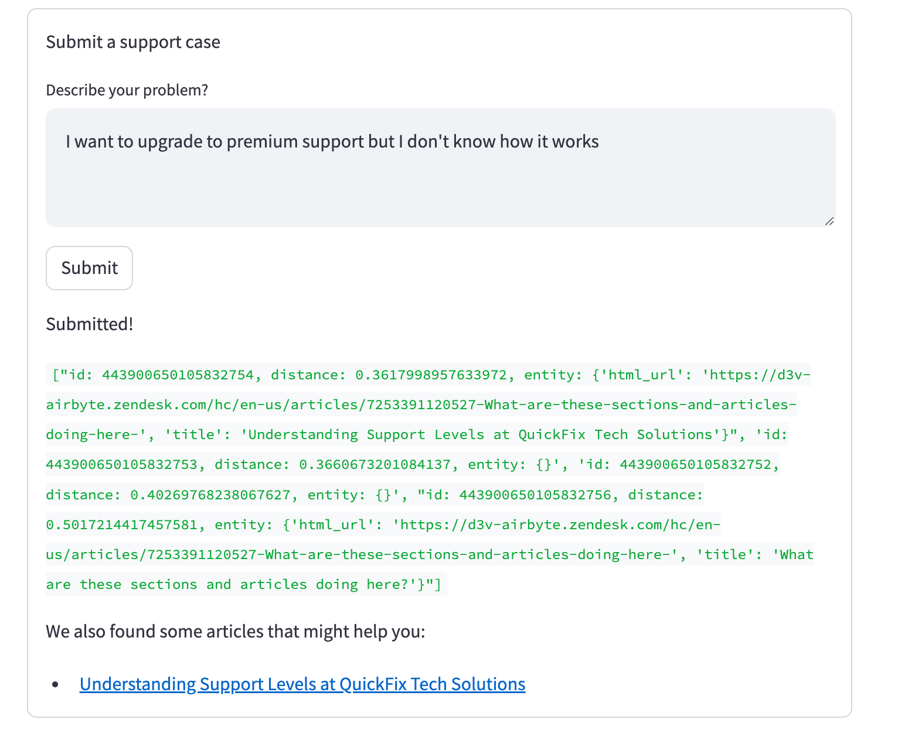

# Airbyte: Open-Source Data Movement Infrastructure

Airbyte is an open-source data movement infrastructure for building extract and load (EL) data pipelines. It is designed for versatility, scalability, and ease of use. Airbyte’s connector catalog comes “out-of-the-box” with over 350 pre-built connectors. These connectors can be used to start replicating data from a source to a destination in just a few minutes.

## Major Components of Airbyte

### 1. Connector Catalog
- **350+ Pre-Built Connectors**: Airbyte’s connector catalog comes “out-of-the-box” with over 350 pre-built connectors. These connectors can be used to start replicating data from a source to a destination in just a few minutes.
- **No-Code Connector Builder**: You can easily extend Airbyte’s functionality to support your custom use cases through tools [like the No-Code Connector Builder](https://docs.airbyte.com/connector-development/connector-builder-ui/overview).

### 2. The Platform
Airbyte’s platform provides all the horizontal services required to configure and scale data movement operations, available as [cloud-managed](https://airbyte.com/product/airbyte-cloud) or [self-managed](https://airbyte.com/product/airbyte-enterprise).

### 3. The User Interface
Airbyte features a UI, [PyAirbyte](https://docs.airbyte.com/using-airbyte/pyairbyte/getting-started) (Python library), [API](https://docs.airbyte.com/api-documentation), and [Terraform Provider](https://docs.airbyte.com/terraform-documentation) to integrate with your preferred tooling and approach to infrastructure management.

With the ability of Airbyte, users can integrate data sources into Milvus cluster for similarity search.

## Before You Begin
You will need:
- Zendesk account (or another data source you want to sync data from)
- Airbyte account or local instance
- OpenAI API key
- Milvus cluster
- Python 3.10 installed locally

## Set Up Milvus Cluster

If you have already deployed a K8s cluster for production, you can skip this step and proceed directly to [deploy Milvus Operator](https://milvus.io/docs/install_cluster-milvusoperator.md#Deploy-Milvus-Operator). If not, you can follow [the steps](https://milvus.io/docs/install_cluster-milvusoperator.md#Create-a-K8s-Cluster) to deploy a Milvus cluster with Milvus Operator.

Individual entities (in our case, support tickets and knowledge base articles) are stored in a “collection” — after your cluster is set up, you need to create a collection. Choose a suitable name and set the Dimension to 1536 to match the vector dimensionality generated by the OpenAI embeddings service. 

After creation, record the endpoint and [authentication](https://milvus.io/docs/authenticate.md?tab=docker) info.

## Set Up Connection in Airbyte

Our database is ready, let’s move some data over! To do this, we need to configure a connection in Airbyte. Either sign up for an Airbyte cloud account at [cloud.airbyte.com](https://cloud.airbyte.com) or fire up a local instance as described [in the documentation](https://docs.airbyte.com/using-airbyte/getting-started/).

### Set Up Source

Once your instance is running, we need to set up the connection — click “New connection” and pick the “Zendesk Support” connector as the source. After clicking the “Test and Save” button, Airbyte will check whether the connection can be established.

On Airbyte cloud, you can easily authenticate by clicking the Authenticate button. When using a local Airbyte instance, follow the directions outlined on the [documentation](https://docs.airbyte.com/integrations/sources/zendesk-support#airbyte-open-source-enable-api-token-access-and-generate-a-token) page.

### Set Up Destination

If everything is working correctly, the next step is to set up the destination to move data to. Here, pick the “Milvus” connector.

The Milvus connector does three things:
- **Chunking and Formatting** - Split Zendesk records into text and metadata. If the text is larger than the specified chunk size, records are split up into multiple parts that are loaded into the collection individually. The splitting of text (or chunking) can, for example, happen in the case of large support tickets or knowledge articles. By splitting up the text, you can ensure that searches always yield useful results.

Let’s go with a chunk size of 1000 tokens and text fields of body, title, description, and subject, as these will be present in the data we will receive from Zendesk.

- **Embedding** - Using Machine Learning models transforms the text chunks produced by the processing part into vector embeddings that you can then search for semantic similarity. To create the embeddings, you must supply the OpenAI API key. Airbyte will send each chunk to OpenAI and add the resulting vector to the entities loaded into your Milvus cluster.
- **Indexing** - Once you have vectorized the chunks, you can load them into the database. To do so, insert the information you got when setting up your cluster and collection in Milvus cluster. <div></div> Clicking “Test and save” will check whether everything is lined up correctly (valid credentials, collection exists and has the same vector dimensionality as the configured embedding, etc.)

### Set up stream sync flow
The last step before data is ready to flow is selecting which “streams” to sync. A stream is a collection of records in the source. As Zendesk supports a large number of streams that are not relevant to our use case, let’s only select “tickets” and “articles” and disable all others to save bandwidth and make sure only the relevant information will show up in searches:<div></div> You can select which fields to extract from the source by clicking the stream name. The “Incremental | Append + Deduped” sync mode means that subsequent connection runs keep Zendesk and Milvus in sync while transferring minimal data (only the articles and tickets that have changed since the last run).

As soon as the connection is set up, Airbyte will start syncing data. It can take a few minutes to appear in your Milvus collection.

If you select a replication frequency, Airbyte will run regularly to keep your Milvus collection up to date with changes to Zendesk articles and newly created issues.

### Check flow
You can check in the Milvus cluster UI how the data is structured in the collection by navigating to the playground and executing a “Query Data” query with a filter set to “_ab_stream == \”tickets\””.<div></div> As you can see in the Result view, each record coming from Zendesk is stored as separate entities in Milvus with all the specified metadata. The text chunk the embedding is based on is shown as the “text” property — this is the text that got embedded using OpenAI and will be what we will search on.

## Build Streamlit app querying the collection
Our data is ready — now we need to build the application to use it. In this case, the application will be a simple support form for users to submit support cases. When the user hits submit, we will do two things:
- Search for similar tickets submitted by users of the same organization
- Search for knowledge-based articles that might be relevant to the user

In both cases, we will leverage semantic search using OpenAI embeddings. To do this, the description of the problem the user entered is also embedded and used to retrieve similar entities from the Milvus cluster. If there are relevant results, they are shown below the form.

### Set up UI environment
You will need a local Python installation as we will use Streamlit to implement the application.

First, install Streamlit, the Milvus client library, and the OpenAI client library locally:
```shell
pip install streamlit pymilvus openai
```
To render a basic support form, create a python file `basic_support_form.py`:
```python
import streamlit as st

with st.form("my_form"):
    st.write("Submit a support case")
    text_val = st.text_area("Describe your problem")

    submitted = st.form_submit_button("Submit")
    if submitted:
        # TODO check for related support cases and articles
        st.write("Submitted!")
```
To run your application, use Streamlit run:
```shell
streamlit run basic_support_form.py
```
This will render a basic form:<div></div>The code for this example can also be found on [GitHub](https://github.com/airbytehq/tutorial-similarity-search/blob/main/1_basic_support_form.py).

### Set up backend query service
Next, let’s check for existing open tickets that might be relevant. To do this, we embed the text the user entered using OpenAI, then did a similarity search on our collection, filtering for still open tickets. If there is one with a very low distance between the supplied ticket and the existing ticket, let the user know and don’t submit:
```python
import streamlit as st
import os
import pymilvus
import openai


with st.form("my_form"):
    st.write("Submit a support case")
    text_val = st.text_area("Describe your problem?")

    submitted = st.form_submit_button("Submit")
    if submitted:
        import os
        import pymilvus
        import openai

        org_id = 360033549136 # TODO Load from customer login data

        pymilvus.connections.connect(uri=os.environ["MILVUS_URL"], token=os.environ["MILVUS_TOKEN"])
        collection = pymilvus.Collection("zendesk")

        embedding = openai.Embedding.create(input=text_val, model="text-embedding-ada-002")['data'][0]['embedding']

        results = collection.search(data=[embedding], anns_field="vector", param={}, limit=2, output_fields=["_id", "subject", "description"], expr=f'status == "new" and organization_id == {org_id}')

        st.write(results[0])
        if len(results[0]) > 0 and results[0].distances[0] < 0.35:
            matching_ticket = results[0][0].entity
            st.write(f"This case seems very similar to {matching_ticket.get('subject')} (id #{matching_ticket.get('_id')}). Make sure it has not been submitted before")
        else:
            st.write("Submitted!")
            
```
Several things are happening here:
- The connection to the Milvus cluster is set up.
- The OpenAI service is used to generate an embedding of the description the user entered.
- A similarity search is performed, filtering results by the ticket status and the organization id (as only open tickets of the same organization are relevant).
- If there are results and the distance between the embedding vectors of the existing ticket and the newly entered text is below a certain threshold, call out this fact.

To run the new app, you need to set the environment variables for OpenAI and Milvus first:
```shell
export MILVUS_TOKEN=...
export MILVUS_URL=https://...
export OPENAI_API_KEY=sk-...

streamlit run app.py
```
When trying to submit a ticket that exists already, this is how the result will look:<div></div> The code for this example can also be found on [GitHub](https://github.com/airbytehq/tutorial-similarity-search/blob/main/2_open_ticket_check.py).

### Show more relevant information
As you can see in the green debug output hidden in the final version, two tickets matched our search (in status new, from the current organization, and close to the embedding vector). However, the first (relevant) ranked higher than the second (irrelevant in this situation), which is reflected in the lower distance value. This relationship is captured in the embedding vectors without directly matching words, like in a regular full-text search.

To wrap it up, let’s show helpful information after the ticket gets submitted to give the user as much relevant information upfront as possible.

To do this, we are going to do a second search after the ticket gets submitted to fetch the top-matching knowledge base articles:
```python
   ......
   
        else:
            # TODO Actually send out the ticket
            st.write("Submitted!")
            article_results = collection.search(data=[embedding], anns_field="vector", param={}, limit=5, output_fields=["title", "html_url"], expr=f'_ab_stream == "articles"')
            st.write(article_results[0])
            if len(article_results[0]) > 0:
                st.write("We also found some articles that might help you:")
                for hit in article_results[0]:
                    if hit.distance < 0.362:
                        st.write(f"* [{hit.entity.get('title')}]({hit.entity.get('html_url')})")

```
If there is no open support ticket with a high similarity score, the new ticket gets submitted and relevant knowledge articles are shown below:<div></div> The code for this example can also be found on [Github](https://github.com/airbytehq/tutorial-similarity-search/blob/main/3_relevant_articles.py).

## Conclusion
While the UI shown here is not an actual support form but an example to illustrate the use case, the combination of Airbyte and Milvus is a very powerful one — it makes it easy to load text from a wide variety of sources (from databases like Postgres over APIs like Zendesk or GitHub over to completely custom sources built using Airbyte's SDK or visual connector builder) and index it in embedded form in Milvus, a powerful vector search engine being able to scale to huge amounts of data.

Airbyte and Milvus are open source and completely free to use on your infrastructure, with cloud offerings to offload operations if desired.

Beyond the classical semantic search use case illustrated in this article, the general setup can also be used to build a question-answering chat bot using the RAG method (Retrieval Augmented Generation), recommender systems, or help make advertising more relevant and efficient.