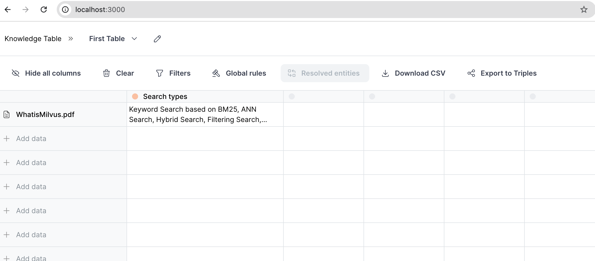

# Knowledge Table with Milvus
[Knowledge Table](https://github.com/whyhow-ai/knowledge-table), developed by [WhyHow AI](https://www.whyhow.ai/), is an open-source package designed to facilitate the extraction and exploration of structured data from unstructured documents. It provides users with a spreadsheet-like interface and enables the creation of knowledge representations, such as tables and graphs, through a natural language query interface. The package includes customizable extraction rules, formatting options, and data traceability through provenance, making it adaptable for diverse applications. It supports seamless integration into RAG workflows, catering to both business users needing a user-friendly interface and developers requiring a flexible backend for efficient document processing.

By default, Knowledge Table uses the Milvus database to store and retrieve the extracted data. This allows users to easily search, filter, and analyze the data using the powerful features of Milvus. In this tutorial, we will show how to get started with Knowledge Table and Milvus.

## Prerequisites

- Docker
- Docker Compose

## Cloning the project
```shell
git clone https://github.com/whyhow-ai/knowledge-table.git
```

## Set up the environment
You will find the `.env.example` file in the project root directory. Copy this file to `.env` and fill in the required environment variables.

For Milvus, you should set the `MILVUS_DB_URI` and `MILVUS_DB_TOKEN` environment variables. Here are some tips:

> - Setting the `MILVUS_DB_URI` as a local file, e.g.`./milvus.db`, is the most convenient method, as it automatically utilizes [Milvus Lite](https://milvus.io/docs/milvus_lite.md) to store all data in this file.
> - If you have large scale of data, say more than a million vectors, you can set up a more performant Milvus server on [Docker or Kubernetes](https://milvus.io/docs/quickstart.md). In this setup, please use the server address and port as your uri, e.g.`http://localhost:19530`. If you enable the authentication feature on Milvus, use "<your_username>:<your_password>" as the token, otherwise don't set the token.
> - If you want to use [Zilliz Cloud](https://zilliz.com/cloud), the fully managed cloud service for Milvus, adjust the `MILVUS_DB_URI` and `MILVUS_DB_TOKEN`, which correspond to the [Public Endpoint and Api key](https://docs.zilliz.com/docs/on-zilliz-cloud-console#free-cluster-details) in Zilliz Cloud.

Besides Milvus, you should also set other environments, e.g. `OPENAI_API_KEY`. You can get each of these from the respective websites.

## Starting the app

```sh
docker-compose up -d --build
```

## Stopping the app

```sh
docker-compose down
```

## Accessing the project

The frontend can be accessed at `http://localhost:3000`, and the backend can be accessed at `http://localhost:8000`.



You can play around with the UI and try with your own documents.

For further demo usage, you can refer to the official [Knowledge Table documentation](https://github.com/whyhow-ai/knowledge-table/tree/main).