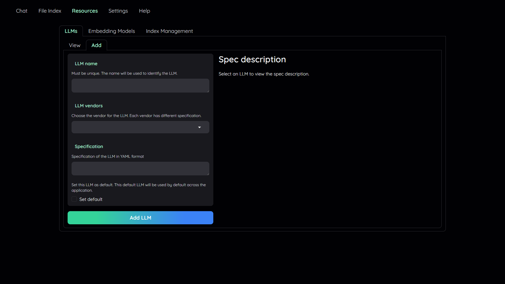
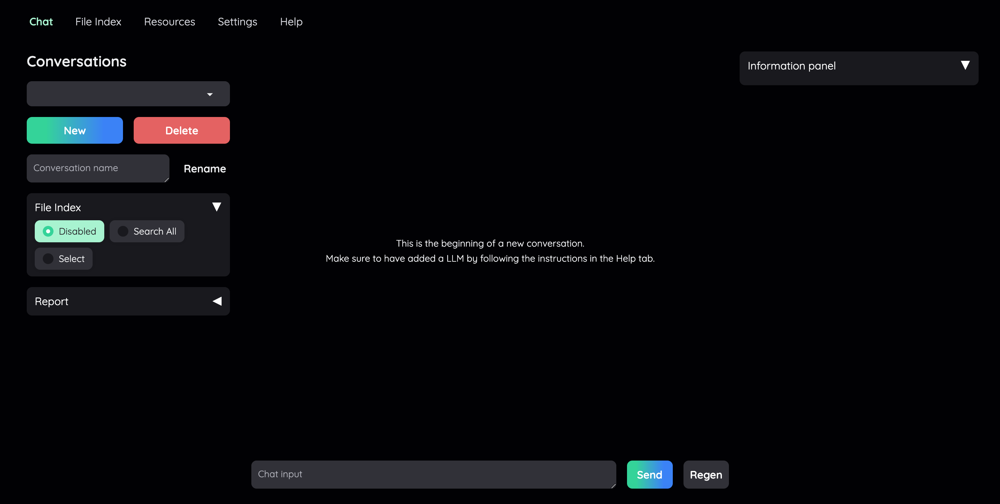

# Kotaemon RAG with Milvus

[Kotaemon](https://github.com/Cinnamon/kotaemon) is an open-source clean & customizable RAG UI for chatting with your documents. Built with both end users and developers in mind.

Kotaemon provides a customizable, multi-user document QA web-UI supporting local and API-based LLMs. It offers a hybrid RAG pipeline with full-text and vector retrieval, multi-modal QA for documents with figures and tables, and advanced citations with document previews. It supports complex reasoning methods like ReAct and ReWOO, and provides configurable settings for retrieval and generation.

This tutorial will guide you on how to customize your kotaemon application using [Milvus](https://milvus.io/).


## Prerequisites

### Installation
We recommend installing kotaemon in this way:
```shell
# optional (setup env)
conda create -n kotaemon python=3.10
conda activate kotaemon

git clone https://github.com/Cinnamon/kotaemon
cd kotaemon

pip install -e "libs/kotaemon[all]"
pip install -e "libs/ktem"
```
Besides this way, there are some other ways to install kotaemon. You can refer to the [official documentation](https://github.com/Cinnamon/kotaemon?tab=readme-ov-file#installation) for more details.

### Set Milvus as the default vector storage
To change the default vector storage to Milvus, you have to modify the `flowsettings.py` file by switching `KH_VECTORSTORE` to:
```python
"__type__": "kotaemon.storages.MilvusVectorStore"
```

### Set Environment Variables
you can configure the models via the `.env` file with the information needed to connect to the LLMs and embedding models. e.g. OpenAI, Azure, Ollama, etc.

### Run Kotaemon
After setting up the environment variables and changing the vector storage, you can run kotaemon by running the following command:
```shell
python app.py
```
Default username / password are: `admin` / `admin`

## Start RAG with kotaemon

### 1. Add your AI models



In the `Resources` tab, you can add and set your LLMs and embedding models. You can add multiple models and set them as active or inactive. You only need to provide at least one. You can also provide multiple models to allow switching between them.

### 2. Upload your documents


In order to do QA on your documents, you need to upload them to the application first.
Navigate to the `File Index` tab, and you can upload and manage your custom documents.

By default, all application data are stored in `./ktem_app_data` folder. The Milvus database data is stored in `./ktem_app_data/user_data/vectorstore`. You can back up or copy this folder to move your installation to a new machine.

### 3. Chat with your documents



Now navigate back to the `Chat` tab. The Chat tab consists of 3 regions: the Conversation Settings Panel, where you manage conversations and file references; the Chat Panel for interacting with the chatbot; and the Information Panel, which displays supporting evidence, confidence scores, and relevance ratings for answers.

You can select your documents in the Conversation Settings Panel. Then just start RAG with your documents by typing a message in the input box and send it to the chatbot. 

If you want to dive deep into how to use kotaemon, you can get a full guidance from the [official documentation](https://cinnamon.github.io/kotaemon/usage/).