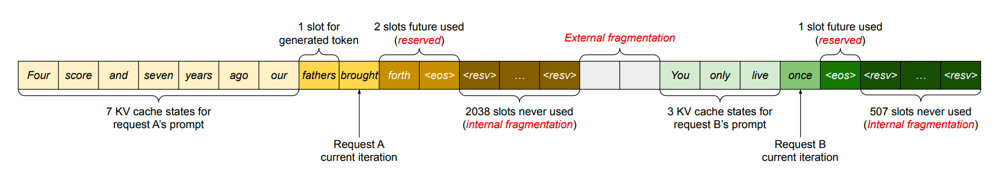
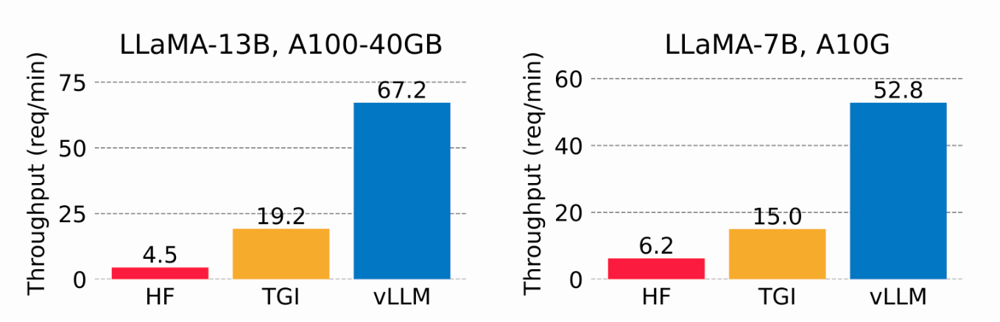

# Building RAG with Milvus, vLLM, and Llama 3.1


The University of California – Berkeley donated [vLLM](https://docs.vllm.ai/en/latest/index.html), a fast and easy-to-use library for LLM inference and serving, to [LF AI & Data Foundation](https://lfaidata.foundation/) as an incubation-stage project in July 2024. As a fellow member project, we’d like to welcome vLLM joining the LF AI & Data family! 🎉 

Large Language Models ([LLMs](https://zilliz.com/glossary/large-language-models-(llms))) and [vector databases](https://zilliz.com/learn/what-is-vector-database) are usually paired to build Retrieval Augmented Generation ([RAG](https://zilliz.com/learn/Retrieval-Augmented-Generation)), a popular AI application architecture to address [AI Hallucinations](https://zilliz.com/glossary/ai-hallucination). This blog will show you how to build and run a RAG with Milvus, vLLM, and Llama 3.1. More specifically, I will show you how to embed and store text information as [vector embeddings](https://zilliz.com/glossary/vector-embeddings) in Milvus and use this vector store as a knowledge base to efficiently retrieve text chunks relevant to user questions. Finally, we'll leverage vLLM to serve Meta's Llama 3.1-8B model to generate answers augmented by the retrieved text. Let's dive in!

## Introduction to Milvus, vLLM, and Meta’s Llama 3.1 

### Milvus vector database
[**Milvus**](https://zilliz.com/what-is-milvus) is an open-source, [purpose-built](https://zilliz.com/blog/what-is-a-real-vector-database), distributed vector database for storing, indexing, and searching vectors for [Generative AI](https://zilliz.com/learn/generative-ai) (GenAI) workloads. Its ability to perform [hybrid search,](https://zilliz.com/blog/a-review-of-hybrid-search-in-milvus) [metadata filtering](https://zilliz.com/blog/what-is-new-with-metadata-filtering-in-milvus), reranking, and efficiently handle trillions of vectors makes Milvus a go-to choice for AI and machine learning workloads. [Milvus](https://github.com/milvus-io/) can be run locally, on a cluster, or hosted in the fully managed [Zilliz Cloud](https://zilliz.com/cloud).

### vLLM
[**vLLM**](https://vllm.readthedocs.io/en/latest/index.html) is an open-source project started at UC Berkeley SkyLab focused on optimizing LLM serving performance. It uses efficient memory management with PagedAttention, continuous batching, and optimized CUDA kernels. Compared to traditional methods, vLLM improves serving performance by up to 24x while cutting GPU memory usage in half.

According to the paper "[Efficient Memory Management for Large Language Model Serving with PagedAttention](https://arxiv.org/abs/2309.06180)," the KV cache uses around 30% of GPU memory, leading to potential memory issues. The KV cache is stored in contiguous memory, but changing size can cause memory fragmentation, which is inefficient for computation.


*Image 1. KV cache memory management in existing systems (2023 Paged Attention  [paper](https://arxiv.org/pdf/2309.06180))*

By using virtual memory for the KV cache, vLLM only allocates physical GPU memory as needed, eliminating memory fragmentation and avoiding pre-allocation. In tests, vLLM outperformed [HuggingFace Transformers](https://huggingface.co/docs/transformers/main_classes/text_generation) (HF) and [Text Generation Inference](https://github.com/huggingface/text-generation-inference) (TGI), achieving up to 24x higher throughput than HF and 3.5x higher than TGI on NVIDIA A10G and A100 GPUs.


*Image 2. Serving throughput when each request asks for three parallel output completions. vLLM achieves 8.5x—15x higher throughput than HF and 3.3x—3.5x higher throughput than TGI (2023 [vLLM blog](https://blog.vllm.ai/2023/06/20/vllm.html)).*

### Meta’s Llama 3.1 
[**Meta’s Llama 3.1**](https://ai.meta.com/research/publications/the-llama-3-herd-of-models) was announced on July 23, 2024. The 405B model delivers state-of-the-art performance on several public benchmarks and has a context window of 128,000 input tokens with various commercial uses permitted. Alongside the 405-billion parameter model, Meta released an updated version of Llama3 70B (70 billion parameters) and 8B (8 billion parameters). Model weights are available to download [on Meta's website](https://info.deeplearning.ai/e3t/Ctc/LX+113/cJhC404/VWbMJv2vnLfjW3Rh6L96gqS5YW7MhRLh5j9tjNN8BHR5W3qgyTW6N1vHY6lZ3l8N8htfRfqP8DzW72mhHB6vwYd2W77hFt886l4_PV22X226RPmZbW67mSH08gVp9MW2jcZvf24w97BW207Jmf8gPH0yW20YPQv261xxjW8nc6VW3jj-nNW6XdRhg5HhZk_W1QS0yL9dJZb0W818zFK1w62kdW8y-_4m1gfjfNW2jswrd3xbv-yW5mrvdk3n-KqyW45sLMF21qDrwW5TR3vr2MYxZ9W2hWhq23q-nQdW4blHqh3JlZWfW937hlZ58-KJCW82Pgv9384MbYW7yp56M6pvzd6f77wnH004). 

A key insight was that fine-tuning generated data can boost performance, but poor-quality examples can degrade it. The Llama team worked extensively to identify and remove these bad examples using the model itself, auxiliary models, and other tools.

## Build and Perform the RAG-Retrieval with Milvus

### Prepare your dataset.
I used the official [Milvus documentation](https://milvus.io/docs/) as my dataset for this demo, which I downloaded and saved locally.

```python
from langchain.document_loaders import DirectoryLoader
# Load HTML files already saved in a local directory
path = "../../RAG/rtdocs_new/"
global_pattern = '*.html'
loader = DirectoryLoader(path=path, glob=global_pattern)
docs = loader.load()


# Print num documents and a preview.
print(f"loaded {len(docs)} documents")
print(docs[0].page_content)
pprint.pprint(docs[0].metadata)
```
```text
loaded 22 documents
Why Milvus Docs Tutorials Tools Blog Community Stars0 Try Managed Milvus FREE Search Home v2.4.x About ...
{'source': 'https://milvus.io/docs/quickstart.md'}
```
### Download an embedding model.
Next, download a free, open-source [embedding model](https://zilliz.com/ai-models) from HuggingFace.

```python
import torch
from sentence_transformers import SentenceTransformer


# Initialize torch settings for device-agnostic code.
N_GPU = torch.cuda.device_count()
DEVICE = torch.device('cuda:N_GPU' if torch.cuda.is_available() else 'cpu')


# Download the model from huggingface model hub.
model_name = "BAAI/bge-large-en-v1.5"
encoder = SentenceTransformer(model_name, device=DEVICE)


# Get the model parameters and save for later.
EMBEDDING_DIM = encoder.get_sentence_embedding_dimension()
MAX_SEQ_LENGTH_IN_TOKENS = encoder.get_max_seq_length()


# Inspect model parameters.
print(f"model_name: {model_name}")
print(f"EMBEDDING_DIM: {EMBEDDING_DIM}")
print(f"MAX_SEQ_LENGTH: {MAX_SEQ_LENGTH}")
```
```text
model_name: BAAI/bge-large-en-v1.5
EMBEDDING_DIM: 1024
MAX_SEQ_LENGTH: 512
```
### Chunk and encode your custom data as vectors.
I’ll use a fixed length of 512 characters with 10% overlap.

```python
from langchain.text_splitter import RecursiveCharacterTextSplitter


CHUNK_SIZE = 512
chunk_overlap = np.round(CHUNK_SIZE * 0.10, 0)
print(f"chunk_size: {CHUNK_SIZE}, chunk_overlap: {chunk_overlap}")


# Define the splitter.
child_splitter = RecursiveCharacterTextSplitter(
   chunk_size=CHUNK_SIZE,
   chunk_overlap=chunk_overlap)


# Chunk the docs.
chunks = child_splitter.split_documents(docs)
print(f"{len(docs)} docs split into {len(chunks)} child documents.")


# Encoder input is doc.page_content as strings.
list_of_strings = [doc.page_content for doc in chunks if hasattr(doc, 'page_content')]


# Embedding inference using HuggingFace encoder.
embeddings = torch.tensor(encoder.encode(list_of_strings))


# Normalize the embeddings.
embeddings = np.array(embeddings / np.linalg.norm(embeddings))


# Milvus expects a list of `numpy.ndarray` of `numpy.float32` numbers.
converted_values = list(map(np.float32, embeddings))


# Create dict_list for Milvus insertion.
dict_list = []
for chunk, vector in zip(chunks, converted_values):
   # Assemble embedding vector, original text chunk, metadata.
   chunk_dict = {
       'chunk': chunk.page_content,
       'source': chunk.metadata.get('source', ""),
       'vector': vector,
   }
   dict_list.append(chunk_dict)
```

```text
chunk_size: 512, chunk_overlap: 51.0
22 docs split into 355 child documents.
```

### Save the vectors in Milvus.
Ingest the encoded vector embedding in the Milvus vector database. 

```python
# Connect a client to the Milvus Lite server.
from pymilvus import MilvusClient
mc = MilvusClient("milvus_demo.db")


# Create a collection with flexible schema and AUTOINDEX.
COLLECTION_NAME = "MilvusDocs"
mc.create_collection(COLLECTION_NAME,
       EMBEDDING_DIM,
       consistency_level="Eventually",
       auto_id=True, 
       overwrite=True)


# Insert data into the Milvus collection.
print("Start inserting entities")
start_time = time.time()
mc.insert(
   COLLECTION_NAME,
   data=dict_list,
   progress_bar=True)


end_time = time.time()
print(f"Milvus insert time for {len(dict_list)} vectors: ", end="")
print(f"{round(end_time - start_time, 2)} seconds")
```
```text
Start inserting entities
Milvus insert time for 355 vectors: 0.2 seconds
```
### Perform a vector search.
Ask a question and search for the nearest neighbor chunks from your knowledge base in Milvus.

```python
SAMPLE_QUESTION = "What do the parameters for HNSW mean?"


# Embed the question using the same encoder.
query_embeddings = torch.tensor(encoder.encode(SAMPLE_QUESTION))
# Normalize embeddings to unit length.
query_embeddings = F.normalize(query_embeddings, p=2, dim=1)
# Convert the embeddings to list of list of np.float32.
query_embeddings = list(map(np.float32, query_embeddings))


# Define metadata fields you can filter on.
OUTPUT_FIELDS = list(dict_list[0].keys())
OUTPUT_FIELDS.remove('vector')


# Define how many top-k results you want to retrieve.
TOP_K = 2


# Run semantic vector search using your query and the vector database.
results = mc.search(
    COLLECTION_NAME,
    data=query_embeddings,
    output_fields=OUTPUT_FIELDS,
    limit=TOP_K,
    consistency_level="Eventually")
```
The retrieved result is as shown below. 
```text
Retrieved result #1
distance = 0.7001987099647522
('Chunk text: layer, finds the node closest to the target in this layer, and'
...
'outgoing')
source: https://milvus.io/docs/index.md

Retrieved result #2
distance = 0.6953287124633789
('Chunk text: this value can improve recall rate at the cost of increased'
...
'to the target')
source: https://milvus.io/docs/index.md
```

## Build and Perform the RAG-Generation with vLLM and Llama 3.1-8B
### Install vLLM and models from HuggingFace
vLLM downloads large language models from HuggingFace by default. In general, anytime you want to use a brand new model on HuggingFace, you should do a pip install --upgrade or -U. Also, you’ll need a GPU to run inference of Meta’s Llama 3.1 models with vLLM.

For a full list of all vLLM-supported models, see this [documentation page](https://docs.vllm.ai/en/latest/models/supported_models.html#supported-models).


```shell
# (Recommended) Create a new conda environment.
conda create -n myenv python=3.11 -y
conda activate myenv


# Install vLLM with CUDA 12.1.
pip install -U vllm transformers torch


import vllm, torch
from vllm import LLM, SamplingParams


# Clear the GPU memory cache.
torch.cuda.empty_cache()


# Check the GPU.
!nvidia-smi
```
To learn more about how to install vLLM, see its [installation](https://docs.vllm.ai/en/latest/getting_started/installation.html) page. 
### Get a HuggingFace token.
Some models on HuggingFace, such as Meta Llama 3.1, require the user to accept their license before being able to download the weights. Therefore, you must create a HuggingFace account, accept the model’s license, and generate a token.

When visiting this [Llama3.1 page](https://huggingface.co/meta-llama/Meta-Llama-3.1-70B) on HuggingFace, you’ll get a message asking you to agree to the terms. Click “**Accept License**” to accept Meta terms before downloading model weights. The approval usually takes less than a day. 

**After you receive approval, you must generate a new HuggingFace token. Your old tokens will not work with the new permissions.**

Before installing vLLM, log in to HuggingFace with your new token. Below, I used Colab secrets to store the token.

```shell
# Login to HuggingFace using your new token.
from huggingface_hub import login
from google.colab import userdata
hf_token = userdata.get('HF_TOKEN')
login(token = hf_token, add_to_git_credential=True)
```
### Run the RAG-Generation
In the demo, we run `Llama-3.1-8B` model, which requires GPU and sizable memory to spin up. The following example was run on Google Colab Pro ($10/month) with an A100 GPU. To learn more about how to run vLLM, you can check out the [Quickstart documentation](https://docs.vllm.ai/en/latest/getting_started/quickstart.html).

```python
# 1. Choose a model
MODELTORUN = "meta-llama/Meta-Llama-3.1-8B-Instruct"


# 2. Clear the GPU memory cache, you're going to need it all!
torch.cuda.empty_cache()


# 3. Instantiate a vLLM model instance.
llm = LLM(model=MODELTORUN,
         enforce_eager=True,
         dtype=torch.bfloat16,
         gpu_memory_utilization=0.5,
         max_model_len=1000,
         seed=415,
         max_num_batched_tokens=3000)
```
Write a prompt using contexts and sources retrieved from Milvus.
```python
# Separate all the context together by space.
contexts_combined = ' '.join(contexts)
# Lance Martin, LangChain, says put the best contexts at the end.
contexts_combined = ' '.join(reversed(contexts))


# Separate all the unique sources together by comma.
source_combined = ' '.join(reversed(list(dict.fromkeys(sources))))


SYSTEM_PROMPT = f"""First, check if the provided Context is relevant to
the user's question.  Second, only if the provided Context is strongly relevant, answer the question using the Context.  Otherwise, if the Context is not strongly relevant, answer the question without using the Context. 
Be clear, concise, relevant.  Answer clearly, in fewer than 2 sentences.
Grounding sources: {source_combined}
Context: {contexts_combined}
User's question: {SAMPLE_QUESTION}
"""


prompts = [SYSTEM_PROMPT]
```
Now, generate an answer using the retrieved chunks and the original question stuffed into the prompt.
```python
# Sampling parameters
sampling_params = SamplingParams(temperature=0.2, top_p=0.95)


# Invoke the vLLM model.
outputs = llm.generate(prompts, sampling_params)


# Print the outputs.
for output in outputs:
   prompt = output.prompt
   generated_text = output.outputs[0].text
   # !r calls repr(), which prints a string inside quotes.
   print()
   print(f"Question: {SAMPLE_QUESTION!r}")
   pprint.pprint(f"Generated text: {generated_text!r}")
```
```text
Question: 'What do the parameters for HNSW MEAN!?'
Generated text: 'Answer: The parameters for HNSW (Hiera(rchical Navigable Small World Graph) are: '
'* M: The maximum degree of nodes on each layer oof the graph, which can improve '
'recall rate at the cost of increased search time. * efConstruction and ef: ' 
'These parameters specify a search range when building or searching an index.'
```
That answer above looks perfect to me! 

If you’re interested in this demo, feel free to try it yourself and let us know your thoughts. You’re also welcome to join our [Milvus community on Discord](https://discord.com/invite/8uyFbECzPX) to have conversations with all the GenAI developers directly.


## References

- vLLM [official documentation](https://docs.vllm.ai/en/latest/getting_started/installation.html) and [model page](https://docs.vllm.ai/en/latest/models/supported_models.html#supported-models).

- [2023 vLLM paper on Paged Attention](https://arxiv.org/pdf/2309.06180)

- [2023 vLLM presentation](https://www.youtube.com/watch?v=80bIUggRJf4) at Ray Summit

- vLLM blog: [vLLM: Easy, Fast, and Cheap LLM Serving with PagedAttention](https://blog.vllm.ai/2023/06/20/vllm.html)

- Helpful blog about running the vLLM server: [Deploying vLLM: a Step-by-Step Guide](https://ploomber.io/blog/vllm-deploy/)

- [The Llama 3 Herd of Models | Research - AI at Meta](https://ai.meta.com/research/publications/the-llama-3-herd-of-models/)