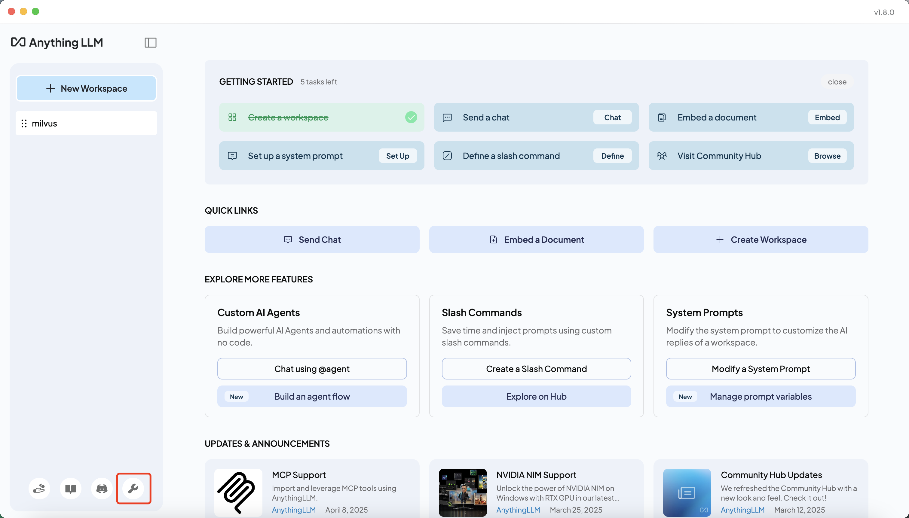
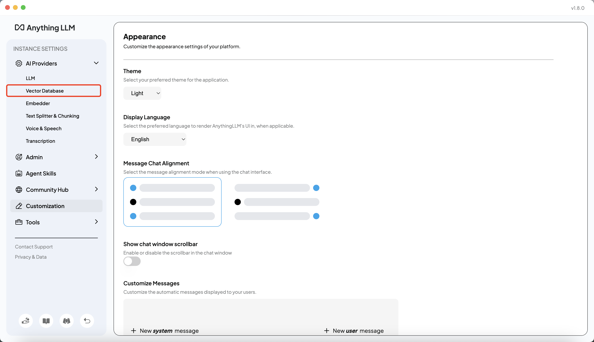
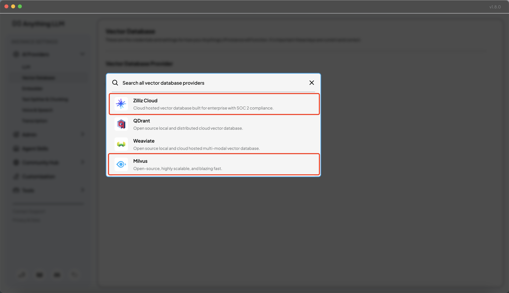
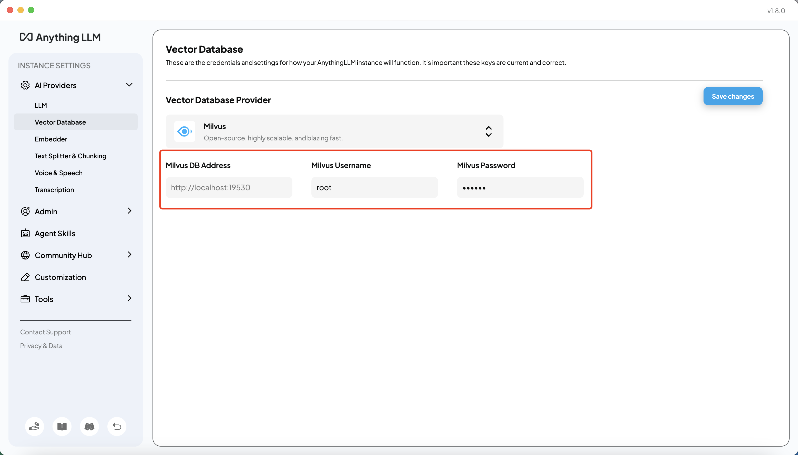
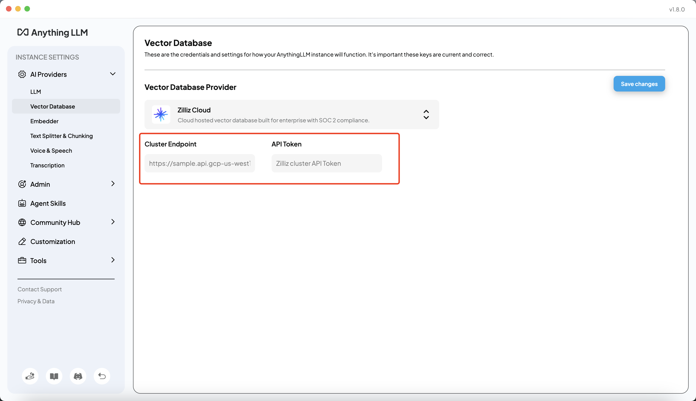
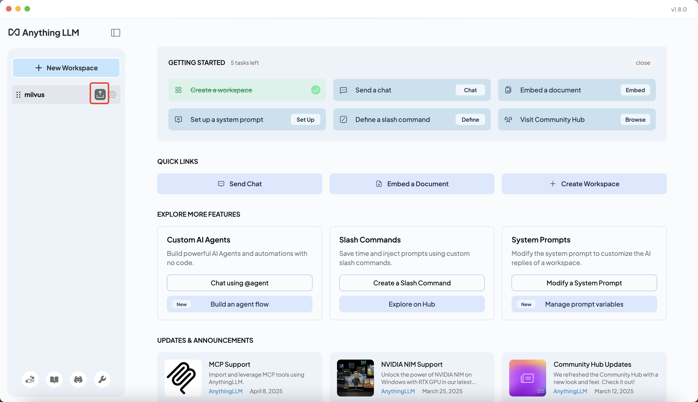
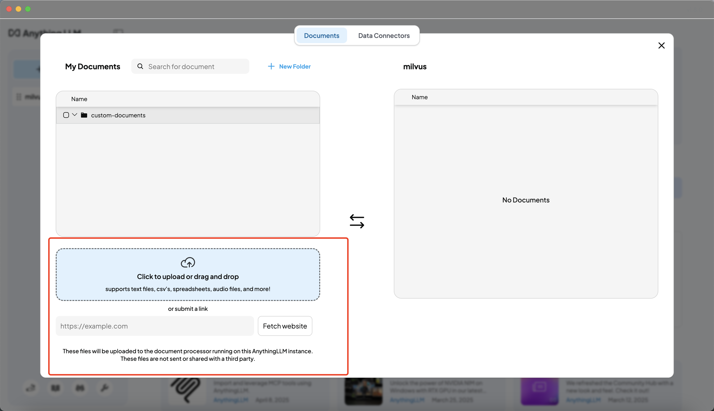
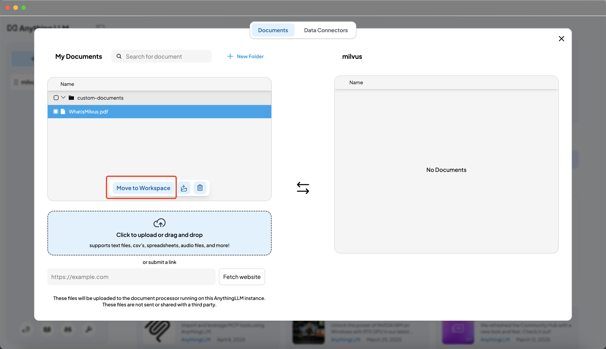
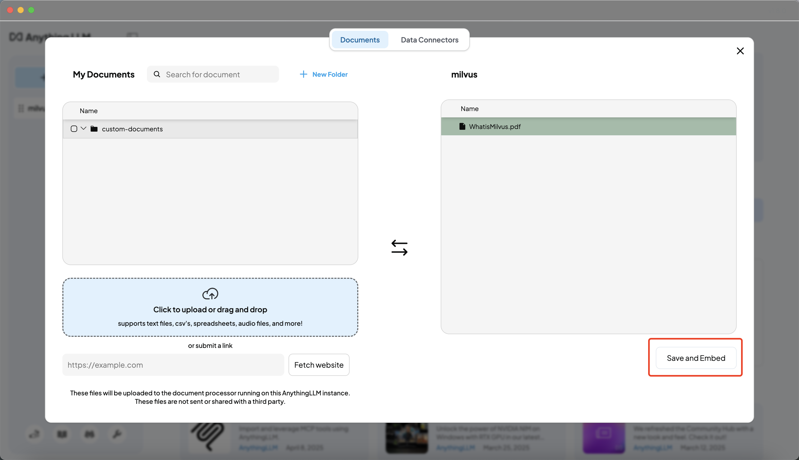
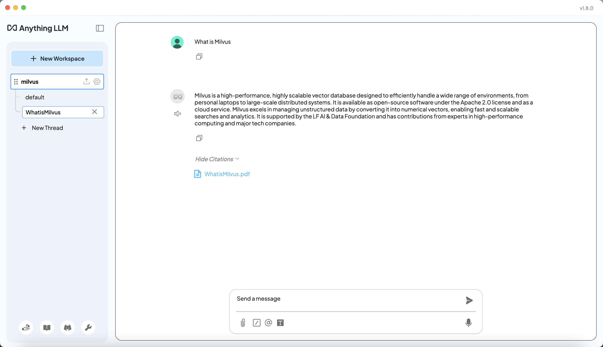

# Use Milvus in AnythingLLM

[AnythingLLM](https://anythingllm.com/) is a powerful, privacy-focused, all-in-one AI desktop application that supports various LLMs, document types, and vector databases. It enables you to build a private, ChatGPT-like assistant that can run locally or be hosted remotely, allowing you to chat intelligently with any documents you provide.

This guide will walk you through configuring Milvus as the vector database in AnythingLLM, enabling you to embed, store, and search your documents for intelligent retrieval and chat.

> This tutorial is based on the official AnythingLLM documentation and real usage steps. If the UI or steps change, please refer to the latest official docs and feel free to suggest improvements.

---

## 1. Prerequisites

- [Milvus](https://milvus.io/docs/install-overview.md) installed locally or a [Zilliz Cloud](https://zilliz.com/cloud) account
- [AnythingLLM Desktop](https://anythingllm.com/desktop) installed
- Documents or data sources ready for upload and embedding (PDF, Word, CSV, web pages, etc.)

---

## 2. Configure Milvus as the Vector Database

1. Open AnythingLLM and click the **settings** icon in the lower left corner  
   

2. In the left menu, select `AI Providers` > `Vector Database`  
   

3. In the Vector Database Provider dropdown, select **Milvus** (or Zilliz Cloud)  
   

4. Fill in your Milvus connection details (for local Milvus). Here is an example:
   - **Milvus DB Address**: `http://localhost:19530`
   - **Milvus Username**: `root`
   - **Milvus Password**: `Milvus`
   

   > If using Zilliz Cloud, enter your Cluster Endpoint and API Token instead:  
   

5. Click **Save changes** to apply your settings.

---

## 3. Create a Workspace and Upload Documents

1. Enter your workspace and click the **upload** icon to open the document upload dialog  
   

2. You can upload a wide variety of data sources:
   - **Local files**: PDF, Word, CSV, TXT, audio files, etc.
   - **Web pages**: Paste a URL and fetch website content directly.

   

3. After uploading or fetching, click **Move to Workspace** to move the document or data into your current workspace  
   

4. Select the document or data and click **Save and Embed**. AnythingLLM will automatically chunk, embed, and store your content in Milvus  
   

---

## 4. Chat and Retrieve Answers from Milvus

1. Return to the workspace chat interface and ask questions. AnythingLLM will search your Milvus vector database for relevant content and use the LLM to generate answers  
   

---

