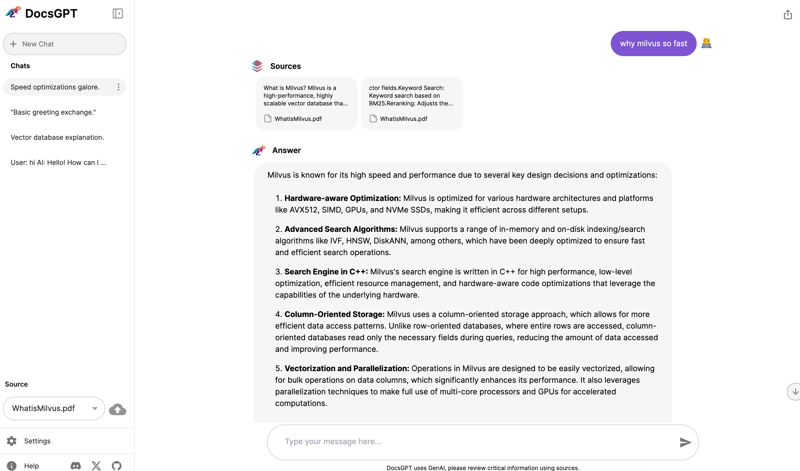

# Use Milvus in DocsGPT
[DocsGPT](https://github.com/arc53/DocsGPT) is an advanced open-source solution that simplifies finding information in project documentation by integrating powerful GPT models. It enables developers to get accurate answers to their questions about a project easily, eliminating time-consuming manual searches. 


In this tutorial, we will show you how to use Milvus as the backend vector database for DocsGPT.

> This tutorial is mainly referred to the [DocsGPT](https://github.com/arc53/DocsGPT?tab=readme-ov-file#quickstart) official installation guide. If you find that this tutorial has outdated parts, you can prioritize following the official guide and create an issue to us.


## Requirements

Make sure you have [Docker](https://docs.docker.com/engine/install/) installed

## Clone the repository
Clone the repository and navigate to it:

```shell
git clone https://github.com/arc53/DocsGPT.git
cd DocsGPT
```

## Add dependency
Append `langchain-milvus` dependency to the `requirements.txt` file under the `application` folder:
```shell
echo "\nlangchain-milvus==0.1.6" >> ./application/requirements.txt
```

## Set environment variables
Add `VECTOR_STORE=milvus`, `MILVUS_URI=...`, `MILVUS_TOKEN=...` to the environment variables for both the `backend` and `worker` services in the `docker-compose.yaml` file, just like this:

```yaml
  backend:
    build: ./application
    environment:
      - VECTOR_STORE=milvus
      - MILVUS_URI=...
      - MILVUS_TOKEN=...
```
```yaml
  worker:
    build: ./application
    command: celery -A application.app.celery worker -l INFO -B
    environment:
      - VECTOR_STORE=milvus
      - MILVUS_URI=...
      - MILVUS_TOKEN=...
```

For the `MILVUS_URI` and `MILVUS_TOKEN`, you can either use fully managed [Zilliz Cloud](https://zilliz.com/cloud)(Recommended) service or manually started Milvus service. 

- For fully managed Zillz Cloud service: We recommend using Zilliz Cloud service. You can sign up for a free trial account on [Zilliz Cloud](https://zilliz.com/cloud). After that, you will get the `MILVUS_URI` and `MILVUS_TOKEN`, which correspond to the [Public Endpoint and API key](https://docs.zilliz.com/docs/on-zilliz-cloud-console#cluster-details).

- For manually started Milvus service: If you want to set up a Milvus service, you can follow the [official Milvus documentation](https://milvus.io/docs/install_standalone-docker-compose.md) to set up a Milvus server, and then get the `MILVUS_URI` and `MILVUS_TOKEN` from the server. The `MILVUS_URI` and `MILVUS_TOKEN` should be in the format of `http://<your_server_ip>:19530` and `<your_username>:<your_password>` respectively.

## Start the services
Run: `./setup.sh`


Then navigate to http://localhost:5173/.

You can play around with the UI and ask questions about your documents.



If you want to stop the services, run:
```shell
docker-compose down
```
For further details and more advanced setups, please refer to the [DocsGPT](https://github.com/arc53/DocsGPT) official documentation.