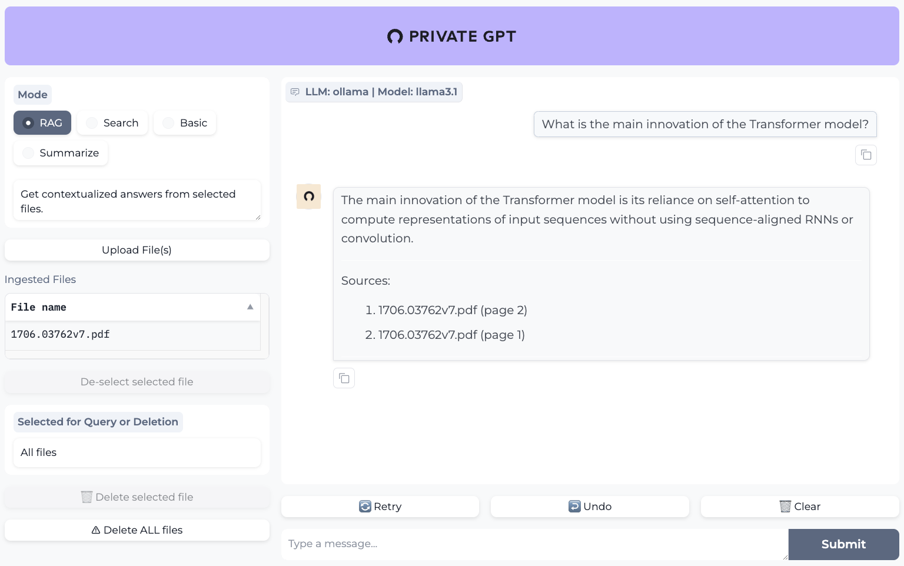

# Use Milvus in PrivateGPT
[PrivateGPT](https://privategpt.dev/) is a production-ready AI project that enables users to ask questions about their documents using Large Language Models without an internet connection while ensuring 100% privacy. PrivateGPT offers an API divided into high-level and low-level blocks. It also provides a Gradio UI client and useful tools like bulk model download scripts and ingestion scripts. Conceptually, PrivateGPT wraps a RAG pipeline and exposes its primitives, being ready to use and providing a full implementation of the API and RAG pipeline.

In this tutorial, we will show you how to use Milvus as the backend vector database for PrivateGPT.

> This tutorial is mainly referred to the [PrivateGPT](https://docs.privategpt.dev/installation/getting-started/installation) official installation guide. If you find that this tutorial has outdated parts, you can prioritize following the official guide and create an issue to us.

## Base requirements to run PrivateGPT
### 1. Clone the PrivateGPT Repository
Clone the repository and navigate to it:

```shell
git clone https://github.com/zylon-ai/private-gpt
cd private-gpt
```

### 2. Install Poetry
Install [Poetry](https://python-poetry.org/docs/#installing-with-the-official-installer) for dependency management: Follow the instructions on the official Poetry website to install it.

### 3. (Optional) Install make
To run various scripts, you need to install make. 

macOS (Using Homebrew):
```shell
brew install make
```

Windows
(Using Chocolatey):
```shell
choco install make
```


## Install Available Modules
PrivateGPT allows customization of the setup for some modules e.g. LLM, Embeddings, Vector Stores, UI.

In this tutorial, we will use the following modules:
- **LLM**: Ollama
- **Embeddings**: Ollama
- **Vector Stores**: Milvus
- **UI**: Gradio

Run the following command to use poetry to install the required module dependencies:
```shell
poetry install --extras "llms-ollama embeddings-ollama vector-stores-milvus ui"
```


## Start Ollama service
Go to [ollama.ai](https://ollama.com/) and follow the instructions to install Ollama on your machine.

After the installation, make sure the Ollama desktop app is closed.

Now, start Ollama service (it will start a local inference server, serving both the LLM and the Embeddings):
```shell
ollama serve
```

Install the models to be used, the default `settings-ollama.yaml` is configured to user `llama3.1` 8b LLM (~4GB) and `nomic-embed-text` Embeddings (~275MB)

By default, PrivateGPT will automatically pull models as needed. This behavior can be changed by modifying the `ollama.autopull_models` property.

In any case, if you want to manually pull models, run the following commands:
```shell
ollama pull llama3.1
ollama pull nomic-embed-text
```
You can optionally change to your favorite models in the `settings-ollama.yaml` file and pull them manually.

## Change Milvus Settings
In the file `settings-ollama.yaml`, set the vectorstore to milvus:
```yaml
vectorstore:
  database: milvus
```

You can also add some cumstom Milvus configuration to specify your settings.
Like this:
```yaml
milvus:
  uri: http://localhost:19530
  collection_name: my_collection
```

The available configuration options are:

| Field Option | Description                          |
|----------------------|--------------------------------------|
| uri                  | Default is set to “local_data/private_gpt/milvus/milvus_local.db” as a local file; you can also set up a more performant Milvus server on docker or k8s e.g.http://localhost:19530, as your uri; To use [Zilliz Cloud](https://zilliz.com/cloud), adjust the uri and token to [Public Endpoint and API key](https://docs.zilliz.com/docs/on-zilliz-cloud-console#cluster-details) in Zilliz Cloud.   |
| token                | Pair with Milvus server on docker or k8s or zilliz cloud api key.|
| collection_name      | The name of the collection, set to default “milvus_db”. |
| overwrite            | Overwrite the data in collection if it existed, set to default as True. |


 ## Start PrivateGPT

Once all settings are done, you can run PrivateGPT with a Gradio UI.

```shell
PGPT_PROFILES=ollama make run
```
The UI will be available at `http://0.0.0.0:8001`.



You can play around with the UI and ask questions about your documents.

For further details, please refer to the [PrivateGPT](https://docs.privategpt.dev/) official documentation.