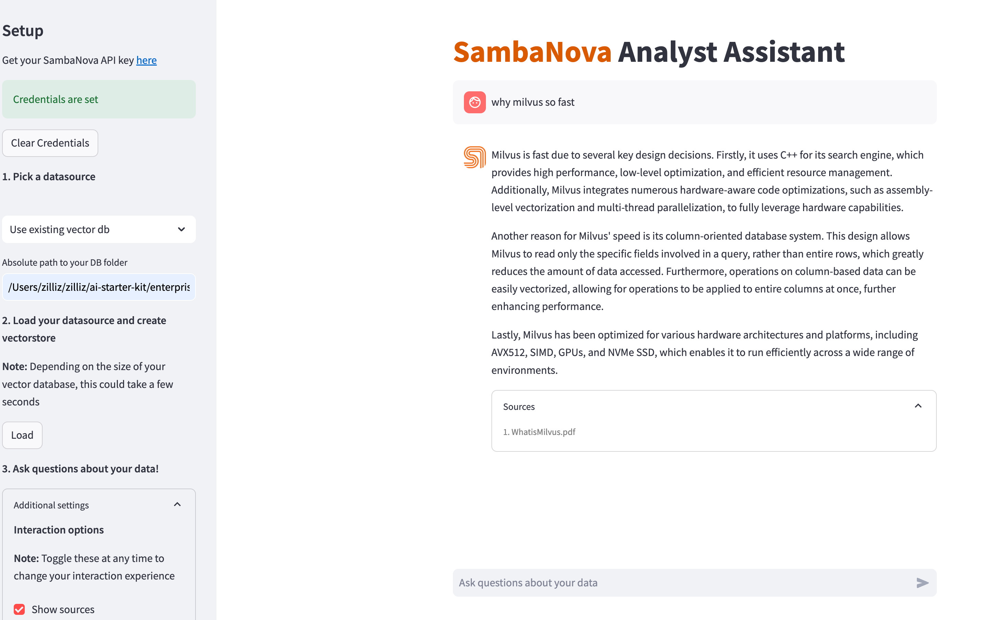

# Use Milvus with SambaNova

[SambaNova](https://sambanova.ai/) is an innovative AI technology platform that accelerates the deployment of advanced AI and deep learning capabilities. Designed for enterprise use, it empowers organizations to leverage generative AI for enhanced performance and efficiency. By providing cutting-edge solutions like the SambaNova Suite and DataScale, the platform enables businesses to extract valuable insights from their data, driving operational improvements and fostering new opportunities in the AI landscape.

[SambaNova AI Starter Kits](https://github.com/sambanova/ai-starter-kit) are a collection of open-source resources designed to assist developers and enterprises in deploying AI-driven applications with SambaNova. These kits provide practical examples and guides that facilitate the implementation of various AI use cases, making it easier for users to leverage SambaNova's advanced technology.

This tutorial leverages Milvus integration in SambaNova AI Starter Kits to build an Enterprise Knowledge Retrieval system, similar to RAG(Retrieval-Augmented Generation), for retrieval and answering based on the enterprise private documents.

> This tutorial is mainly referred to the [SambaNova AI Starter Kits](https://github.com/sambanova/ai-starter-kit/tree/main) official guide. If you find that this tutorial has outdated parts, you can prioritize following the official guide and create an issue to us.

## Prerequisites

We recommend using Python >= 3.10 and < 3.12.

Visit the [SambaNova Cloud](https://cloud.sambanova.ai/) to get an SambaNova API key.

## Clone the repository
```shell
git clone https://github.com/sambanova/ai-starter-kit.git
cd ai-starter-kit/enterprise_knowledge_retriever
```

## Change the vector store type
Change the vector store by setting `db_type='milvus'` in the `create_vector_store()` and `load_vdb()` functions in `src/document_retrieval.py`.
```python
...
vectorstore = self.vectordb.create_vector_store(
    ..., db_type='milvus'
)
...
vectorstore = self.vectordb.load_vdb(..., db_type='milvus', ...)
```

## Install dependencies
Install the required dependencies by running the following command:

```shell
python3 -m venv enterprise_knowledge_env
source enterprise_knowledge_env/bin/activate
pip install -r requirements.txt
```

## Start the application

Use the following command to start the application:
```bash
streamlit run streamlit/app.py --browser.gatherUsageStats false 
```
After that, you see the user interface in your browser:
`http://localhost:8501/`



After set your SambaNova API key in the UI, you can play around with the UI and ask questions about your documents.

For further details, please refer to the [Enterprise Knowledge Retrieval
 of SambaNova AI Starter Kits](https://github.com/sambanova/ai-starter-kit/tree/main/enterprise_knowledge_retriever) official documentation.