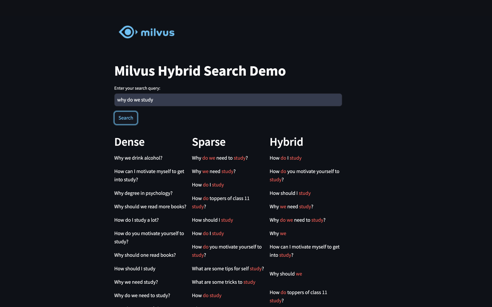

# Hybrid Semantic Search with Milvus

<div style="text-align: center;">
  <figure>
    
  </figure>
</div>

The Milvus Hybrid Search Demo uses the BGE-M3 model to provide advanced search results. Users can enter queries to receive Dense, Sparse, and Hybrid responses. Dense responses focus on the semantic context, while Sparse responses emphasize keyword matching. The Hybrid approach combines both methods, offering comprehensive results that capture both context and specific keywords. This demo highlights the effectiveness of integrating multiple retrieval strategies to enhance search result relevance with the balacne of both semantic and lexical similairty.

## Features
1. Embed the text as dense and sparse vectors.
2. Set up a Milvus collection to store the dense and sparse vectors.
3. Insert the data into Milvus.
4. Search and inspect the results.

## Quick Deploy

Follow these steps to quickly deploy the application locally:

### Preparation

> Prerequisites: Python 3.8 or higher

**1. Download Codes**

```bash
$ git clone <https://github.com/milvus-io/bootcamp.git>
$ cd bootcamp/bootcamp/tutorials/quickstart/app/hybrid_demo_with_milvus
```

**2. Installation**

Run the following commands to install the required libraries:

```bash
$ pip install -r requirements.txt
```

**3.Data Download**

Download the Quora Duplicate Questions dataset and place it in the same directory:

```bash
wget http://qim.fs.quoracdn.net/quora_duplicate_questions.tsv
```

Credit for the dataset: [First Quora Dataset Release: Question Pairs](https://quoradata.quora.com/First-Quora-Dataset-Release-Question-Pairs)

**4. Load Data and Create Embeddings**

Create a collection and load data from the downloaded dataset to get the knowledge ready by running the [index.py](/index.py).

```bash
$ python index.py
```

### Start Service

Run the Streamlit application:

```bash
$ streamlit run ui.py
```
