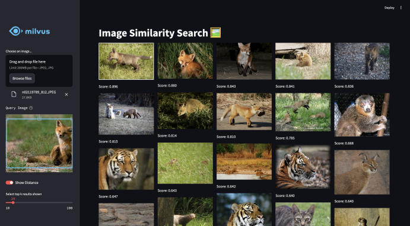
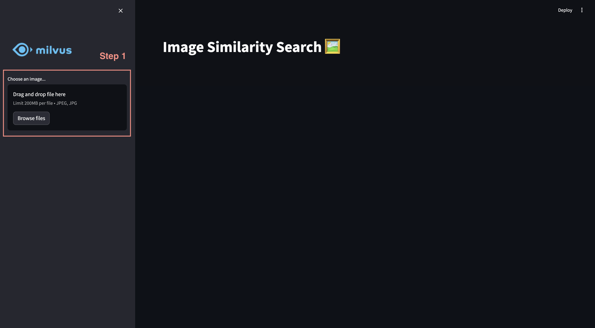
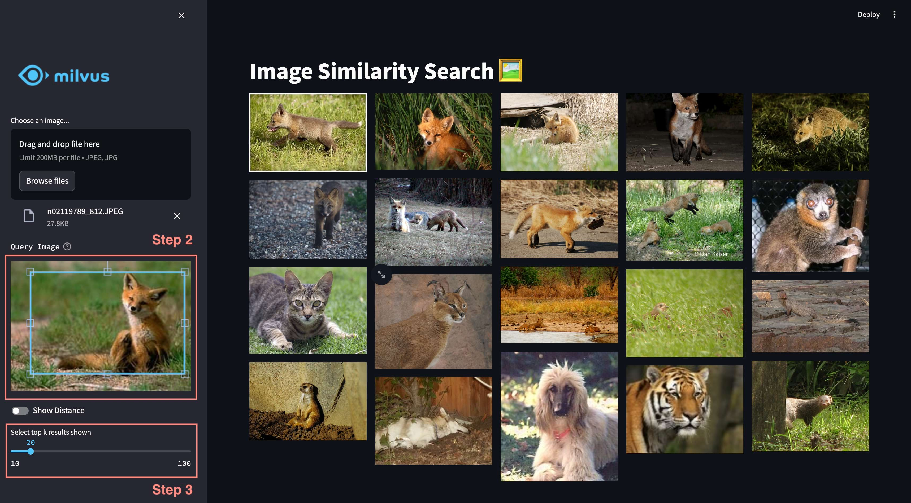
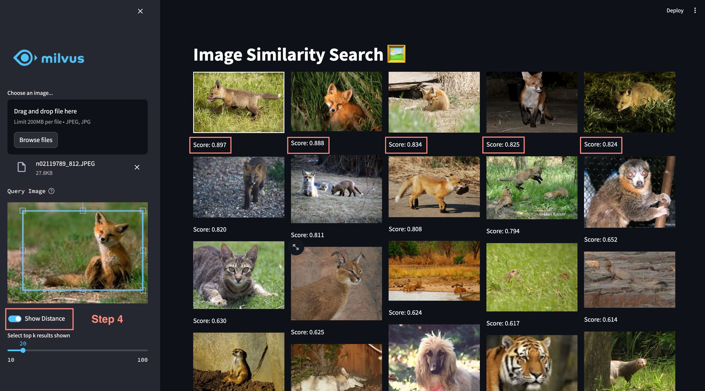

# Image Similarity Search with Milvus 🖼️

<div style="text-align: center;">
  <figure>
    
  </figure>
</div>

This demo implements an image similarity search application using Streamlit, Milvus, and a pre-trained ResNet model. Users can upload an image, crop it to focus on the region of interest, and search for similar images from a pre-built database.

## Features
- Upload and crop images to define the region of interest.
- Extract features using a pre-trained ResNet model.
- Search for similar images using Milvus for efficient similarity search.
- Display search results along with similarity scores.

## Quick Deploy

Follow these steps to quickly deploy the application locally:

### Preparation

> Prerequisites: Python 3.8 or higher

**1. Download Codes**
```bash
$ git clone https://github.com/milvus-io/bootcamp.git
$ cd bootcamp/bootcamp/tutorials/quickstart/app/image_search_with_milvus
```

**2. Set Environment**

- Install dependencies

  ```bash
  $ pip install -r requirements.txt
  ```

- Set environment variables

  Modify the environment file [.env](./.env) to change environment variables:

  ```
  MILVUS_ENDPOINT=./milvus_demo.db
  # MILVUS_TOKEN=************

  COLLECTION_NAME=my_image_collection
  ```

  - `MILVUS_ENDPOINT`: The URI to connect Milvus or Zilliz Cloud service. By default, we use a local file "./milvus_demo.db" for convenience, as it automatically utilizes [Milvus Lite](https://milvus.io/docs/milvus_lite.md) to store all data at local.
    > - If you have large scale of data, you can set up a more performant Milvus server on docker or kubernetes. In this setup, please use the server uri, e.g. http://localhost:19530, as your uri.
    > 
    > - If you want to use Zilliz Cloud, the fully managed cloud service for Milvus, adjust the uri and token, which correspond to the Public Endpoint and Api key in Zilliz Cloud.
  - `MILVUS_TOKEN`: This is optional. Uncomment this line to enter your password if authentication is required by your Milvus or Zilliz Cloud service.
  - `COLLECTION_NAME`: The collection name in Milvus database, defaults to "my_image_collection".
  - `MODEL_NAME`: The name of pretrained image embedding model, defaults to "resnet34".
  - `MODEL_DIM`: The embedding dimension, which should change according to the MODEL_NAME.

**3. Prepare Data**

We are using [a subset of ImageNet](https://github.com/milvus-io/pymilvus-assets/releases/download/imagedata/reverse_image_search.zip) for this demo, which includes approximately 200 categories with images of animals, objects, buildings, and more.<br>

```bash
$ wget https://github.com/milvus-io/pymilvus-assets/releases/download/imagedata/reverse_image_search.zip
$ unzip -q reverse_image_search.zip -d reverse_image_search
```

Create a collection named as the environment variable `COLLECTION_NAME` and load data from "reverse_image_search/train" to get the knowledge ready by running the [insert.py](./insert.py). Please note we will use the JPEG images only from the "reverse_image_search/train" to build the database. There will be about 1000 images.

```bash
$ python insert.py reverse_image_search/train
```

> **Note:** If the collection exists in the Milvus database, then it will be dropped first to create a new one.

### Start Service

Run the Streamlit application:

```bash
$ streamlit run app.py
```

### Example Usage

**Step 1:** Choose an image file to upload (JPEG format).
<div style="text-align: center;">
  <figure>
    
  </figure>
</div>

**Step 2:** Crop the image to focus on the region of interest.
**Step 3:** Set the desired number of top-k results to display using the slider.
<div style="text-align: center;">
  <figure>
    
  </figure>
</div>

**Step 4:** View the search results along with similarity scores.
<div style="text-align: center;">
  <figure>
    
  </figure>
</div>

## Code Structure

```text
./image_search_with_milvus
  ├── app.py
  ├── encoder.py
  ├── insert.py
  ├── milvus_utils.py
  ├── requirements.txt
```

- app.py: The main file to run application by Streamlit, where the user interface is defined and the image similarity search is performed.
- encoder.py: The image encoder is able to convert image to image embeddings using a pretrained model.
- insert.py: This script creates a Milvus collection and inserts images with corresponding embembeddings into the collection.
- milvus_utils.py: Includes functions for interacting with the Milvus database, such as setting up Milvus client.
