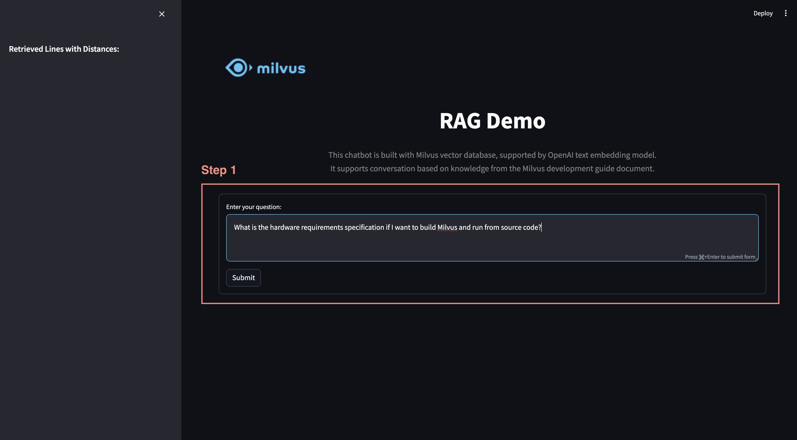
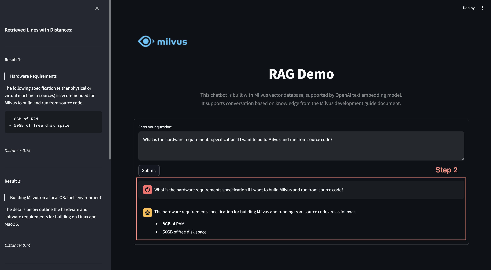
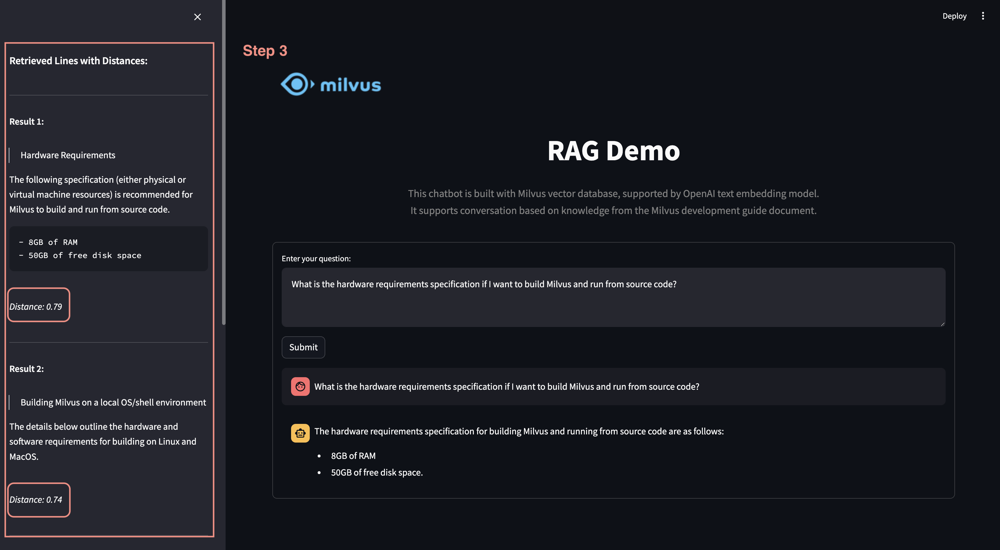

# Build RAG with Milvus

<div style="text-align: center;">
  <figure>
    
  </figure>
</div>

This demo shows you how to build a RAG (Retrieval-Augmented Generation) pipeline with Milvus.<br>

The RAG system combines a retrieval system with a generative model to generate new text based on a given prompt. The system first retrieves relevant documents from a corpus using Milvus, and then uses a generative model to generate new text based on the retrieved documents.

## Quick Deploy

Follow these steps to quickly deploy the application locally:

### Preparation

**1. Download Codes**
```bash
$ git clone <https://github.com/milvus-io/bootcamp.git>
$ cd bootcamp/bootcamp/tutorials/quickstart/app/rag_search_with_milvus
```

**2. Set Environment**
- Install dependencies

  ```bash
  $ pip install -r requirements.txt
  ```

- Set environment variables

  Modify the environment file [.env](./.env) to change environment variables:

  ```
  OPENAI_API_KEY=************
  MILVUS_ENDPOINT=./milvus_demo.db
  # MILVUS_TOKEN=************

  COLLECTION_NAME=my_rag_collection
  ```

  - `OPENAI_API_KEY`: We will use OpenAI for LLM capabilities. You need to prepare the [OpenAI API Key](https://help.openai.com/en/articles/4936850-where-do-i-find-my-openai-api-key).
  - `MILVUS_ENDPOINT`: The URI to connect Milvus or Zilliz Cloud service. By default, we use a local file "./milvus_demo.db" for convenience, as it automatically utilizes [Milvus Lite](https://milvus.io/docs/milvus_lite.md) to store all data at local.
    > - If you have large scale of data, you can set up a more performant Milvus server on docker or kubernetes. In this setup, please use the server uri, e.g. http://localhost:19530, as your uri.
    > 
    > - If you want to use Zilliz Cloud, the fully managed cloud service for Milvus, adjust the uri and token, which correspond to the Public Endpoint and Api key in Zilliz Cloud.
  - `MILVUS_TOKEN`: This is optional. Uncomment this line to enter your password if authentication is required by your Milvus or Zilliz Cloud service.
  - `COLLECTION_NAME`: The collection name in Milvus database, defaults to "my_rag_collection".
 

**3. Prepare Data**

This chatbot in the demo supports conversation based on knowledge from the [Official Documents of Milvus 2.4.x](https://github.com/milvus-io/milvus-docs/releases/download/v2.4.6-preview/milvus_docs_2.4.x_en.zip). <br>

Download example data and unzip documents to the folder "milvus_docs".

```bash
$ wget https://github.com/milvus-io/milvus-docs/releases/download/v2.4.6-preview/milvus_docs_2.4.x_en.zip
$ unzip -q milvus_docs_2.4.x_en.zip -d milvus_docs
```

You will get a directory of milvus documents containing markdown and json files. Please note that we will only use markdown files to build the knowledge in this demo. There are about 200+ documents and 4000+ chunks in total.

```
./milvus_docs
  ├── en
    ├── Variables.json
    ├── about
    │   ├── comparison.md
    │   ├── ...
    │   └── roadmap.md
    | ...
    └── userGuide
        ├── data-import
        │   ├── import-data.md
        │   └── prepare-source-data.md
        ├── enable-dynamic-field.md
        ├── ...

```

Create a collection named as the environment variable `COLLECTION_NAME` and load data from "milvus_docs/en" to get the knowledge ready by running the [insert.py](./insert.py).

```bash
$ python insert.py milvus_docs/en
```

> **Note:** If the collection exists in the Milvus database, then it will be dropped first to create a new one.

### Start Service

Run the Streamlit application:

```bash
$ streamlit run app.py
```

**Optional: Deploy with Docker Image**

You are also able to deploy the application using the docker image:

```bash
$ docker run -itd \
  -p 5005:5005 \
  -e ZILLIZ_URI="YOUR_MILVUS_OR_ZILLIZ_ENDPOINT" \
  -e ZILLIZ_TOKEN="YOUR_MILVUS_OR_ZILLIZ_TOKEN" \
  -e OPENAI_API_KEY="YOUR_OPENAI_API_KEY" \
  towhee/milvus_rag:v0.1
```

With the service up, you should be able to visit it in browser with http://localhost:5005

### Example Usage

**Step 1:** Enter your question in the chat and click on 'submit' button.
<div style="text-align: center;">
  <figure>
    
  </figure>
</div>

**Step 2:** Response generated by LLM based on the prompt.
<div style="text-align: center;">
  <figure>
    
  </figure>
</div>

**Step 3:** Top 3 retrieved original quotes from text data are listed on the left along with their distances, indicating how related the quote and the prompt are.
<div style="text-align: center;">
  <figure>
    
  </figure>
</div>

## Code Structure
```
./image_search_with_milvus
  ├── app.py
  ├── encoder.py
  ├── insert.py
  ├── milvus_utils.py
  └── requirements.txt
```

- **app.py:** The main file to run application by Streamlit, where the user interface is defined and the RAG chatbot is presented.
- **encoder.py:** The text encoder is able to convert text inputs to text embeddings using a pretrained model.
- **insert.py:** This script creates collection and inserts document chunks with embeddings into the collection.
- **milvus_utils.py:** Functions to interact with the Milvus database, such as creating collection and retrieving search results. 
 
