# How to Enhance the Performance of Your RAG Pipeline

With the increasing popularity of Retrieval Augmented Generation ([RAG](https://zilliz.com/learn/Retrieval-Augmented-Generation)) applications, there is a growing concern about improving their performance. This article presents all possible ways to optimize RAG pipelines and provides corresponding illustrations to help you quickly understand the mainstream RAG optimization strategies. 

It's important to note that we'll only provide a high-level exploration of these strategies and techniques, focusing on how they integrate into a RAG system. However, we won't delve into intricate details or guide you through step-by-step implementation.

## A Standard RAG Pipeline

The diagram below shows the most straightforward vanilla RAG pipeline. First, document chunks are loaded into a vector store (such as [Milvus](https://milvus.io/docs) or [Zilliz cloud](https://zilliz.com/cloud)). Then, the vector store retrieves the Top-K most relevant chunks related to the query. These relevant chunks are then injected into the [LLM](https://zilliz.com/glossary/large-language-models-\(llms\))'s context prompt, and finally, the LLM returns the final answer. 

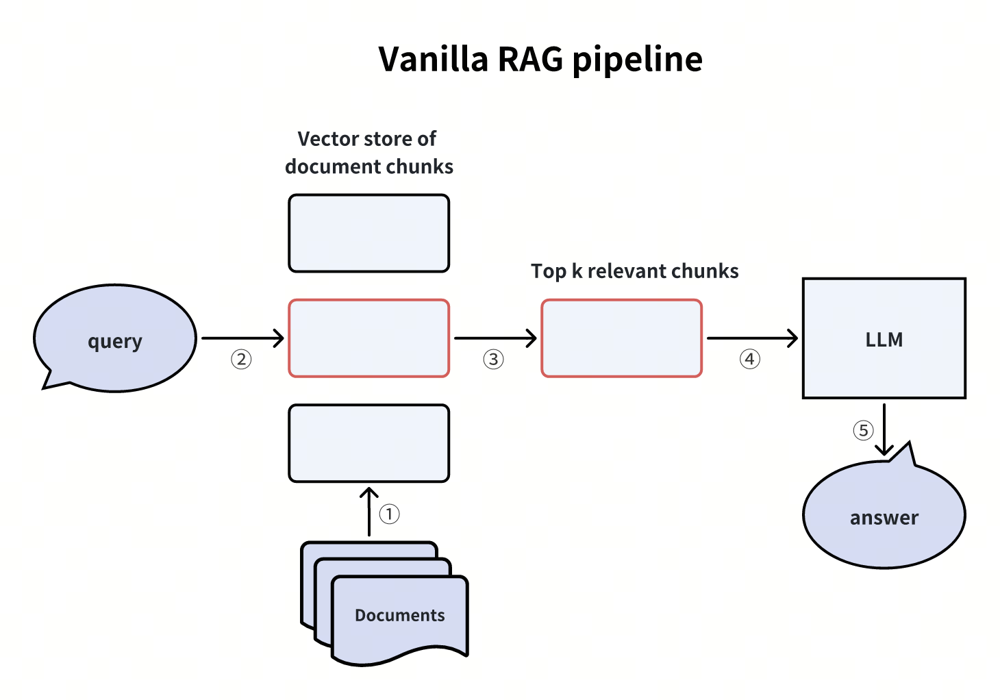

## Various Types of RAG Enhancement Techniques 

We can classify different RAG enhancement approaches based on their roles in the RAG pipeline stages.

* **Query Enhancement**: Modifying and manipulating the query process of the RAG input to better express or process the query intent.  
* **Indexing Enhancement**: Optimizing the creation of chunking indexes using techniques such as multi-chunking, step-wise indexing, or multi-way indexing.  
* **Retriever Enhancement**: Applying optimization techniques and strategies during the retrieval process.  
* **Generator Enhancement**: Adjusting and optimizing prompts when assembling prompts for the LLM to provide better responses.  
* **RAG Pipeline Enhancement**: Dynamically switching processes within the entire RAG pipeline, including using agents or tools to optimize key steps in the RAG pipeline.

Next, we will introduce specific methods under each of these categories.

## Query Enhancement

Let's explore four effective methods to enhance your query experience: Hypothetical Questions, Hypothetical Document Embeddings, Sub-Queries, and Stepback Prompts.

### Creating Hypothetical Questions 

Creating hypothetical questions involves utilizing an LLM to generate multiple questions that users might ask about the content within each document chunk. Before the user's actual query reaches the LLM, the vector store retrieves the most relevant hypothetical questions related to the real query, along with their corresponding document chunks, and forwards them to the LLM.

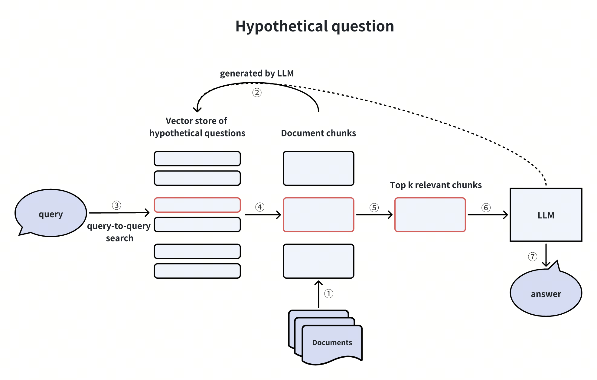

This methodology bypasses the cross-domain asymmetry problem in the vector search process by directly engaging in query-to-query searches, alleviating the burden on vector searches. However, it introduces additional overhead and uncertainty in generating hypothetical questions.

### HyDE (Hypothetical Document Embeddings)

HyDE stands for Hypothetical Document Embeddings. It leverages an LLM to craft a "***Hypothetical Document***" or a ***fake*** answer in response to a user query devoid of contextual information. This fake answer is then converted into vector embeddings and employed to query the most relevant document chunks within a vector database. Subsequently, the vector database retrieves the Top-K most relevant document chunks and transmits them to the LLM and the original user query to generate the final answer.

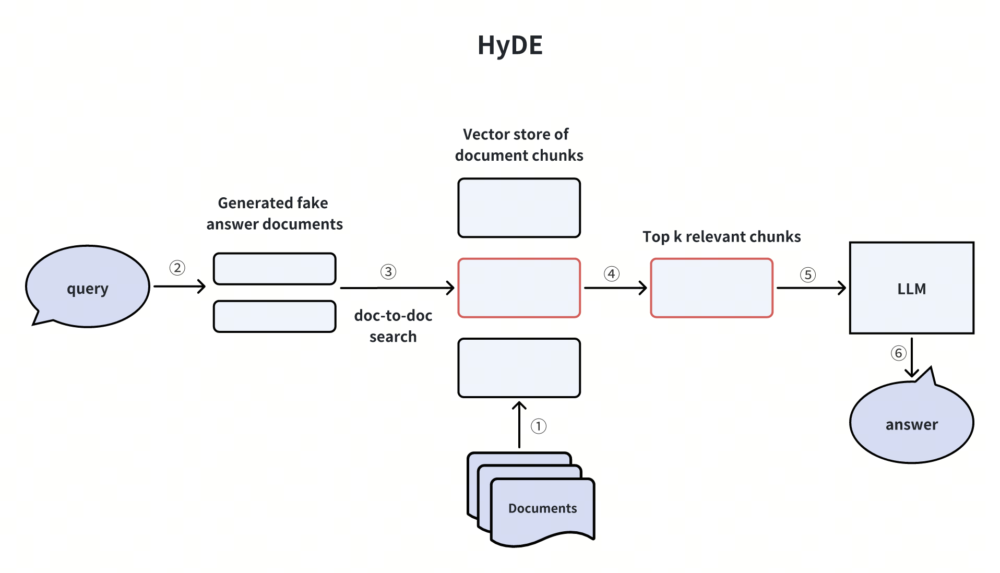

This method is similar to the hypothetical question technique in addressing cross-domain asymmetry in vector searches. However, it also has drawbacks, such as the added computational costs and uncertainties of generating fake answers.

For more information, refer to the [HyDE](https://arxiv.org/abs/2212.10496) paper. 

### Creating Sub-Queries

When a user query is too complicated, we can use an LLM to break it down into simpler sub-queries before passing them on to the vector database and the LLM. Let's take a look at an example. 

Imagine a user asking: "***What are the differences in features between Milvus and Zilliz Cloud?***" This question is quite complex and might not have a straightforward answer in our knowledge base. To tackle this issue, we can split it into two simpler sub-queries:

* Sub-query 1: "What are the features of Milvus?"  
* Sub-query 2: "What are the features of Zilliz Cloud?"

Once we have these sub-queries, we send them all to the vector database after converting them into vector embeddings. The vector database then finds the Top-K document chunks most relevant to each sub-query. Finally, the LLM uses this information to generate a better answer.

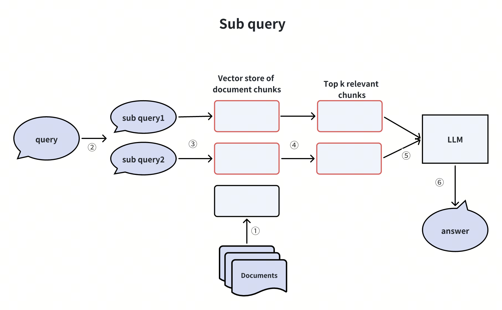

By breaking down the user query into sub-queries, we make it easier for our system to find relevant information and provide accurate answers, even to complex questions.

### Creating Stepback Prompts 

Another way to simplify complex user queries is by creating ***stepback prompts***. This technique involves abstracting complicated user queries into **"*stepback questions*"** using an LLM. Then, a vector database uses these stepback questions to retrieve the most relevant document chunks. Finally, the LLM generates a more accurate answer based on these retrieved document chunks.

Let's illustrate this technique with an example. Consider the following query, which is quite complex and not straightforward to answer directly:

***Original User Query: "I have a dataset with 10 billion records and want to store it in Milvus for querying. Is it possible?"***

To simplify this user query, we can use an LLM to generate a more straightforward stepback question:

***Stepback Question: "What is the dataset size limit that Milvus can handle?"***

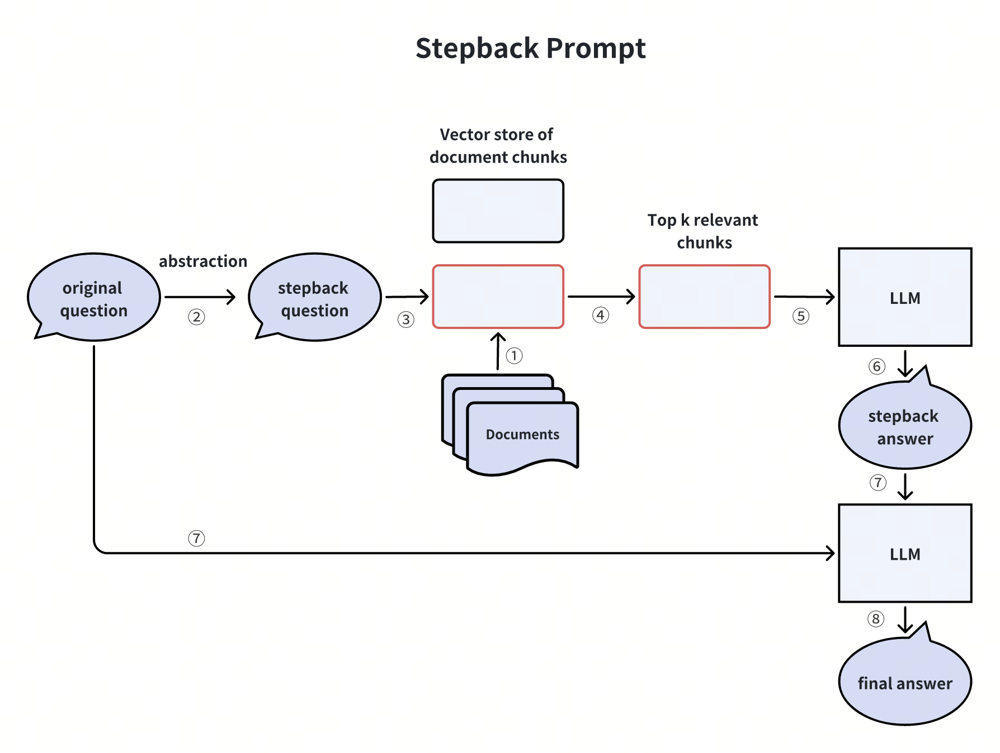

This method can help us get better and more accurate answers to complex queries. It breaks down the original question into a simpler form, making it easier for our system to find relevant information and provide accurate responses.

## Indexing Enhancement

Enhancing indexing is another strategy for enhancing the performance of your RAG applications. Let’s explore three indexing enhancement techniques. 

### Merging Document Chunks Automatically 

When building an index, we can employ two granularity levels: child chunks and their corresponding parent chunks. Initially, we search for child chunks at a finer level of detail. Then, we apply a merging strategy: if a specific number, ***n***, of child chunks from the first ***k*** child chunks belong to the same parent chunk, we provide this parent chunk to the LLM as contextual information. 

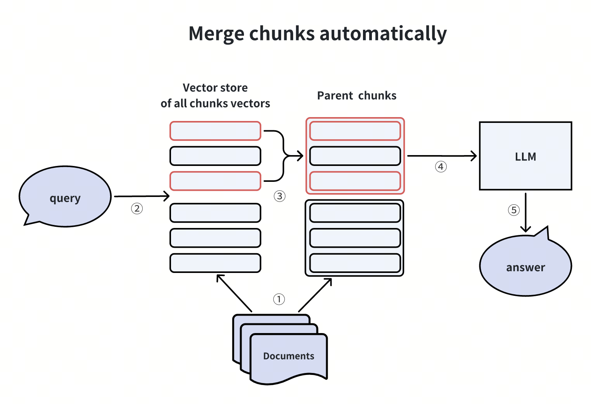

This methodology has been implemented in [LlamaIndex](https://docs.llamaindex.ai/en/stable/examples/retrievers/recursive_retriever_nodes.html).

### Constructing Hierarchical Indices

When creating indices for documents, we can establish a two-level index: one for document summaries and another for document chunks. The vector search process comprises two stages: initially, we filter relevant documents based on the summary, and subsequently, we retrieve corresponding document chunks exclusively within these relevant documents.

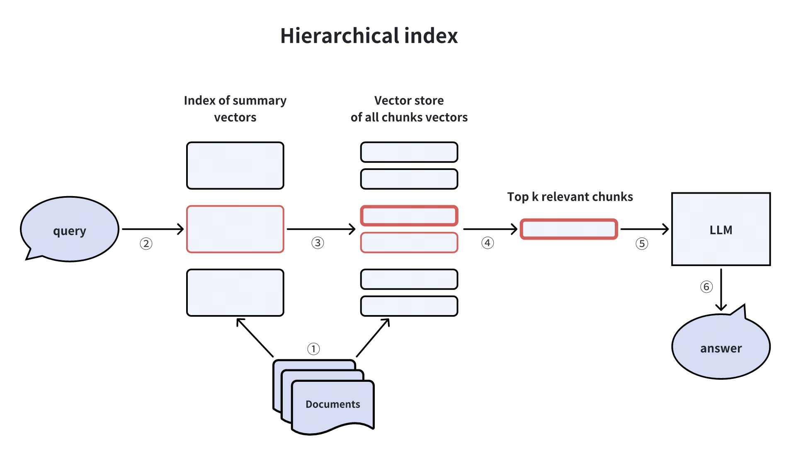

This approach proves beneficial in situations involving extensive data volumes or instances where data is hierarchical, such as content retrieval within a library collection.

### Hybrid Retrieval and Reranking

The Hybrid Retrieval and Reranking technique integrates one or more supplementary retrieval methods with [vector similarity retrieval](https://zilliz.com/learn/vector-similarity-search). Then, a [reranker](https://zilliz.com/learn/optimize-rag-with-rerankers-the-role-and-tradeoffs#What-is-a-Reranker) reranks the retrieved results based on their relevancy to the user query. 

Common supplementary retrieval algorithms include lexical frequency-based methods like [BM25](https://milvus.io/docs/embed-with-bm25.md) or big models utilizing sparse embeddings like [Splade](https://zilliz.com/learn/discover-splade-revolutionize-sparse-data-processing). Re-ranking algorithms include RRF or more sophisticated models such as [Cross-Encoder](https://www.sbert.net/examples/applications/cross-encoder/README.html), which resembles BERT-like architectures.

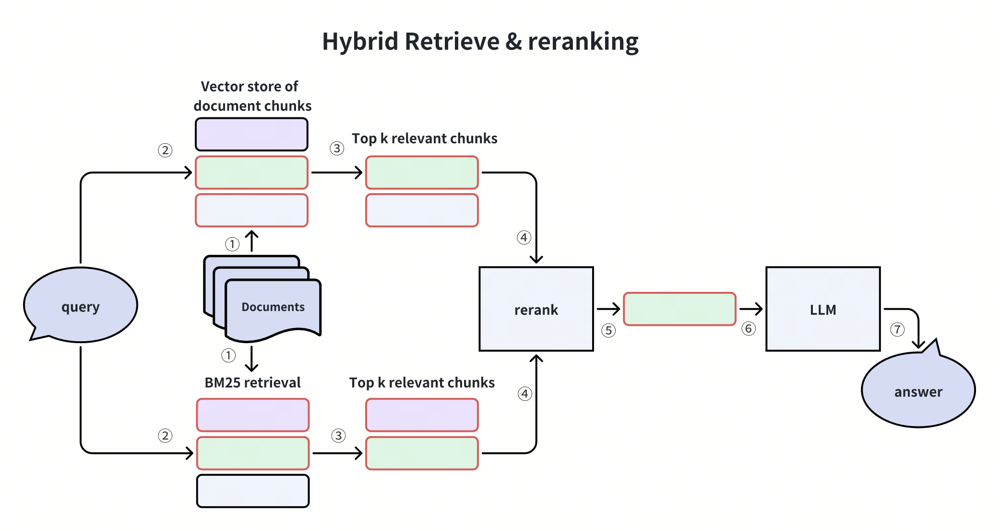

This approach leverages diverse retrieval methods to improve retrieval quality and address potential gaps in vector recall.

## Retriever Enhancement

Refinement of the retriever component within the RAG system can also improve RAG applications. Let's explore some effective methods for enhancing the retriever. 

### Sentence Window Retrieval

In a basic RAG system, the document chunk given to the LLM is a larger window encompassing the retrieved embedding chunk. This ensures that the information provided to the LLM includes a broader range of contextual details, minimizing information loss. The Sentence Window Retrieval technique decouples the document chunk used for embedding retrieval from the chunk provided to the LLM. 

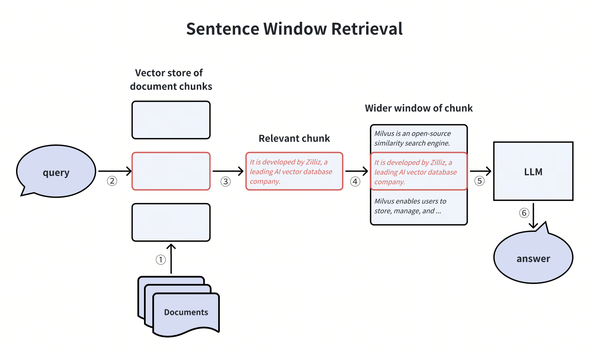

However, expanding the window size may introduce additional interfering information. We can adjust the size of the window expansion based on the specific business needs.

### Meta-data Filtering

To ensure more precise answers, we can refine the retrieved documents by filtering metadata like time and category before passing them to the LLM. For instance, if financial reports spanning multiple years are retrieved, filtering based on the desired year will refine the information to meet specific requirements. This method proves effective in situations with extensive data and detailed metadata, such as content retrieval in library collections.

## Generator Enhancement

Let’s explore more RAG optimizing techniques by improving the generator within a RAG system. 

### Compressing the LLM prompt 

The noise information within retrieved document chunks can significantly impact the accuracy of RAG's final answer. The limited prompt window in LLMs also presents a hurdle for more accurate answers. To address this challenge, we can compress irrelevant details, emphasize key paragraphs, and reduce the overall context length of retrieved document chunks. 

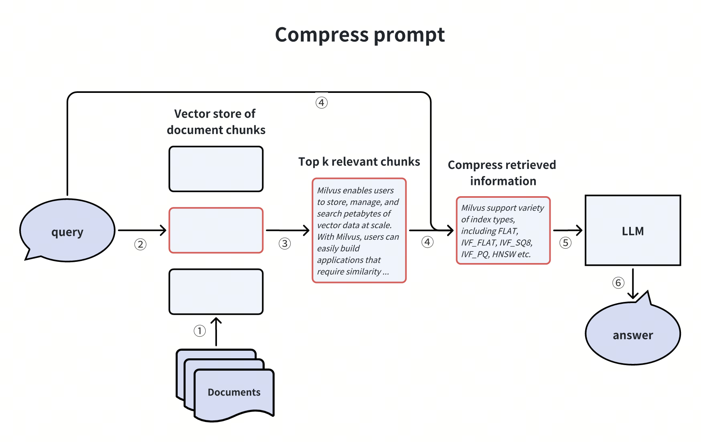

This approach is similar to the earlier discussed hybrid retrieval and reranking method, wherein a reranker is utilized to sift out irrelevant document chunks.

### Adjusting the chunk order in the prompt

In the paper "[Lost in the middle](https://arxiv.org/abs/2307.03172)," researchers observed that LLMs often overlook information in the middle of given documents during the reasoning process. Instead, they tend to rely more on the information presented at the beginning and end of the documents. 

Based on this observation, we can adjust the order of retrieved chunks to improve the answer quality: when retrieving multiple knowledge chunks, chunks with relatively low confidence are placed in the middle, and chunks with relatively high confidence are positioned at both ends. 

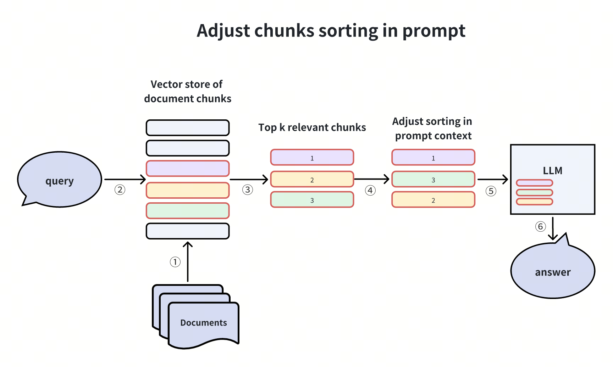

## RAG Pipeline Enhancement

We can also improve the performance of your RAG applications by enhancing the whole RAG pipeline. 

### Self-reflection

This approach incorporates the concept of self-reflection within AI agents. Then, how does this technique work? 

Some initially retrieved Top-K document chunks are ambiguous and may not answer the user question directly. In such cases, we can conduct a second round of reflection to verify whether these chunks can genuinely address the query. 

We can conduct the reflection using efficient reflection methods such as Natural Language Inference(NLI) models or additional tools like internet searches for verification. 

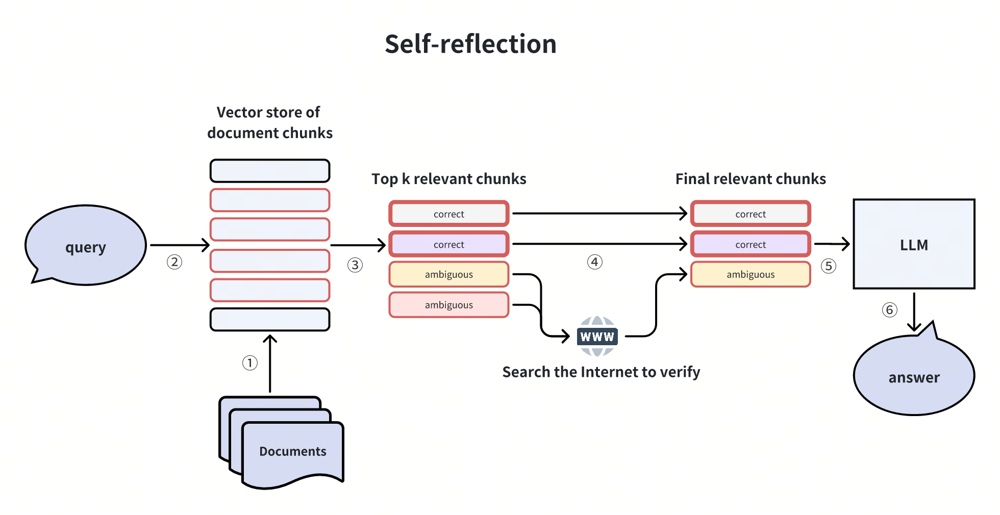

This concept of self-reflection has been explored in several papers or projects, including [Self-RAG](https://arxiv.org/pdf/2310.11511.pdf), [Corrective RAG](https://arxiv.org/pdf/2401.15884.pdf), [LangGraph](https://github.com/langchain-ai/langgraph/blob/main/examples/reflexion/reflexion.ipynb), etc. 

### Query Routing with an Agent 

Sometimes, we don’t have to use a RAG system to answer simple questions as it might result in more misunderstanding and inference from misleading information. In such cases, we can use an agent as a router at the querying stage. This agent assesses whether the query needs to go through the RAG pipeline. If it does, the subsequent RAG pipeline is initiated; otherwise, the LLM directly addresses the query. 

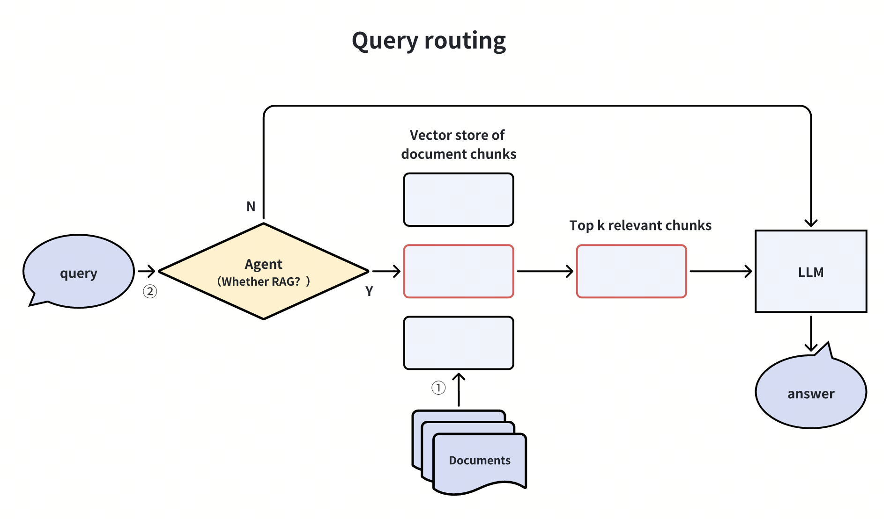
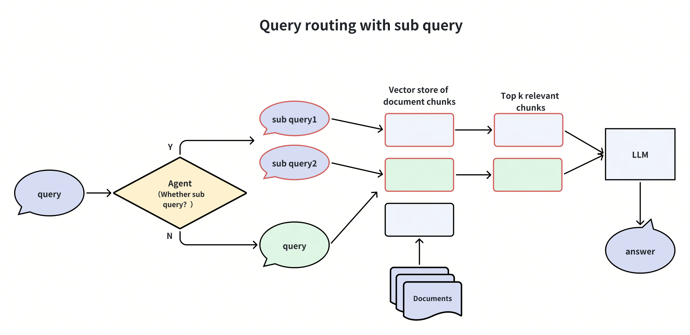

The agent could take various forms, including an LLM, a small classification model, or even a set of rules. 

By routing queries based on user intent, you can redirect a portion of the queries, leading to a significant boost in response time and a noticeable reduction in unnecessary noise. 

We can extend the query routing technique to other processes within the RAG system, such as determining when to utilize tools like web searches, conducting sub-queries, or searching for images. This approach ensures that each step in the RAG system is optimized based on the specific requirements of the query, leading to more efficient and accurate information retrieval.

## Summary

While a vanilla RAG pipeline may appear simple, achieving optimal business performance often requires more sophisticated optimization techniques. 

This article summarizes various popular approaches to enhancing the performance of your RAG applications. We also provided clear illustrations to help you quickly understand these concepts and techniques and expedite their implementation and optimization. 

You can get the simple implementations of the major approaches listed in this article at this [GitHub link](https://github.com/milvus-io/bootcamp/tree/master/bootcamp/RAG/advanced_rag).

