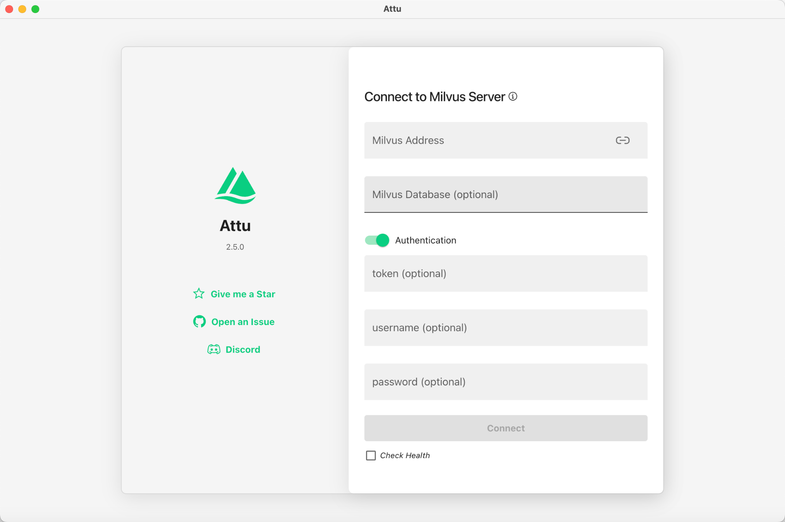
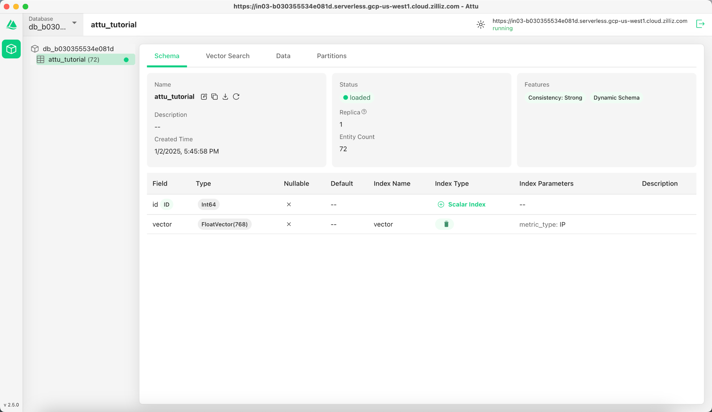
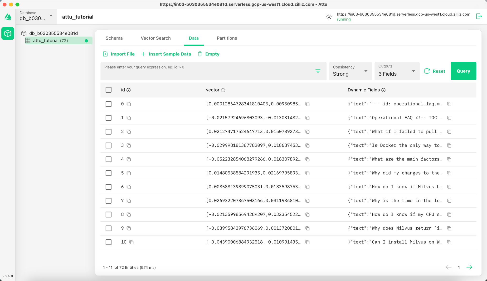
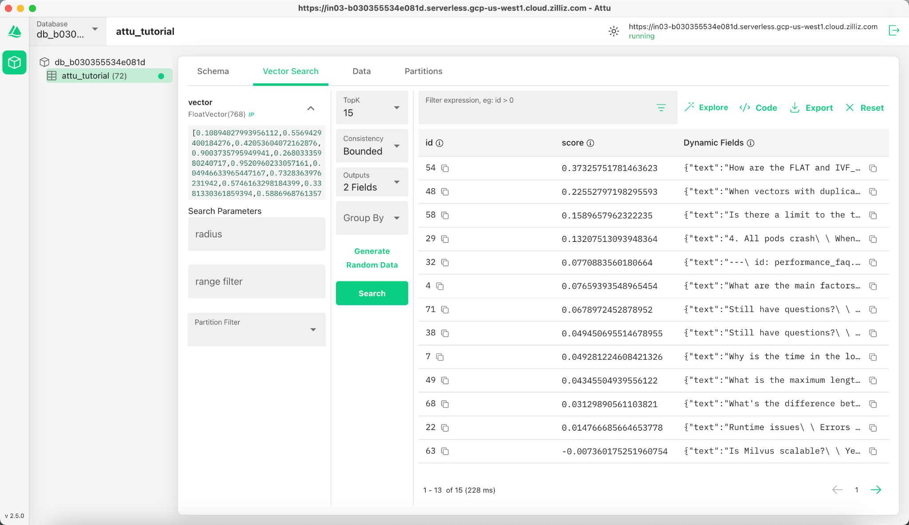
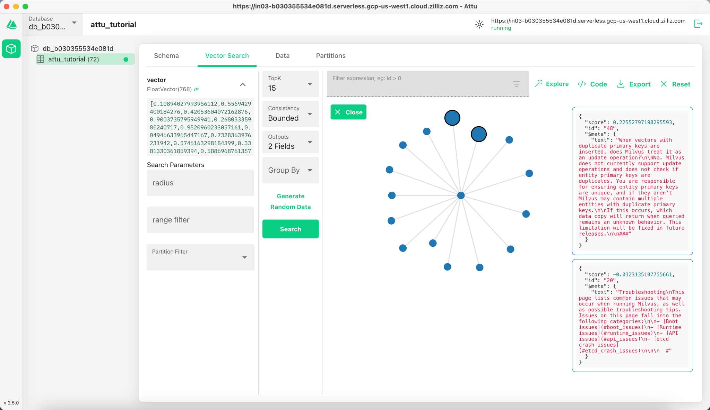
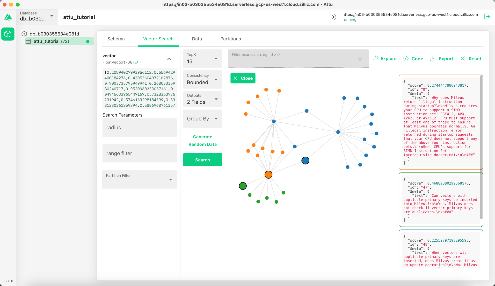

# Quick Start with Attu Desktop

## 1. Introduction
[Attu](https://github.com/zilliztech/attu) is an all-in-one, open-source administration tool for Milvus. It features an intuitive graphical user interface (GUI), allowing you to easily interact with your databases. With just a few clicks, you can visualize your cluster status, manage metadata, perform data queries, and much more.


---

## 2. Install Desktop Application
Download the desktop version of Attu by visiting the [Attu GitHub Releases page](https://github.com/zilliztech/attu/releases). Select the appropriate version for your operating system and follow the installation steps.

### Note for macOS (M series chip):
If you encounter the error:
```
attu.app is damaged and cannot be opened.
```
Run the following command in terminal to bypass this issue:
```
sudo xattr -rd com.apple.quarantine /Applications/attu.app
```

---
## 3. Connect to Milvus
Attu supports connecting to both **Milvus Standalone** and **Zilliz Cloud**, providing flexibility to work with local or cloud-hosted databases.

To use Milvus Standalone locally:
1. Start Milvus Standalone by following the [Milvus installation guide](https://milvus.io/docs/install_standalone-docker.md).
2. Open Attu and enter the connection information:
   - Milvus Address: Your Milvus Standalone server URI, e.g. http://localhost:19530
   - Other optional settings: You can set them depending on your Milvus configurations or just leave them as default.
3. Click Connect to access your database.
> You can also connect the fully managed Milvus on [Zilliz Cloud](https://zilliz.com/cloud). Simply set the `Milvus Address` and `token` to the [Public Endpoint and API key](https://docs.zilliz.com/docs/on-zilliz-cloud-console#cluster-details) of your Zilliz Cloud instance.

4. Click  to access your database.

<p align="center">
  
</p>

---

## 4. Prepare Data, Create Collection, and Insert Data

### 4.1 Prepare the Data
We use the FAQ pages from the [Milvus Documentation 2.4.x](https://github.com/milvus-io/milvus-docs/releases/download/v2.4.6-preview/milvus_docs_2.4.x_en.zip) as the dataset for this example.

#### Download and Extract Data:
```bash
wget https://github.com/milvus-io/milvus-docs/releases/download/v2.4.6-preview/milvus_docs_2.4.x_en.zip
unzip -q milvus_docs_2.4.x_en.zip -d milvus_docs
```

#### Process Markdown Files:
```python
from glob import glob

text_lines = []
for file_path in glob("milvus_docs/en/faq/*.md", recursive=True):
    with open(file_path, "r") as file:
        file_text = file.read()
    text_lines += file_text.split("# ")
```

---

### 4.2 Generate Embeddings
Define a embedding model to generate text embeddings using the `milvus_model`. We use the `DefaultEmbeddingFunction` model as an example, which is a pre-trained and lightweight embedding model.
```python
from pymilvus import model as milvus_model

embedding_model = milvus_model.DefaultEmbeddingFunction()

# Generate test embedding
test_embedding = embedding_model.encode_queries(["This is a test"])[0]
embedding_dim = len(test_embedding)
print(embedding_dim)
print(test_embedding[:10])
```
#### Output:
```
768
[-0.04836066  0.07163023 -0.01130064 -0.03789345 -0.03320649 -0.01318448
 -0.03041712 -0.02269499 -0.02317863 -0.00426028]
```
---

### 4.3 Create Collection
Connect to Milvus and create a collection:
```python
from pymilvus import MilvusClient

# Connect to Milvus Standalone
client = MilvusClient(uri="http://localhost:19530")

collection_name = "attu_tutorial"

# Drop collection if it exists
if client.has_collection(collection_name):
    client.drop_collection(collection_name)

# Create a new collection
client.create_collection(
    collection_name=collection_name,
    dimension=embedding_dim,
    metric_type="IP",  # Inner product distance
    consistency_level="Strong"
)
```

---

### 4.4 Insert Data
Iterate through the text lines, create embeddings, and insert the data into Milvus:
```python
from tqdm import tqdm

data = []
doc_embeddings = embedding_model.encode_documents(text_lines)

for i, line in enumerate(tqdm(text_lines, desc="Creating embeddings")):
    data.append({"id": i, "vector": doc_embeddings[i], "text": line})

client.insert(collection_name=collection_name, data=data)
```
---

### 4.5 Visualize Data and Schema

Now we can visualize the data schema and inserted entities using Attu's interface. The schema displays defined fields, including an `id` field of type `Int64` and a `vector` field of type `FloatVector(768)` with an `Inner Product (IP)` metric. The collection is loaded with **72 entities**. 

Additionally, we can view the inserted data, including ID, vector embeddings, and dynamic fields storing metadata such as text content. The interface supports filtering and querying based on specified conditions or dynamic fields.
<p align="center">
  
  
</p>


## 5. Visualizing Search Results and Relationships

Attu provides a powerful interface for visualizing and exploring data relationships. To examine the inserted data points and their similarity relationships, follow these steps:

### 5.1 **Perform a Search**  
Navigate to the **Vector Search** tab in Attu.  
1. Click on the **Generate Random Data** button to create test queries.  
2. Click **Search** to retrieve results based on the generated data.  

The results are displayed in a table, showing IDs, similarity scores, and dynamic fields for each matching entity.  

<p align="center">
  
</p>

---

### 5.2 **Explore Data Relationships**  
Click the **Explore** button in the results panel to visualize the relationships between the query vector and the search results in a **knowledge graph-like structure**.  

- The **central node** represents the search vector.  
- The **connected nodes** represent the search results, clicking them will display the detailed information of the corresponding node.

<p align="center">
  
</p>

---

### 5.3 **Expand the Graph**  
Double-click on any result node to expand its connections. This action reveals additional relationships between the selected node and other data points in the collection, creating a **larger, interconnected knowledge graph**.  

This expanded view allows for deeper exploration of how data points are related, based on vector similarity.

<p align="center">
  
</p>

---

## 6. Conclusion

Attu simplifies the management and visualization of vector data stored in Milvus. From data insertion to query execution and interactive exploration, it provides an intuitive interface for handling complex vector search tasks. With features like dynamic schema support, graphical search visualizations, and flexible query filters, Attu empowers users to analyze large-scale datasets effectively.

By leveraging Attu’s visual exploration tools, users can better understand their data, identify hidden relationships, and make data-driven decisions. Start exploring your own datasets today with Attu and Milvus!


---


