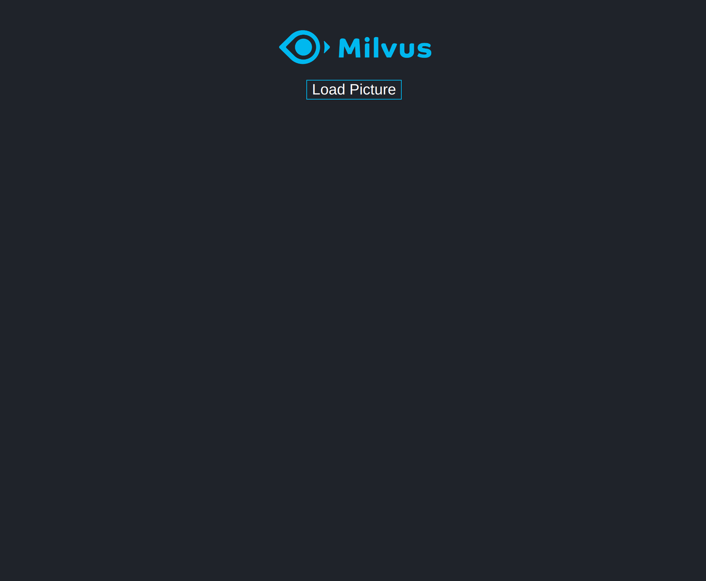
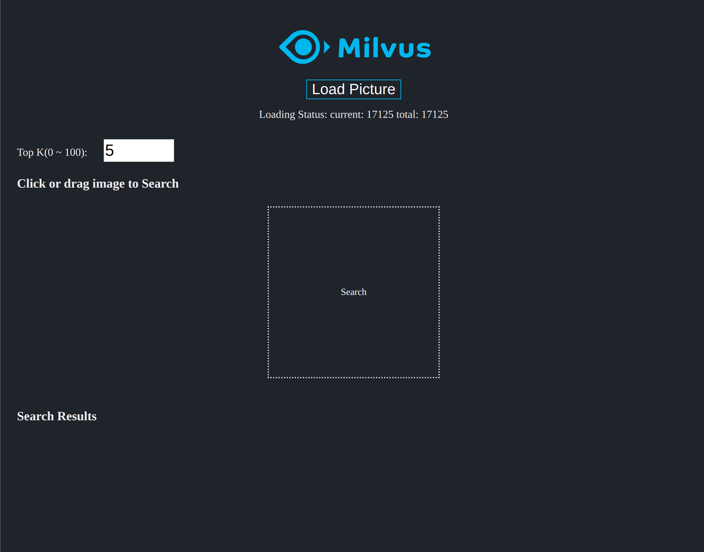

# 基于 Milvus 和 VGG 实现以图搜图

本文展示如何利用图片特征提取模型 VGG 和向量搜索引擎 Milvus 搭建一个以图搜图的demo系统。

系统架构图如下所示：


### 数据来源

本次测试使用的图片数据集为 PASCAL VOC 图片集，包含 17125 张图片，涵盖 20 个目录：人类；动物（鸟、猫、牛、狗、马、羊）；交通工具（飞机、自行车、船、公共汽车、小轿车、摩托车、火车）；室内（瓶子、椅子、餐桌、盆栽植物、沙发、电视）。

数据集大小：~2GB

下载地址：http://host.robots.ox.ac.uk/pascal/VOC/voc2012/VOCtrainval_11-May-2012.tar

> 说明：您也可以使用其他的图片数据进行测试。经过测试，可以进行加载的图片格式有.jpg格式、.png格式。

### 部署流程

##### 1、启动 Milvus docker

本实验建议使用 Milvus0.5.3 版本，启动方法参考链接：https://github.com/milvus-io/docs/blob/0.5.3/userguide/install_milvus.md

##### 2、启动 pic_search_demo docker

```bash
$ docker run -d --rm --gpus all --name zilliz_search_images_demo \
-v /your/data/path:/tmp/images-data \
-p 35000:5000 \
-e "DATA_PATH=/tmp/images-data" \
-e "MILVUS_HOST=192.168.1.85" \
chenglong555/pic_search_demo:0.2.0
```

上述启动命令中，“ /your/data/path ” 表示你存放图片数据的目录，“ MILVUS_HOST “ 表示启动 Milvus docker 的服务器地址，命令其他部分保持不变即可。

##### 3、启动 pic_search_demo_web docker

```bash
$ docker run -d  -p 80:80 \
-e API_URL=http://192.168.1.85:35000/api/v1 \
chenglong555/pic_search_demo_web:0.1.0
```

上述启动命令中，" 192.168.1.85 " 表示启动 Milvus docker 的服务器地址。

### 界面展示

按照上述部署流程部署完成之后，在浏览器输入 " localhost " 就可以访问以图搜图的界面了。



进行第一次搜索之前，需要点击 “ Load Picture " 的按钮将图片数据转换成 512 维的向量加载到 Milvus，加载完一次之后，以后查询就可以不用加载了，加载完成之后的搜索界面下图所示：



> 加载过程中会在界面上端显示加载进度，如果没有显示，刷新一下网页即可看到。

选择一张图片进行搜索：


经实测，在如下机器配置下，整个 demo 系统的端到端查询时间可以达到 1 秒以内。


 		 				
