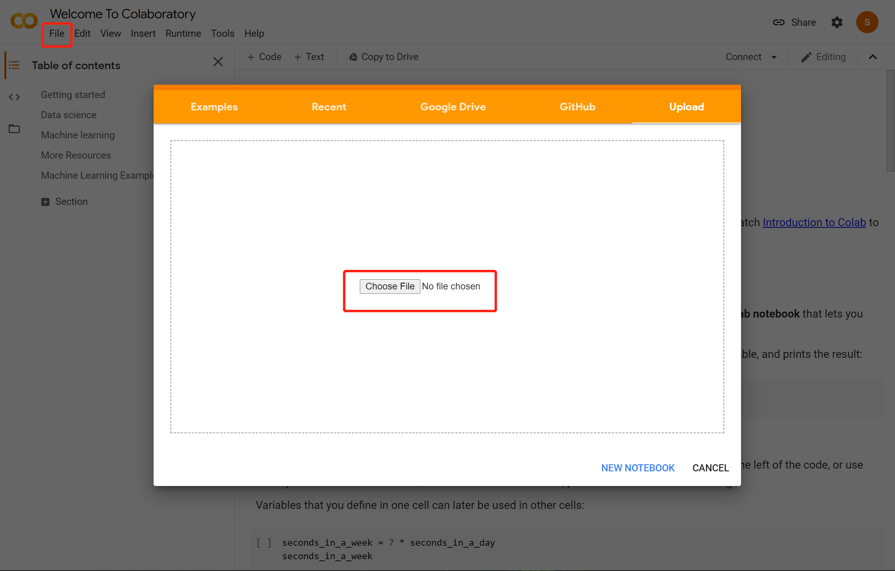
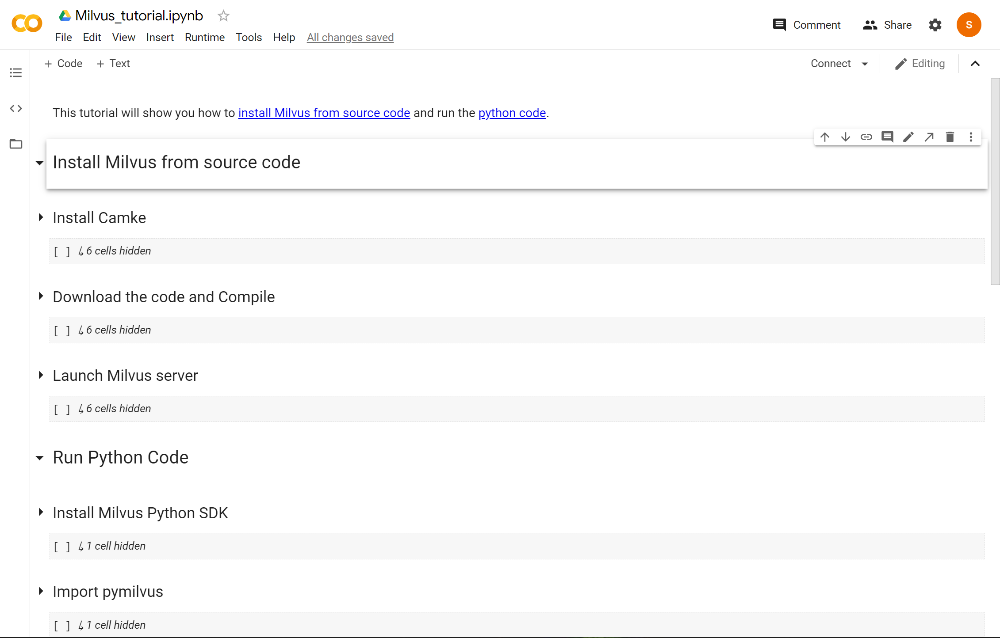

# How to set up Milvus in Google Colaboratory


This tutorial will show you how to [install Milvus v1.1 from source code](https://github.com/milvus-io/milvus/blob/1.1/INSTALL.md#build-from-source) and run the [python code](https://github.com/milvus-io/pymilvus/tree/1.1) on Google Colab.

**1. Download the [notebook](./milvus_tutorial.ipynb)**

   ```bash
$ wget https://raw.githubusercontent.com/shiyu22/bootcamp/new-bootcamp/deployments/google_colab/Milvus_tutorial.ipynb
   ```

**2. Start [Google Colab](https://colab.research.google.com/) and upload the notebook**



**3. Run the code**

   
