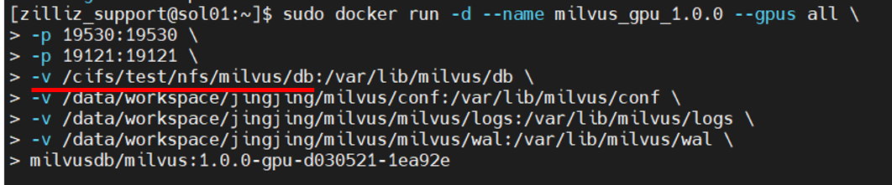
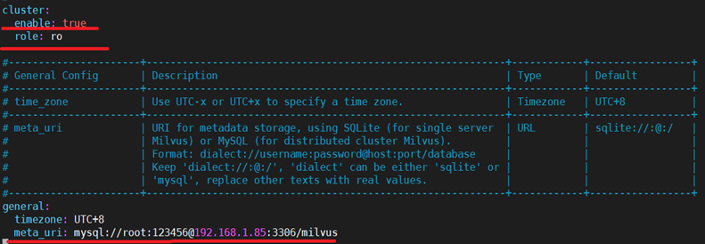

# Using Nginx to load balance Milvus

This example shows how to implement load balancing for Milvus using Nginx. The most common function of Nginx is server load balancing configuration, which is achieved by distributing requests to multiple Milvus using Nginx to distribute different requests.

## Preparation

This example requires at least two devices and a **shared storage device**, based on the 1.0 version of Milvus' build

1、Nginx 1.18.0

2、At least two or more Milvus read nodes and one Milvus write node

## Implementation

### 一、Nginx Install

1.First, download the software package from the [Nginx website](http://nginx.org/en/download.html) and decompress it.

```
wget http://nginx.org/download/nginx-1.18.0.tar.gz
tar -zxvf nginx-1.18.0.tar.gz
cd nginx-1.18.0
```

2.After entering the unpacked software directory, you need to install the dependent libraries

```
#Update source
sudo apt-get update

#Install C++ dependency libraries
sudo apt-get install build-essential
sudo apt-get install libtool

#Install openssl dependencies
sudo apt-get install openssl

#Install pcre dependency library
sudo apt-get install libpcre3 libpcre3-dev

#Installing zlib dependencies
sudo apt-get install zlib1g-dev 
```

3、Before compiling, you need to configure and install nginx to the **/usr/local/ngnix** directory

```
./configure --prefix=/usr/local/nginx
```

 *Note: --prefix: Configure the installation directory*

4、Compile and install, and switch to Root if you don't have permission

```
su root
make  #Compile
make install #Install
```

5、Start nginx with the following command, and then test if ngnix is installed successfully

```
/usr/local/nginx/sbin/nginx 
```

Check if there is nginx process started, if there is process started, it means the installation is successful

```
ps -ef | grep nginx
```

You can also input *<localhost(local IP address):port(default port is 80)>* in your browser, and you will see welcome to nginx as a successful installation.


## 二、Milvus Configuration

1. The version of Milvus in this example is 1.0, refer to [Milvus official website](https://milvus.io/cn/docs/v1.0.0/milvus_docker-gpu.md) for installation details, you need to set the path of all device data storage to the shared storage path during installation. As shown in the figure below



 **/cifs/test/nfs/milvus/db** is the path to shared storage

2. Then [Use Mysql to manage metadata](https://www.milvus.io/cn/docs/v0.10.4/data_manage.md), after the installation of Mysql is complete, you need to change the parameter meta_uri in the Milvus configuration file server_config.yaml. Server 1 ip address 192.168.1.85, server 2 ip address 172.16.10.1, we install two Milvus on server 1 , Milvus 1 set readable , IP address 192.168.1.85:19537 and Milvus 3 set writable 192.168.1.85: 19539, server 2 install Milvus 2 set to readable, ip address 172.16.10.1:19538. modify the parameters enable and role in the server_config.yaml configuration file, as shown in the following figure



The parameter `enable` indicates whether to set it to distributed mode, the parameter `role` determines whether Milvus is read-only or writable, the parameter `meta_uri` should be modified to the address of the device on which MySQL is installed, and the rest of the configuration refers to the configuration of the standalone version of Milvus.

Note: **Milvus needs to be restarted after modifying the configuration file**

## 三、Nginx Configuration

1、Then modify the Nginx configuration file at **/usr/local/nginx/conf/nginx.conf** and add the following code at the end of the configuration file, the load balancing policy used in this example is polling

```
stream {
    log_format proxy '$remote_addr [$time_local] '
                 '$protocol $status $bytes_sent $bytes_received '
                 '$session_time "$upstream_addr" '
                 '"$upstream_bytes_sent" "$upstream_bytes_received" "$upstream_connect_time"';
    #Log format configuration
    access_log /var/log/nginx/access.log proxy ;
    open_log_file_cache off; #Log cache settings, set to disabled here
    
    server {
       listen 19585;   #The port number to listen on cannot conflict with Milvus' port number
       proxy_pass milvus;

    }
    upstream milvus {
        server 192.168.1.85:19537; Ip address for milvus1
       server 172.16.70.1:19538;Ip address for Milvus2
    }

}

```

*Note: The code cannot be written inside **http{}***
If you are using the grpc client to call the nginx interface, you need to replace the above proxy_pass with the following code
```
location / {
        grpc_pass grpc://milvus;
    }
```
3、After modifying the Nginx configuration file, test whether the configuration file is correct by first stopping the Nginx service and then restarting it

```
/usr/local/nginx/sbin/nginx -t          #Test if the configuration file is correct
/usr/local/nginx/sbin/nginx  -s stop    #Stop the Nginx service
/usr/local/nginx/sbin/nginx             #Start the Nginx service
```

4、Create a virtual environment, install Milvus corresponding version of pymilvus, run the **python3 test.py** script for testing, and then use the following command to view the nginx log file

```
tail /var/log/nginx/access.log
```

The Ip address and port of Milvus in the test.py script needs to be changed to the IP address and port configured by nginx

```
client = Milvus(host='localhost', port='19585')
```

Finally, the result of the ngnix log query is shown in the figure below, where you can see that nginx distributes the requests to different Milvus server


