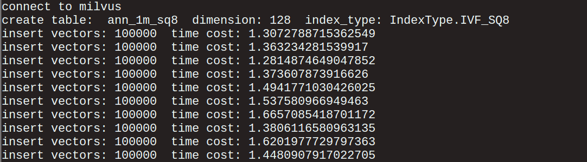

# 实验一：百万向量检索

## 1、准备测试数据和脚本

本实验所使用的原始数据集为 SIFT1B ，关于该数据集的详细信息请参考：[http://corpus-texmex.irisa.fr/](http://corpus-texmex.irisa.fr/)。在本次测试中，我们提取了原始数据集中的 100 万条数据。

经实测，以下硬件配置可顺利完成实验：

| Component           | Minimum Config                |
| ------------------ | -------------------------- |
| OS            | Ubuntu LTS 18.04 |
| CPU           | Intel Core i5-8250U           |
| GPU           | Nvidia GeForce MX150, 2GB GDDR5  |
| GPU Driver    | CUDA 10.1, Driver 418.74 |
| Memory        | 8 GB DDR4          |
| Storage       | NVMe SSD 256 GB             |

测试工具下载：
- 100 万测试数据集下载地址：https://pan.baidu.com/s/1nVIIxO8MnOle339iYs2dUw
- 查询向量集下载地址：https://pan.baidu.com/s/1mBRM1cJZ6QWehDuddOYl4A
- 搜索结果对照 （ gound truth ）下载地址：https://pan.baidu.com/s/1-95nJvW3vx2Cq9wqBWOFaA
- 测试脚本下载路径：[/bootcamp/scripts/](/scripts/)

为方便存放测试数据和脚本，请创建名为 milvus_sift1m 的文件夹。利用前文提供的下载链接，将测试数据集下载到 milvus_sift1m 目录下：

- 测试数据集下载并解压完成之后，你将会看到一个名为 bvecs_data 的文件夹。该文件夹里面存放了 10 个 npy 文件，每个 npy 文件中存放了10 万条 uint8 格式的向量数据。
- 查询向量集下载完成之后，你会看到一个 query.npy 的文件，该文件里存放了 10,000 条实验中需要查询的向量。
- 对照数据（ groundtruth ）包含一个名为 ground_truth.txt 的文本文件，该文件里存放的是查询向量集中的每条向量的 top1000 相似向量的位置。
- 测试脚本会包含一个 python 程序 milvus_bootcamp.py 和一个 shell 脚本 get_id.sh。

获取完测试需要的数据和脚本后， milvus_sift1m 目录下应该存放有以下内容：
1. 100 万测试数据： bvecs_data 文件夹
2. 10,000 条查询向量集： query.npy
3. 10,000 条查询向量集的 ground truth：ground_truth.txt
4. 测试脚本：milvus_bootcamp.py 和 get_id.sh

**注意**

使用脚本 milvus_bootcamp.py 进行测试之前，请仔细阅读该脚本的 README 。并根据实际情况，对脚本中的相关变量值进行修改。
使用脚本 get_id.sh 测试之前需要为它添加可执行权限，执行下述指令：
```bash
$ chmod +x get_id.sh
```

## 2、 配置 Milvus 参数

Milvus 可以根据数据分布和性能、准确性的要求灵活调整相关系统参数，以发挥产品的最佳性能。在此实验中，采用如下表所示的参数配置，就可以实现90%以上召回率。

配置文件： **/home/$USER/milvus/conf/server_config.yaml**

|         参数名称         | 推荐值 |
| ---------------------- | ---- |
| index_building_threshold |   64   |
|    cpu_cache_capacity    |   4    |
|    use_blas_threshold    |  801   |
|          nprobe          |   32   |

其余参数保持默认即可。配置文件参数修改完毕后，重启 Milvus Docker 使配置生效。

```bash
$ docker restart <container id>
```

## 3、 数据导入

导入数据之前，首先确保 bvecs_data 文件夹与测试脚本 milvus_bootcamp.py 都放在 milvus_sift1m 目录下，然后确认 Milvus 已经正常启动。（ Milvus 安装及启动方法参见：[Milvus 快速上手](../milvus101/quickstart.md) ）

进入 milvus_sift1m 目录，运行如下脚本：

```bash
$ python3 milvus_bootcamp.py --table=ann_1m_sq8 --index=ivfsq8 -t
```

脚本会创建一张名为 ann_1m_sq8 的表，它采用的索引类型为 ivfsq8  ，并导入数据：



上述过程完成之后，运行如下脚本以查看 Milvus 中存在的的表，以及表中的向量条数：

```bash
$ python3 milvus_bootcamp.py --show
$ python3 milvus_bootcamp.py --table=ann_1m_sq8 --rows
```

数据导入完成后，会在 milvus_sift1m 目录下产生一个名为 ann_1m_sq8_idmap.txt 的文件，该文件中存放的是 Milvus 为每一条向量分配的向量编号（ ids ）以及该向量的具体位置。

为了确保导入 Milvus 的数据已经全部建好索引，请进入  **/home/$USER/milvus/db** 目录，在终端输入如下命令：

```bash
$ sqlite3 meta.sqlite
```

进入交互式命令行之后，输入如下命令，检查向量数据表当前的状态：

```sqlite
sqlite> select * from TableFiles where table_id='ann_1m_sq8';
30|ann_1m_sq8|3|1565599487052367000|3|102400000|1565599495009366|1565599487052372|1190712
31|ann_1m_sq8|3|1565599495107862000|3|102400000|1565599502559292|1565599495107863|1190712
32|ann_1m_sq8|3|1565599502656466000|3|102400000|1565599510079453|1565599502656467|1190712
33|ann_1m_sq8|3|1565599510129972000|3|51200000|1565599513555987|1565599510129973|1190712
34|ann_1m_sq8|3|1565599513650120000|3|102400000|1565599521067974|1565599513650121|1190712
35|ann_1m_sq8|3|1565599521132604000|3|51200000|1565599524843984|1565599521132605|1190712
```

Milvus 会将一个向量数据表分成若干数据分片进行存储，因此查询命令会返回多条记录。其中第三列数字代表数据表采用的索引类型，数字 3 代表采用的是 ivfsq8 索引。第五列数字代表索引构建的情况，当这列数字为 3 时，代表相应的数据表分片上的索引已构建完毕。如果某个分片上的索引还没有构建完成，可以手动为这个数据分片建立索引。进入 milvus_sift1m 目录，运行如下脚本：

```bash
$ python3 milvus_bootcamp.py --table=ann_1m_sq8 --build
```

手动建立索引后，再次进入 sqlite 交互界面，确认所有数据分片都已经建好索引。如果想了解其他列数据代表的含义，请进入  **/home/$USER/milvus/db** 目录，在 sqlite 交互界面输入如下命令进行查看。

```sqlite
sqlite>.schema
```

## 4、准确性测试

SIFT1B 提供了10,000 条向量的查询向量集，并且对于每条查询向量都给出了该向量在不同规模数据集上的 top1000 ground truth。因此，可以方便地对 Milvus 查询结果的准确率进行计算。准确率计算公式为：

准确率＝ ( Milvus 查询结果与 Groundtruth 一致的向量个数 ) / ( query_records 的向量个数 * top_k )

（1）执行准确性测试脚本

从 10,000 条查询向量中随机取出 10 条向量，然后测试 Milvus 针对这 10 条向量的 top20 结果的准确率。进入 milvus_sift1m 目录，运行如下脚本：

```bash
$ python3 milvus_bootcamp.py --table=ann_1m_sq8 -q 10 -k 20 -s
```

（2）验证准确性测试结果

上述脚本运行完成后，将会生成一个名为 accuracy_results 的文件夹，在该文件夹下面会有一个名为 10_20_result.csv 的文件，文件里的内容如下图所示：


- nq: 代表的是第几个查询向量
- topk: 代表的是查询该向量的前 k 个相似的向量
- total_time: 代表整个查询花费的总时间，单位：秒
- avg_time: 代表每一条向量的平均查询时间，单位：秒
- recall: 代表 milvus 的查询结果与 ground truth 对比后的准确率

Milvus 查询准确率与搜索子空间（ nprobe 参数）有很大关系。本次测试中 nprobe 设置为32，Milvus 查询准确率可以达到 90% 以上。可以通过增大 nprobe 值来实现更高的准确率但同时也会降低 Milvus 的查询性能。

因此，需要结合实际数据分布和业务SLA，调整搜索子空间大小以达到性能和准确性的平衡。

## 5、性能测试

为评估 Milvus 的查询性能，进入 milvus_sift1m 目录，运行如下脚本：

```bash
$ python3 milvus_bootcamp.py --table=ann_1m_sq8 -s
```

运行结束后，将会生成一个名为 performance_results 的文件夹，在该文件夹下会有一个名为 xxx_results.csv 的文件，'xxx' 代表执行命令的时间。文件内容如下图所示（未完全展示）：


- nq: 代表要查询的向量数
- topk: 代表的是查询某个向量的前 k 个相似的向量
- total_time: 代表的是查询 nq个向量的前 k 个相似向量一共花费的时间，单位：秒
- avg_time: 代表的是查询一个向量的 topk 个相似向量的平均时间，单位：秒

**注意**

1. milvus_bootcamp.py 中设置的待测试的 nq 为：1、50、100、150、200、250、300、350、400、450、500、550、600、650、700、750、800。对于每一个 nq，milvus_bootcamp.py 设置的 topk 为：1、20、50、100、300、500、800、1000。
2. Milvus 启动后，进行第一次向量检索时，需要花部分时间加载数据到内存。
3. 如果两次测试间隔一段时间，Intel CPU可能降频至基础频率。性能测试时尽量连续运行测试案例。第一个测试案例可以运行两次，取第二次的运行时间。
