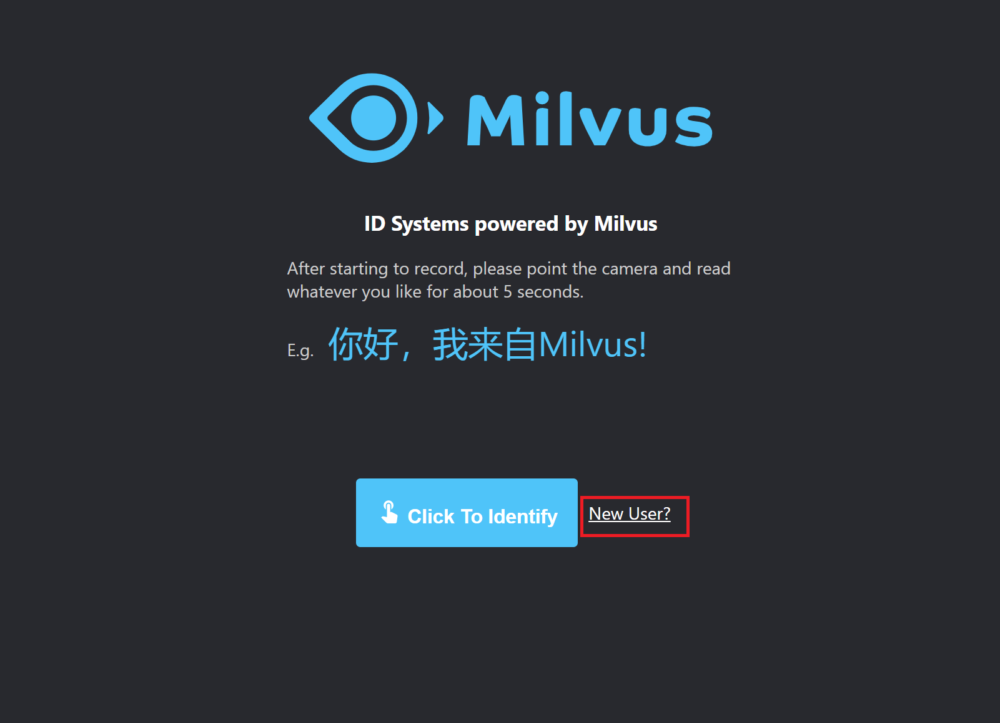
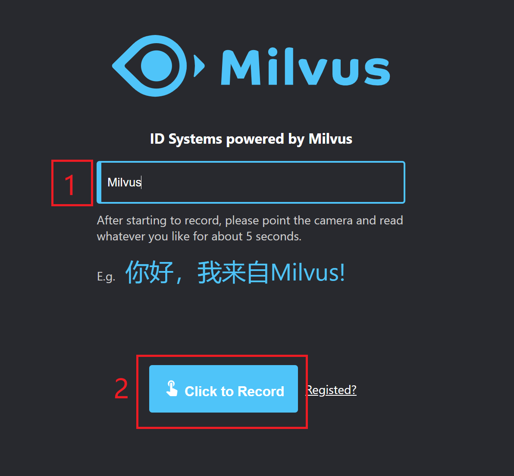
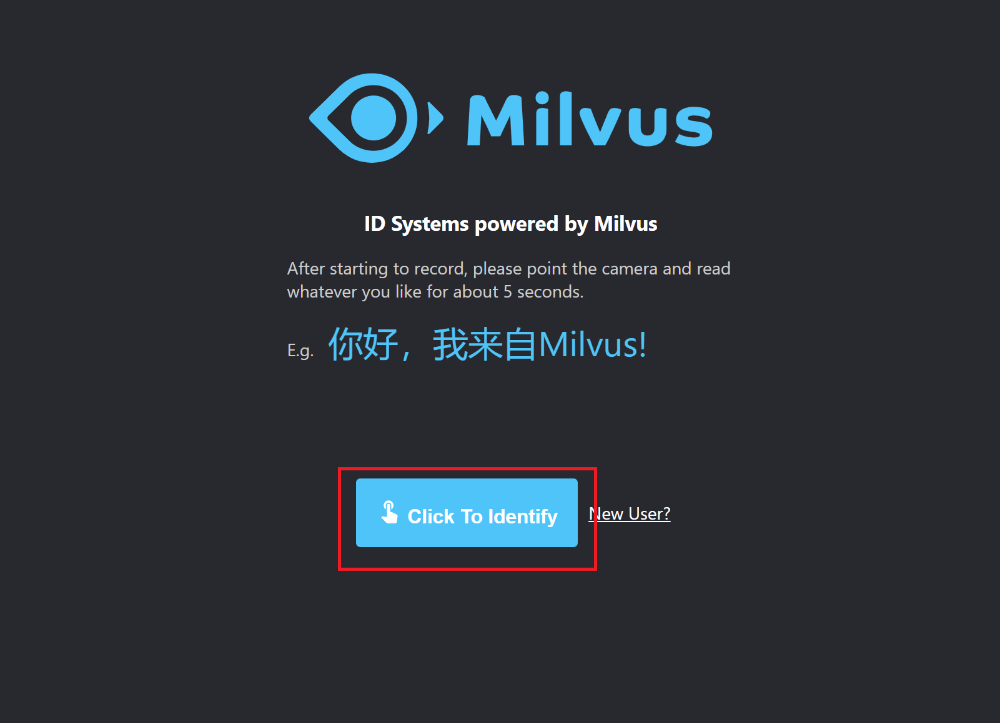
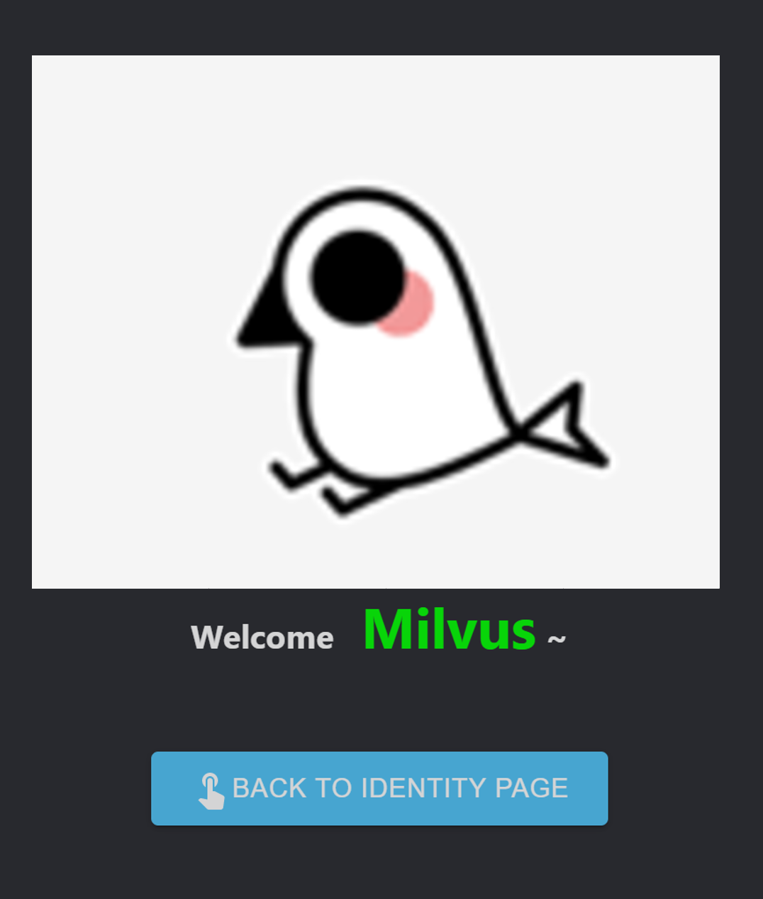

# 生物多因子认证系统

本文介绍的生物多因子认证系统利用 [InsightFace](https://github.com/deepinsight/insightface) 提取人脸特征，[Deep Speaker](https://github.com/philipperemy/deep-speaker) 提取声纹特征，然后在 [Milvus](https://milvus.io/) 中做混合认证。

## 前提环境

- #### Milvus

- #### postgres

## 系统搭建

在搭建生物多因子认证系统前，请先**启动 Milvus 服务**，下面将介绍使用 Docker 部署系统和构建镜像部署两种方法：

### 使用 Docker 部署

- #### 启动 MFA-demo

```bash
$ docker run -td -p 5003:5000 -e API_URL=https://192.168.1.85:5003 -e "MILVUS_HOST=192.168.1.85" -e "MILVUS_PORT=19533" -e "PG_HOST=192.168.1.85" -e "PG_HOST=5432" milvusbootcamp/mfa-demo:0.1.0
```

上述启动命令相关参数说明：

| 参数                                 | 说明                                                         |
| ------------------------------------ | ------------------------------------------------------------ |
| -p 5003:5000                         | -p 表示宿主机和 image 之间的端口映射                         |
| -e API_URL=https://192.168.1.85:5003 | -e 表示宿主机和 image 之间的系统参数映射 <br />请将 `192.168.1.85` 修改为当前启动 mfa-demo 的服务器 IP 地址，5003是映射到宿主机的端口 |
| -e "MILVUS_HOST=192.168.1.85"        | 请修改`192.168.1.85`为启动 Milvus docker 的服务器 IP 地址    |
| -e "MILVUS_PORT=19530"               | 请修改`19530`为启动 Milvus docker 的服务器端口号             |
| -e "PG_HOST=192.168.1.85"            | 请修改`192.168.1.85`为启动 Postgres 的服务器 IP 地址         |
| -e "PG_HOST=5432"                    | 请修改`5432`为启动 Postgres 的服务器端口                     |

### 构建镜像部署

```bash
# clone mfa 的代码
$ git clone https://github.com/milvus-io/bootcamp.git
$ cd bootcamp/solutions/MFA/webserver
# 构建 mfa-demo 镜像
$ docker build -t mfa-demo:0.1.0 .
# 启动 mfa-demo, 启动命令参考"使用 Docker 部署"
$ docker run -td -p 5003:5000 -e API_URL=https://192.168.1.85:5003 -e "MILVUS_HOST=192.168.1.85" -e "MILVUS_PORT=19533" -e "PG_HOST=192.168.1.85" -e "PG_HOST=5432" mfa-demo:0.1.0
```

> 注意：在构建镜像时需下载 face_embedding 模型，下载链接：https://pan.baidu.com/s/18EWcP5YJmeDrY1A8_k09pw , 提取码：82ht；在构建镜像时需下载 deep speaker 模型，下载链接：https://pan.baidu.com/s/16_moPcoUGah1dqdDtEQreQ, 提取码：11vv。
>
> 下载后请解压 mfa-models，并将 models 文件夹移动到 bootcamp/solutions/MFA/webserver/face-embedding 下；将ResCNN_triplet_training_checkpoint_265移动到 bootcamp/solutions/MFA/webserver/src/deep_speaker/checkpoints。


## 系统使用

在手机端或者客户端的浏览器（建议谷歌浏览器）中输入`https://192.168.1.85:5003`(启动 MFA-demo 指定的 API_URL)，就可以开始进行生物多因子认证了。

- #### 系统录入

  首先点击 `New User` ，将在系统中录入信息。



​		然后在框里面填下个人昵称,，比如 `Milvus`，然后点击 `Click to Record` 将会录视频，如果浏览器弹出需要**访问摄像头和话筒**，请选择同意，接下来就在系统中录制 5 秒左右的视频。



​		系统录入成功后将会出现以下界面：


- #### 系统认证

  点击 `Click To Iddentify` 将进行验证，同样在系统中录制 5s 左右的视频。



​		系统认证成功将会出现以下界面，图片将会显示验证人的人脸，这里替换了 Milvus logo：

