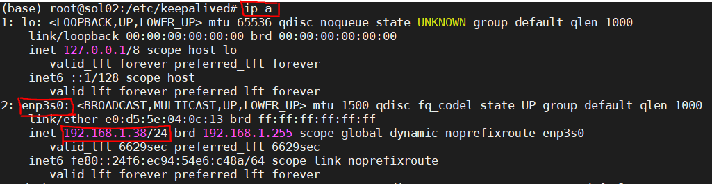

# Milvus 高可用 (HA) 方案

## 环境准备

本次HA方案需要用到两台机器和一个共享存储设备。

主机：192.168.1.85

备机：192.168.1.38


## 安装 Milvus

在主备机上安装 Milvus server。主备机的 Milvus `db` 目录均指向共享存储的位置。

安装方法：参考 https://milvus.io/docs/zh-CN/userguide/install_milvus/

安装完成后，启动主机的 Milvus server，停止备机的 Milvus server。

## 安装并配置 keepalived

**查看主备机 IP**




**修改系统网络配置**

在主备机环境中输入如下命令：

```bash
# vim /etc/sysctl.conf
```

将 `net.ipv4.ip_forward=1`前的”#”号删除，将 `net.ipv4.ip_nonlocal_bind=1` 插入到其后，保存并退出。

输入命令使其生效：

```bash
# sysctl -p
```

**安装 keepalived 及其依赖**

在主备机中安装 keepalived 及其依赖包：

```bash
# apt-get install libssl-dev openssl libpopt-dev
# apt-get install keepalived
```

**配置 keepalived**

给主备机配置 keepalived。虚拟路由地址设置为

```bash
# vim /etc/keepalived/keepalived.conf
```

主机配置文件如下：

```yaml
! Configuration File for keepalived
global_defs {
  router_id sol01 #主机路由ID
}

vrrp_script chk_milvus {
       script "/etc/keepalived/chk_milvus.sh"   # 检查主机的milvus是否正常运行脚本
       interval 2
       weight -20
}

vrrp_instance VI_SERVER {
  state MASTER               # 主机服务器模式，备机设为BACKUP
  interface enp7s0             # 主机监控网卡实例
  virtual_router_id 51       # VRRP组名，主备机设置必须完全一致
  priority 110               # 优先级(1-254)，主机设置必须比备机高，备机可设为90
  authentication {           # 认证信息，主备机必须完全一致
    auth_type PASS
    auth_pass 1111
  }
  virtual_ipaddress {        # 虚拟IP地址，主备机必须完全一致
    192.168.1.104/24         # 注意配置子网掩码
  }
  track_script {
  chk_milvus
  }
}
```

备机配置文件如下：

```yaml
! Configuration File for keepalived
global_defs {
  router_id sol02 # 备机路由ID
}

vrrp_instance VI_SERVER {
  state BACKUP               # 主机服务器模式，备机设为BACKUP
  interface enp3s0             # 备机监控网卡实例
  virtual_router_id 51       # VRRP组名，主备机设置必须完全一致
  priority 91               # 优先级(1-254)，主机设置必须比备机高，备机可设为90
  authentication {           # 认证信息，主备机必须完全一致
    auth_type PASS
    auth_pass 1111
  }
  virtual_ipaddress {        # 虚拟IP地址，主备机必须完全一致
    192.168.1.104/24         # 注意配置子网掩码
  }

  notify_master "/etc/keepalived/start_docker.sh master"
  notify_backup "/etc/keepalived/stop_docker.sh backup"
}

```

在主机 `/etc/keepalived` 目录下创建上述提到的 `chk_milvus.sh` 脚本，该脚本用于检测 Milvus server 是否正常。

```bash
#!/bin/bash
RUNNING_STATUS=$(docker inspect --format '{{.State.Running}}' <docker id>)
if [[ "${RUNNING_STATUS}" != "true" ]];then
    exit 1
fi
# <docker id>表示主机的milvus server docker id
```

在备机 `/etc/keepalived` 目录下创建上述提到的 `start_docker.sh` 和 `stop_docker.sh` 脚本。`start_docker.sh` 会在主机 server 异常断掉，虚拟地址指向备机后启动备机的 Milvus server；`stop_docker.sh` 会在主机回复正常后，停止备机的 Milvus server。

`start_docker.sh` 脚本包含以下代码：

```bash
#!/bin/bash
RUNNING_STATUS=$(docker inspect --format '{{.State.Running}}' <docker id>)
if [[ "${RUNNING_STATUS}" != "true" ]];then
docker start <docker id>
fi
```

该`<docker id>`表示备机的 Milvus server docker id。

`stop_docker.sh` 脚本包含以下代码：

```bash
#!/bin/bash
RUNNING_STATUS=$(docker inspect --format '{{.State.Running}}' <docker id>)
if [[ "${RUNNING_STATUS}" = "true" ]];then
docker start <docker id>
fi
```

该`<docker id>`表示备机的 Milvus server docker id

注：上述三个脚本创建后，需要增加其可执行权限。

```bash
chmod +x chk_milvus.sh
chmod +x start_docker.sh
chmod +x stop_docker.sh
```

**启动主备机的 keepalived**

```bash
service keepalived start
# 查看keepalived状态
service keepalived status
```

**查看 keepalived 日志**

```bash
# cat /var/log/syslog | grep Keepalived | tail
```

## 验证

上述步骤安装完成后，在主机上输入命令 `ip a`，可以看见虚拟 IP 地址192.168.1.104出现在了主机中。


此时客户端，可通过地址192.168.1.104连接 Milvus server, 进行建表、插入、查询等相关操作了。

关闭主机电源或停止主机的 Milvus server，再次用 `ip a` 查看，可以看见虚拟 IP 已从主机自动移除了。


此时，在备机输入 `ip a`，可以看见虚拟地址转移到了备机上。


输入命令 docker ps,可以看见备机中的 docker 已经自动启动完成了。客户端通过192.168.1.104连接的 Milvus server 实际已从主机转移到备机。由于主备机的 Milvus server 共享一个存储设备，所以两边的 Milvus 数据都是同步的。在主机出现异常的情况下，上述方案可保证客户在实际操作时，可以在秒级的时间 server 连接恢复正常。

重新恢复主机端 Milvus server 后，虚拟地址会自动转移到主机上，此时客户端连接的 server 又变回主机 server 了。备机上的 Milvus server 也将自动停止。
