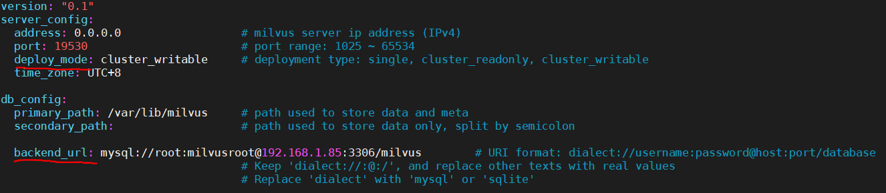

# 基于 Mishards（Milvus 集群分片中间件）的分布式解决方案

Milvus 旨在帮助用户实现海量非结构化数据的近似检索和分析。单个 Milvus 实例可处理十亿级数据规模，而对于百亿或者千亿级数据，则需要一个 Milvus 集群实例。该实例对于上层应用可以像单机实例一样使用，同时满足海量数据低延迟、高并发业务需求。

本文主要展示如何使用 Mishards（Milvus 集群分片中间件）来搭建 Milvus 集群。

关于 Mishards 更多详解请参考（https://github.com/milvus-io/milvus/blob/0.6.0/shards/README_CN.md）。

本文默认你已经会在单机上安装使用 Milvus 了，在此基础上可参考下文搭建一个 Milvus 集群。

## 环境准备

搭建 Milvus 集群至少需要两台设备和一个共享存储设备。

1.安装[Nvidia-driver](https://www.nvidia.com/Download/index.aspx)418 或更高版本。

2.安装[docker](https://docs.docker.com/install/linux/docker-ce/ubuntu/)。

2.安装[docker-compose](https://docs.docker.com/compose/install/)。

3.安装[nvidia-docker2](https://github.com/nvidia/nvidia-docker/wiki/Installation-(version-2.0))。

在本示例中，将用两台设备搭建一个小的 Milvus 集群。其中一台设置为可写，另一台设置为只读。

## 搭建步骤

### 1.安装 MySQL

MySQL 服务只需要在集群中**任意一台**设备上启动即可。

此处将通过 docker 启动 MySQL。可以看到，本项目目录下包含了 `mysqld.cnf`、`mysql_dc.yml` 两个脚本。通过如下命令运行脚本将启动 MySQL 服务。

```shell
$ docker-compose -f mysql_dc.yml up -d
```

查看 mysql 服务是否启动成功

```shell
$ docker ps
```

### 2.启动Milvus

集群中的每一台设备均需要安装 Milvus,不同的设备可给 Milvus 配置不同的读写权限。（这里建议给集群中的一台设备配置为可写，其他均为只读）

#### 可写

本项目目录下有cluster_wr_server.yml、cluster_wr.yml两个脚本。根据实际环境，修改相应配置。

`cluster_wr_server.yml`：



在该配置文件中，参数 deploy_mode 决定了 Milvus 是只读还是可写。此处选择 `cluster_writable` 表示为该 Milvus 可写。参数 `backend_url` 应修改为 MySQL 所安装的设备的地址。其余配置参照 Milvus 单机版时的配置。

`cluster_wr.yml`：


此处 `volumes` 下的路径 `/test/solution/milvus/db` 是数据存储位置，该路径需指向一个共享存储，集群中的所有设备数据存储位置均设置为同一个共享存储。其余参数使用默认设置即可。

通过如下命令启动 Milvus 服务：

```shell
$ docker-compose -f cluster_wr.yml up -d
```

#### 只读

本项目目录下有 `cluster_ro_server.yml`、`cluster_ro.yml` 两个脚本。根据实际环境，修改相应配置。

`cluster_ro_server.yml`：


此处 deploy_mode 设置为 cluster_readonly 表示为该 Milvus 只可读（即只有在 search 时才会启用该服务）。参数 backend_url 应修改为 mysql 所安装的设备的地址。其余配置参照 Milvus 单机版时的配置。

`cluster_ro.yml`:


该处路径同上。

通过如下命令启动 Milvus 服务：

```shell
$ docker-compose -f cluster_ro.yml up -d
```

（注意：集群中每台设备的 Milvus 安装与启动也可参考[Milvus 官网](https://milvus.io/cn/docs/v0.6.0/guides/get_started/install_milvus/gpu_milvus_docker.md)的安装步骤执行。但是需要修改 `conf` 文件夹下的配置文件 `server_config.yml`，可写设备按照 `cluster_wr_server.yml` 修改参数 `deploy_mode` 和 `backend_url`，只读设备按照 `cluster_ro_server.yml` 修改参数 `deploy_mode` 和 `backend_url`。且启动时，所有设备数据存储路径均需要映射到同一个共享存储。）

### 3.启动 Mishards

Mishards 服务只需在集群中**任意一台**设备上启动即可。

本项目目录中有一个 `cluster_mishards.yml` 文件，如图：


在脚本中需要注意修改的参数：

`SQLALCHEMY_DATABASE_URI`：将 `192.168.1.85` 修改为 MySQL 所在的 IP 地址。

`WOSERVER`：修改为 Milvus 可写实例的 IP 地址。参考格式： `tcp://127.0.0.1:19530`。

`DISCOVERY_STATIC_HOSTS`：集群中的所有 IP 地址。

(`SERVER_PORT`定义了 Mishards 的服务端口)

通过如下命令启动 Mishards 服务：

```shell
$ docker-compose -f cluster_mishards.yml up
```


## 使用

完成上述步骤后，成功搭建 Milvus 集群。

通过连接 Mishards 所在的 IP 地址，以及 Mishards 服务端口19531就可以连接该 Milvus 集群 server。其余操作与 Milvus 单机版一致。

在查询过程中观察 Mishards 打印的日志，可以看见集群中每个设备所分配到的任务。
