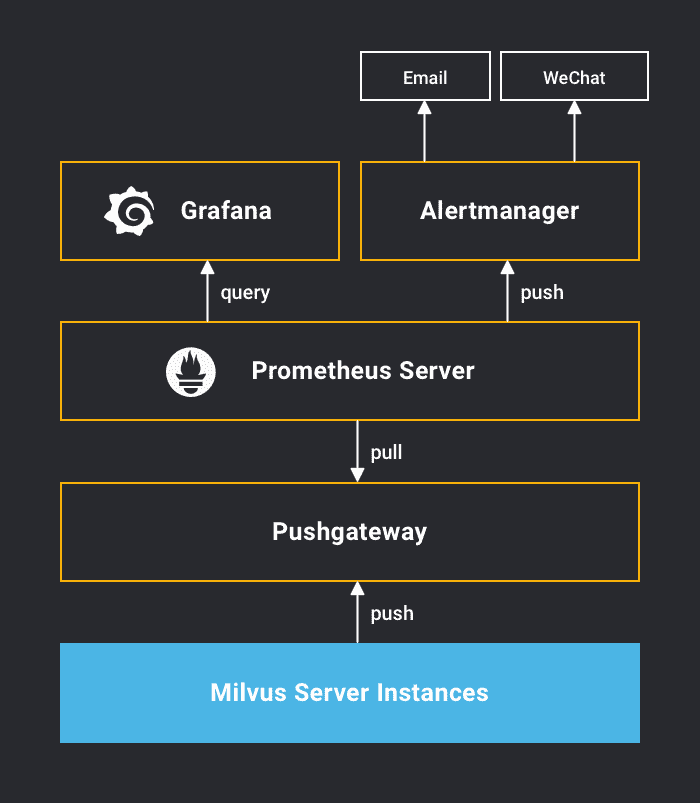

# 使用Promtheus 和Grafana 对Milvus进行监控和报警

本项目后续将不再维护更新，最新内容将更新在:https://github.com/zilliz-bootcamp/milvus_monitoring_and_alarm

Milvus使用Prometheus来监控和存储性能指标，并使用开源计时数据分析和可视化平台Grafana来显示性能指标。

## 方案概述

Milvus收集监控数据并将其推送到Pushgateway。同时，Prometheus服务器会定期从Pushgateway提取数据并保存到它的定时数据库(TSDB)中。当警报生成时，Prometheus服务器会将警报信息推送到Alertmanager。Grafana可用于可视化收集的数据。



## 环境准备

1、Prometheus

2、Alertmanager

3、Grafana

## 搭建步骤

首先，使用Prometheus来收集Milvus监测指标，以及如何将Alertmanager连接到Prometheus来实现数据显示和报警机制的可视化。

##### 安装 Prometheus

下载  [Prometheus binary zip file](https://prometheus.io/download/).

```
tar xvfz prometheus-*.tar.gz
cd prometheus-*
```

##### 安装 Pushgateay

下载  [Pushgateway binary zip file](https://prometheus.io/download/).

```
tar xvfz pushgateway-*.tar.gz
cd pushgateway-*
```

##### 启动 Pushgateway

```
./pushgateway
```

**<u>注 ：必须在启动 Milvus Server 之前启动 Pushgateway 进程</u>**

在 **milvus.yaml** 中开启 Prometheus 监控，并设置 Pushgateway 的地址和端口号

```
metric:
  enable: true       # Set the value to true to turn on Prometheus monitoring
  address: 127.0.0.1 # Set the IP address of Pushgateway
  port: 9091         # Set the port number of Pushgateway.
```

下载 Milvus [Prometheus 配置文件](https://github.com/milvus-io/docs/blob/master/v0.11.0/assets/monitoring/prometheus.yml)：

```
$ wget https://raw.githubusercontent.com/milvus-io/docs/master/v0.10.3/assets/monitoring/prometheus.yml \ -O prometheus.yml
```

下载 Milvus [报警规则文件](https://github.com/milvus-io/docs/blob/master/v0.11.0/assets/monitoring/alert_rules.yml) 到 Prometheus 根目录：

```
$ wget -P rules https://raw.githubusercontent.com/milvus-io/docs/master/v0.10.3/assets/monitoring/alert_rules.yml
```

根据实际需求编辑 Prometheus 配置文件：

- `global`：配置 `scrape_interval` 和 `evaluation_interval` 等参数

  ```
  global:
   scrape_interval:     2s # Set the fetch time interval to 2S 
   evaluation_interval: 2s # Set the evaluation interval to 2S
  ```

- `alerting`：设置 Alertmanager 的地址和端口

  ```
  alerting:
  alertmanagers:
  - static_configs:
    - targets: ['localhost:9093']
  ```

- `rule_files`：设置报警规则文件

  ```
  rule_files:
    - "alert_rules.yml"
  ```

- `scrape_configs`：设置抓取数据的 `job_name` 及 `targets` 等信息

  ```
  scrape_configs:
  - job_name: 'prometheus'
    static_configs:
    - targets: ['localhost:9090']
  
  - job_name: 'pushgateway'
    honor_labels: true
    static_configs:
    - targets: ['localhost:9091']
  ```

启动 Prometheus:

```
./prometheus --config.file=prometheus.yml
```

通过浏览器http://<localhost:9090>进入prometheus用户交互页面。


##### 

### 需要报警的事件

积极的监控帮助及早发现问题，但创建报警规则以便在出现突发事件时触发用户通知也非常有必要。

以下主要介绍需要创建报警规则的事件。

**服务器宕机**

- 报警规则：当 Milvus 服务器宕机时发送报警信息。
- 如何判断：当 Milvus 服务器宕机时，监控仪表盘上各个指标会显示 **No Data**。

**CPU/GPU 温度过高**

- 报警规则：当 CPU/GPU 温度超过 80 摄氏度时发送报警信息。
- 如何判断：查看监控仪表盘上的 **CPU Temperature** 和 **GPU Temperature** 两个指标

下载  [Alertmanager binary zip file](https://prometheus.io/download/)

```
tar xvfz Alertmanager-*.tar.gz
cd Alertmanager-*
```

根据 [配置 Alertmanager](https://prometheus.io/docs/alerting/configuration/) 创建配置文件 **alertmanager.yml**，指定接受报警通知的邮箱或微信账号，并将配置文件添加到 Alertmanager 根目录下。

启动 Alertmanager 服务并指定配置文件：

```
./alertmanager --config.file=alertmanager.yml
```


# 使用 Grafana 展示 Milvus 监控指标

- 运行 Grafana:

```
docker run -i -p 3000:3000 grafana/grafana
```

在浏览器中打开 *http://<提供 Grafana 服务的主机 IP>:3000* 网址，并登录 Grafana 用户交互页面


<!--Grafana 的默认用户名和密码都是 `admin`。你也可以在此创建新的 Grafana 账号.-->

- [将 Prometheus 添加为数据源](https://grafana.com/docs/grafana/latest/features/datasources/add-a-data-source/)

在 Grafana 用户交互页面中，点击 **Configuration > Data Sources > Prometheus**，然后设置以下数据源属性：


| 名称    | 值                                            |
| :------ | :-------------------------------------------- |
| Name    | Prometheus                                    |
| Default | `True`                                        |
| URL     | *http://<提供 Prometheus 服务的主机 IP>:9090* |
| Access  | Browser                                       |

- 下载 [Grafana 配置文件](https://github.com/milvus-io/docs/blob/master/v0.11.0/assets/monitoring/dashboard.json)

- 下载 [Grafana 配置文件](https://github.com/milvus-io/docs/blob/master/v0.11.0/assets/monitoring/dashboard.json)

  

- 你可以通过 Milvus 提供的 [Grafana 配置文件](https://github.com/milvus-io/docs/blob/master/v0.11.0/assets/monitoring/dashboard.json) 配置 Milvus 提供的各项监控指标。详见：[Milvus 监控指标](https://www.milvus.io/cn/docs/v0.11.0/milvus_metrics.md)

  
  
  
  
  # Milvus 监控指标
  
  Milvus 会生成关于系统运行状态的详细时序 metrics。你可以通过 [Prometheus](https://prometheus.io/)、[Grafana](https://grafana.com/) 或任何可视化工具展现以下指标：
  
  - Milvus 性能指标
  - 系统运行指标：CPU/GPU 使用状况，网络、磁盘读取等指标。
  - 硬件存储指标：数据大小，数据文件及存储情况等指标。
  
  ## Milvus 性能指标
  
  | 指标                      | 说明                                                         |
  | :------------------------ | :----------------------------------------------------------- |
  | **Insert per Second**     | 每秒钟插入的向量数量（实时显示）。                           |
  | **Queries per Minute**    | 每分钟运行的查询数量（实时显示）。                           |
  | **Query Time per Vector** | 单条向量查询时间 = 查询使用时间 / 向量数量                   |
  | **Query Service Level**   | 查询服务级别 = 一定时间阈值内的查询数量/总查询数量 一般建议设置 3 个时间阈值来跟踪查询服务级别。 |
  | **Uptime**                | Milvus 服务器正常运行的时长（分钟）。                        |
  
  ## 系统运行指标
  
  | 指标                  | 说明                                                   |
  | :-------------------- | :----------------------------------------------------- |
  | **GPU Utilization**   | GPU 利用率（%）。                                      |
  | **GPU Memory Usage**  | Milvus 当前使用的显存量 （GB）。                       |
  | **CPU Utilization**   | CPU 利用率（%）= 服务器任务执行时间 / 服务器总运行时间 |
  | **Memory Usage**      | Milvus 当前使用的内存量（GB）。                        |
  | **Cache Utilization** | 缓存利用率（%）。                                      |
  | **Network IO**        | 网口的读写速度（GB/s）。                               |
  | **Disk Read Speed**   | 磁盘读取速度（GB/s）。                                 |
  | **Disk Write Speed**  | 磁盘写入速度（GB/s）。                                 |
  
  ## 硬件存储指标
  
  | 指标           | 说明                        |
  | :------------- | :-------------------------- |
  | **Data Size**  | Milvus 所存数据总量（GB）。 |
  | **Total File** | Milvus 所存数据文件总个数。 |
