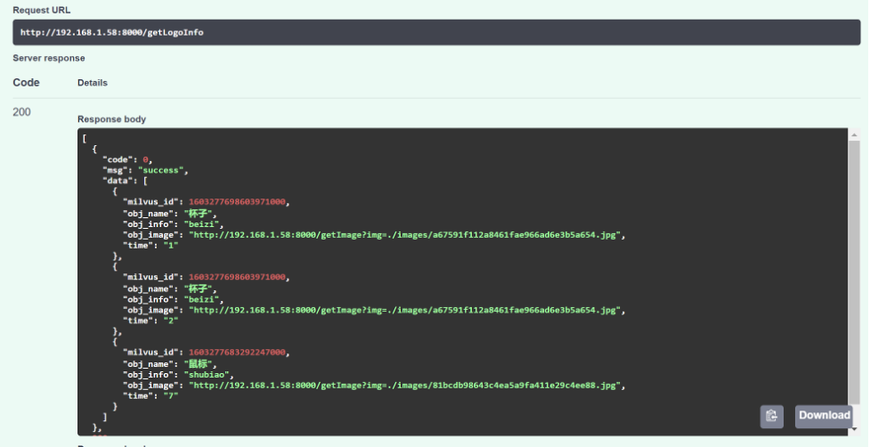

# 基于 Milvus 的视频分析系统

常见的视频分析系统能够对视频区域内出现的运动目标自动识别出目标类型并跟踪，能够同时监测同一场景里多个目标。经过分析的视频可以被广泛应用到各个领域，例如广告推荐、安防和娱乐产业。本项目利用 [yolov3](https://pjreddie.com/darknet/yolo/) 和 [insightface](https://github.com/deepinsight/insightface)，结合 OpenCV 的截帧技术，对视频中出现的物品进行徽标识别并对人脸进行追踪与识别。

## 环境准备

- Milvus 0.11.0
- pymilvus 0.3.0
- tensorflow==1.14.0
- opencv-python==4.2.0.34

## 参数说明

本项目中包含了 webservice 和 webclient 两部分。webservice 提供了后端服务的代码。webclient 提供了前端界面的脚本。

下面介绍一下 webservice 中的重要参数：

**common/config.py**

| Parameter        | Description               | Default      |
| ---------------- | ------------------------- | ------------ |
| MILVUS_HOST      | Milvus service IP         | 192.168.1.58 |
| MILVUS_PORT      | Milvus service port       | 19666        |
| LOGO_DIMENSION   | Dimension of logo         | 256          |
| FACE_DIMENSION   | Dimension of face         | 512          |
| MYSQL_USER       | MySql user name           | root         |
| MYSQL_PASSWORD   | MySql password            | 123456       |
| MYSQL_DB         | MySql database name       | mysql        |
| COCO_MODEL_PATH  | Path of YOLOv3 model      | None         |
| YOLO_CONFIG_PATH | Path of config file       | None         |
| FACE_MODEL_PATH  | Path of insightface model | None         |

## 搭建流程

1. 安装 Milvus 0.11.0，具体流程请参考 [Milvus 安装概述](https://milvus.io/cn/docs/install_milvus.md)。

2. 安装 MySQL。

3. 拉取源码。

   ```bash
   $ git clone https://github.com/milvus-io/bootcamp.git
   $ cd bootcamp/solution/Video_analysis
   ```
   
4. 安装依赖

   ```bash
   $ pip install -r requirements.txt
   ```

5. 下载 YOLOv3 模型

   ```bash
   $ cd webservice/yolov3_detector/data
   $ ./prepare_model.sh
   ```

6. 启动服务

   ```bash
   $ cd ../..
   $ python main.py
   # You are expected to see the following outputs.
   ...
   INFO:     Started server process [71037]
   INFO:     Waiting for application startup.
   INFO:     Application startup complete.
   INFO:     Uvicorn running on http://127.0.0.1:8000 (Press CTRL+C to quit)
   ...
   ```
   
   > 在浏览器访问 http://127.0.0.1:8000/docs，即可访问并使用前端。
## 结果展示

徽标识别



TA 是谁？


只看 TA

