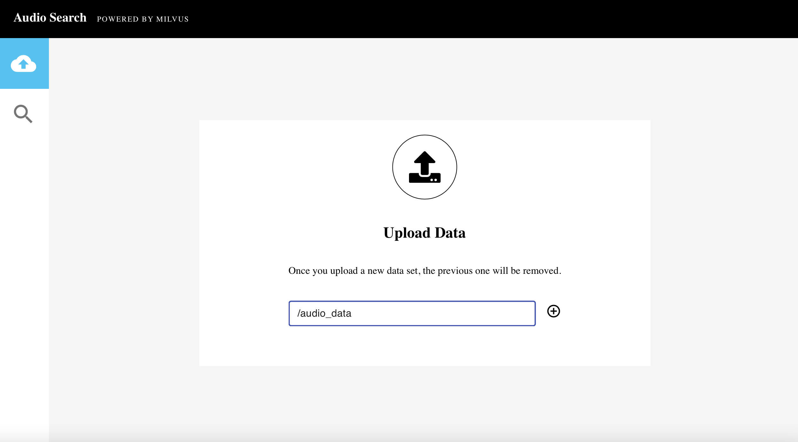

# Audio search system

This project uses [PANNs](https://github.com/qiuqiangkong/audioset_tagging_cnn)(Large-Scale Pretrained Audio Neural Networks) for Audio Pattern Recognition to perform audio tagging and sound event detection, finally obtaining audio embeddings. Then this project uses [Milvus](https://milvus.io/docs/v2.0.0/overview.md) to search for similar audio clips.

   * [Local Deployment](#local-deployment)
      * [Deploy with Docker Compose](#deploy-with-docker-compose)
      * [Deploy with source code](#deploy-with-source-code)
         * [1. Start API Server](#1-start-api-server)
         * [2. Start Client](#2-start-client)
   * [How to use front-end](#how-to-use-front-end)
   * [Code  structure](#code--structure)

## Local Deployment

### Deploy with Docker Compose

The molecular similarity search system requires [**Milvus**](https://milvus.io/docs/v2.0.0/install_standalone-docker.md), MySQL, Webserver and Webclient services. We can start these containers with one click through [docker-compose.yaml](./audiosearch-docker-compose.yaml), so please make sure you have [installed Docker Engine](https://docs.docker.com/engine/install/) and [Docker Compose](https://docs.docker.com/compose/install/) before running.

```bash
$ git clone https://github.com/milvus-io/bootcamp.git
$ cd solutions/audio/audio_similarity_search/quick_deploy
$ docker-compose -f audiosearch-docker-compose.yaml up -d
```

Then you will see the that all containers are created.

```bash
Creating network "quick_deploy_app_net" with driver "bridge"
Creating milvus-minio    ... done
Creating audio-webclient   ... done
Creating milvus-etcd     ... done
Creating audio-mysql       ... done
Creating milvus-standalone ... done
Creating audio-webserver   ... done
```

And show all containers with `docker ps`, and you can use `docker logs audio-webserver` to get the logs of **server** container.

```bash
CONTAINER ID   IMAGE                                         COMMAND                  CREATED          STATUS                             PORTS                                                  NAMES
a8428e99f49d   milvusbootcamp/audio-search-server:2.0        "/bin/sh -c 'python3…"   28 seconds ago   Up 24 seconds                      0.0.0.0:8002->8002/tcp, :::8002->8002/tcp              audio-webserver
5391a8ebc3a0   milvusdb/milvus:v2.0.0-rc8-20211104-d1f4106   "/tini -- milvus run…"   33 seconds ago   Up 28 seconds                      0.0.0.0:19530->19530/tcp, :::19530->19530/tcp          milvus-standalone
1d1f70f98735   minio/minio:RELEASE.2020-12-03T00-03-10Z      "/usr/bin/docker-ent…"   38 seconds ago   Up 33 seconds (healthy)            9000/tcp                                               milvus-minio
8f4cfeba5953   quay.io/coreos/etcd:v3.5.0                    "etcd -advertise-cli…"   38 seconds ago   Up 33 seconds                      2379-2380/tcp                                          milvus-etcd
209563de4c12   mysql:5.7                                     "docker-entrypoint.s…"   38 seconds ago   Up 29 seconds                      0.0.0.0:3306->3306/tcp, :::3306->3306/tcp, 33060/tcp   audio-mysql
f4a6b30f5840   milvusbootcamp/audio-search-client:2.0        "/bin/bash -c '/usr/…"   38 seconds ago   Up 31 seconds (health: starting)   0.0.0.0:801->80/tcp, :::801->80/tcp                    audio-webclient
```

### Deploy with source code

Actually we recommend using Docker Compose to deploy the audio similarity search system. If you want to run from source code, you must manually start [Milvus](https://milvus.io/docs/v2.0.0/install_standalone-docker.md) and [Mysql](https://dev.mysql.com/doc/mysql-installation-excerpt/5.7/en/docker-mysql-getting-started.html). Next show you how to run the API server and Client.

#### 1. Start API Server

Then to start the system server, and it provides HTTP backend services.

- **Install the Python packages**

```bash
$ git clone https://github.com/milvus-io/bootcamp.git
$ cd solutions/audio_similarity_search/quick_deploy/server
$ pip install -r requirements.txt
```

- **Set configuration**

```bash
$ vim src/config.py
```

Modify the parameters according to your own environment. Here listing some parameters that need to be set, for more information please refer to [config.py](./server/src/config.py).

| **Parameter**    | **Description**                                       | **Default setting** |
| ---------------- | ----------------------------------------------------- | ------------------- |
| MILVUS_HOST      | The IP address of Milvus, you can get it by ifconfig. If running everything on one machine, most likely 127.0.0.1 | 127.0.0.1           |
| MILVUS_PORT      | Port of Milvus.                                       | 19530               |
| VECTOR_DIMENSION | Dimension of the vectors.                             | 2048                |
| MYSQL_HOST       | The IP address of Mysql.                              | 127.0.0.1           |
| MYSQL_PORT       | Port of Milvus.                                       | 3306                |
| DEFAULT_TABLE    | The milvus and mysql default collection name.         | audiotable          |

- **Run the code**

Then start the server with Fastapi.

```bash
$ python src/main.py
```

- **API Docs**

After starting the service, Please visit `127.0.0.1:8002/docs` in your browser to view all the APIs.


> **/data**
>
> Returns the audio file from the server at the specified file path.
>
> **/progress**
>
> Returns data processing progress.
>
> **/audio/load**
>
> Loads audio files at the specified filepath into the system to be made available for searching.
>
> **/audio/search**
>
> Upload a specified file to the system, then conduct a search for similar audio files and return results.
>
> **/audio/count**
>
> Returns the number of audio files in the system available for searching.
>
> **/audio/drop**
>
> Drops Milvus and MySQL tables, removing loaded data.

#### 2. Start Client

Next, start the frontend GUI.

- **Set parameters**

Modify the parameters according to your own environment.

| **Parameter**   | **Description**                                       | **example**      |
| --------------- | ----------------------------------------------------- | ---------------- |
| **API_HOST** | The IP address of the backend server.                    | 127.0.0.1        |
| **API_PORT** | The port of the backend server.                          | 8002             |

```bash
$ export API_HOST='127.0.0.1'
$ export API_PORT='8002'
```

- **Run Docker**

First, build the docker image from the Dockerfile.

```bash
$ docker run -d \
-p 80:80 \
-e "API_URL=http://${API_HOST}:${API_PORT}" \
 milvusbootcamp/audio-search-client:2.0
```

> Refer to the instructions in the [Client Readme](./client/README.md).

## How to use front-end

Navigate to `127.0.0.1:80` in your browser to access the front-end interface.

- **Insert data**

Download and unzip the [extract .wav sound files](https://drive.google.com/uc?id=1bKu21JWBfcZBuEuzFEvPoAX6PmRrgnUp) to the specified [data directory](./data). Next, enter the path **/audio_data** in the frontend GUI to initiate the upload.

> The **data** directory is the path where the data is locally mounted to the webserver docker, and **/audio_data** is the path inside the docker, so we are supposed to fill in the path in the docker, namely `/audio_data`.



- **Search for similar audio clips**

Select the magnifying glass icon on the left side of the interface. Then, press the "Default Target Audio File" button and upload a .wav sound file you'd like to search. Results will be displayed.


## Code  structure

If you are interested in our code or would like to contribute code, feel free to learn more about our code structure.

   ```
   └───server
   │   │   Dockerfile
   │   │   requirements.txt
   │   │   main.py  # File for starting the program.
   │   │
   │   └───src
   │       │   config.py  # Configuration file.
   │       │   encode.py  # Covert image/video/questions/audio... to embeddings.
   │       │   milvus_helpers.py  # Connect to Milvus server and insert/drop/query vectors in Milvus.
   │       │   mysql_helpers.py   # Connect to MySQL server, and add/delete/query IDs and object information.
   │       │   
   │       └───operations # Call methods in milvus.py and mysql.py to insert/query/delete objects.
   │               │   insert.py
   │               │   query.py
   │               │   delete.py
   │               │   count.py
   ```
