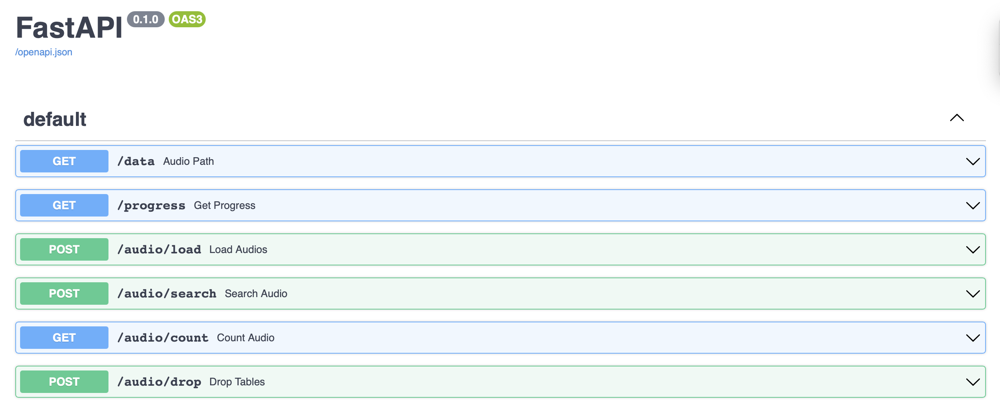
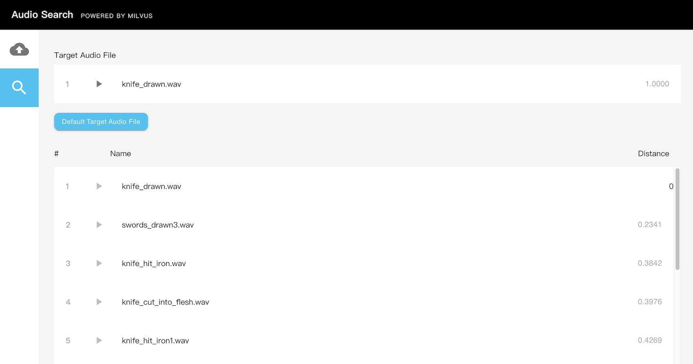

# Audio search system with Milvus

This project uses [PANNs](https://github.com/qiuqiangkong/audioset_tagging_cnn)(Large-Scale Pretrained Audio Neural Networks) for Audio Pattern Recognition to perform audio tagging and sound event detection, finally obtaining audio embeddings. Then this project uses [Milvus](https://milvus.io/docs/v2.0.0/overview.md) to search for similar audio clips.

## Local Deployment

### Requirements

- [Milvus 2.0](https://milvus.io/docs/v2.0.0/install_standalone-docker.md)
- [MySQL](https://hub.docker.com/r/mysql/mysql-server)
- [Python3](https://www.python.org/downloads/)

### 1. Start Milvus and MySQL

The system will use Milvus to store and search the feature vector data, and Mysql is used to store the correspondence between the ids returned by Milvus and the questions data set, then you need to start Milvus and Mysql first.

- **Start Milvus v2.0**

  First, you are supposed to refer to the Install [Milvus v2.0](https://milvus.io/docs/v2.0.0/install_standalone-docker.md) for how to run Milvus docker.

  > Note the version of Milvus.

- **Start MySQL**

```bash
$ docker run -p 3306:3306 -e MYSQL_ROOT_PASSWORD=123456 -d mysql:5.7
```

### 2. Start API Server

The next step is to start the system server. It provides HTTP backend services, and there are two ways to start: running with Docker or source code.

#### 2.1 Run server with Docker

- **Set parameters**

Modify the parameters according to your own environment. Below are the main parameters that you will need to setup, for more information please refer to [config.py](./server/src/config.py).

| **Parameter**   | **Description**                                       | **example**      |
| --------------- | ----------------------------------------------------- | ---------------- |
| **EXTERNAL_DATAPATH**   | The directory of the SMILES data.                     | /data/audio_path |
| **INTERNAL_DATAPATH**   | The mount locaiton of the data within the docker container.                     | /audio_data |
| **MILVUS_HOST** | The IP address of Milvus. Due to containers not being able to access localhost, please use the IP address of the host, you can get it by ifconfig. | 172.16.20.10     |
| **MILVUS_PORT** | The port of Milvus.                                   | 19530            |
| **MYSQL_HOST**  | The IP address of MySQL, can be the same as MILVUS_HOST if running on the same system.                               | 172.16.20.10     |

```bash
$ export EXTERNAL_DATAPATH='/data/audio_path'
$ export INTERNAL_DATAPATH='/audio_data'
$ export Milvus_HOST='172.16.20.10'
$ export Milvus_PORT='19530'
$ export Mysql_HOST='172.16.20.10'
```

- **Run Docker**

First, build the docker image from the Dockerfile.

```bash
$ cd server
$ docker build -t audio-search-webserver .
```


```bash
$ docker run -d \
-v ${EXTERNAL_DATAPATH}:${INTERNAL_DATAPATH} \
-p 8002:8002 \
-e "MILVUS_HOST=${Milvus_HOST}" \
-e "MILVUS_PORT=${Milvus_PORT}" \
-e "MYSQL_HOST=${Mysql_HOST}" \
audio-search-webserver
```

Note: The first time you run the container, it may take a while to become usable as models must be downloaded.

#### 2.2 Run source code

- **Install the Python packages**

```bash
$ cd server
$ pip install -r requirements.txt
```

- **Set configuration**

```bash
$ vim server/src/config.py
```

Modify the parameters according to your own environment. Here listing some parameters that need to be set, for more information please refer to [config.py](./server/src/config.py).

| **Parameter**    | **Description**                                       | **Default setting** |
| ---------------- | ----------------------------------------------------- | ------------------- |
| MILVUS_HOST      | The IP address of Milvus, you can get it by ifconfig. If running everything on one machine, most likely 127.0.0.1 | 127.0.0.1           |
| MILVUS_PORT      | Port of Milvus.                                       | 19530               |
| VECTOR_DIMENSION | Dimension of the vectors.                             | 2048                |
| MYSQL_HOST       | The IP address of Mysql.                              | 127.0.0.1           |
| MYSQL_PORT       | Port of Milvus.                                       | 3306                |
| DEFAULT_TABLE    | The milvus and mysql default collection name.         | audiotable          |

- **Run the code**

Then start the server with Fastapi.

```bash
$ python main.py
```

### 2.3 API Docs

After starting the service, Please visit 127.0.0.1:8002/docs in your browser to view all the APIs.



> **/data**
>
> Returns the audio file from the server at the specified file path.
>
> **/progress**
>
> Returns data processing progress.
>
> **/audio/load**
>
> Loads audio files at the specified filepath into the system to be made available for searching.
>
> **/audio/search**
>
> Upload a specified file to the system, then conduct a search for similar audio files and return results.
>
> **/audio/count**
>
> Returns the number of audio files in the system available for searching.
>
> **/audio/drop**
>
> Drops Milvus and MySQL tables, removing loaded data.

## 3. Start Client

Next, start the frontend GUI. Like the system server, there are two ways to start the frontend: running with Docker or source code(recommended).

#### 3.1 Run server with Docker

- **Set parameters**

Modify the parameters according to your own environment.

| **Parameter**   | **Description**                                       | **example**      |
| --------------- | ----------------------------------------------------- | ---------------- |
| **API_HOST** | The IP address of the backend server.                    | 127.0.0.1        |
| **API_PORT** | The port of the backend server.                          | 8002             |

```bash
$ export API_HOST='127.0.0.1'
$ export API_PORT='8002'
```

- **Run Docker**

First, build the docker image from the Dockerfile.

```bash
$ cd client
$ docker build -t audio-search-client .
```

```bash
$ docker run -d \
-p 80:80 \
-e "API_URL=http://${API_HOST}:${API_PORT}" \
audio-search-client
```

#### 3.2 Run source code

Refer to the instructions in the [Client Readme](./client/README.md).

### 3.3 How to use front-end

Navigate to `127.0.0.1:80` in your browser to access the front-end interface.

- Insert data.

Download and extract .wav sound files to the "EXTERNAL_DATAPATH" directory specified earlier. Next, input the path to the "INTERNAL_DATAPATH" in the frontend GUI to initiate the upload.


- Search for similar audio clips.

Select the magnifying glass icon on the left side of the interface. Then, press the "Default Target Audio File" button and upload a .wav sound file you'd like to search. Results will be displayed.



- **Code  structure**

If you are interested in our code or would like to contribute code, feel free to learn more about our code structure.

   ```
   └───server
   │   │   Dockerfile
   │   │   requirements.txt
   │   │   main.py  # File for starting the program.
   │   │
   │   └───src
   │       │   config.py  # Configuration file.
   │       │   encode.py  # Covert image/video/questions/audio... to embeddings.
   │       │   milvus_helpers.py  # Connect to Milvus server and insert/drop/query vectors in Milvus.
   │       │   mysql_helpers.py   # Connect to MySQL server, and add/delete/query IDs and object information.
   │       │   
   │       └───operations # Call methods in milvus.py and mysql.py to insert/query/delete objects.
   │               │   insert.py
   │               │   query.py
   │               │   delete.py
   │               │   count.py
   ```
