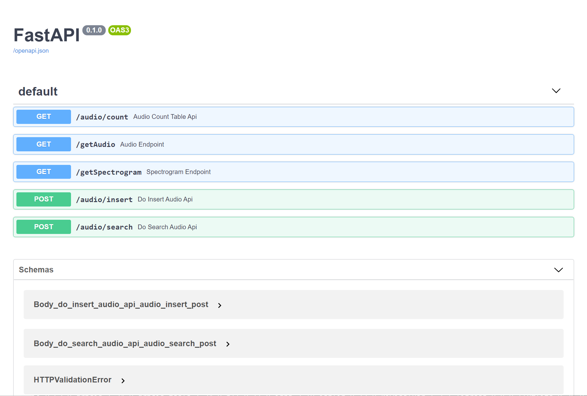
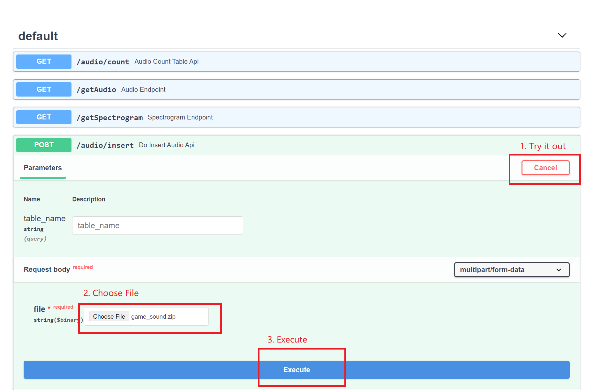
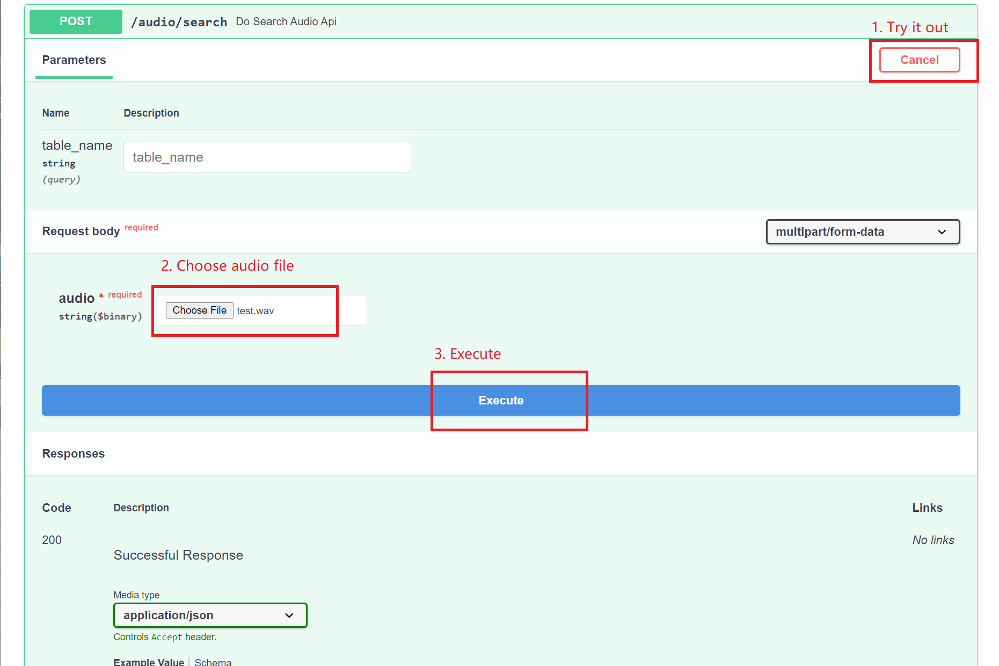

# Audio search system with Milvus

This project uses [PANNs](https://github.com/qiuqiangkong/audioset_tagging_cnn)(Large-Scale Pretrained Audio Neural Networks) for Audio Pattern Recognition to perform audio tagging and sound event detection, finally obtaining audio embeddings. Then this project uses [Milvus](https://milvus.io/docs/v2.0.0/overview.md) to search for similar audio clips.

## Local Deployment

### Requirements

- [Milvus 2.0](https://milvus.io/docs/v2.0.0/install_standalone-docker.md)
- [MySQL](https://hub.docker.com/r/mysql/mysql-server)
- [Python3](https://www.python.org/downloads/)

### Run Server

1. **Install python requirements**

   ```bash
   $ cd bootcamp/solutions/audio_search/src/
   $ pip install -r audio_requirements.txt
   ```

### 2. Start Server

The next step is to start the system server. It provides HTTP backend services, and there are two ways to start: running with Docker or source code.

#### 2.1 Run server with Docker

- **Set parameters**

Modify the parameters according to your own environment. Below are the main parameters that you will need to setup, for more information please refer to [config.py](./server/src/config.py).

| **Parameter**   | **Description**                                       | **example**      |
| --------------- | ----------------------------------------------------- | ---------------- |
| **EXTERNAL_DATAPATH**   | The directory of the SMILES data.                     | /data/audio_path |
| **INTERNAL_DATAPATH**   | The mount locaiton of the data within the docker container.                     | /audio_data |
| **MILVUS_HOST** | The IP address of Milvus. Due to containers not being able to access localhost, please use the IP address of the host, you can get it by ifconfig. | 172.16.20.10     |
| **MILVUS_PORT** | The port of Milvus.                                   | 19530            |
| **MYSQL_HOST**  | The IP address of MySQL, can be the same as MILVUS_HOST if running on the same system.                               | 172.16.20.10     |

```bash
$ export EXTERNAL_DATAPATH='/data/audio_path'
$ export INTERNAL_DATAPATH='/audio_data'
$ export Milvus_HOST='172.16.20.10'
$ export Milvus_PORT='19530'
$ export Mysql_HOST='172.16.20.10'
```

- **Run Docker**

First, build the docker image from the Dockerfile.

```bash
$ cd server
$ docker build -t audio-search-webserver .
```


```bash
$ docker run -d \
-v ${EXTERNAL_DATAPATH}:${INTERNAL_DATAPATH} \
-p 8002:8002 \
-e "MILVUS_HOST=${Milvus_HOST}" \
-e "MILVUS_PORT=${Milvus_PORT}" \
-e "MYSQL_HOST=${Mysql_HOST}" \
audio-search-webserver
```
#### 2.2 Run source code

- **Install the Python packages**

```bash
$ cd server
$ pip install -r requirements.txt
```

- **Set configuration**

```bash
$ vim server/src/config.py
```

Modify the parameters according to your own environment. Here listing some parameters that need to be set, for more information please refer to [config.py](./server/src/config.py).

| **Parameter**    | **Description**                                       | **Default setting** |
| ---------------- | ----------------------------------------------------- | ------------------- |
| MILVUS_HOST      | The IP address of Milvus, you can get it by ifconfig. If running everything on one machine, most likely 127.0.0.1 | 127.0.0.1           |
| MILVUS_PORT      | Port of Milvus.                                       | 19530               |
| VECTOR_DIMENSION | Dimension of the vectors.                             | 2048                |
| MYSQL_HOST       | The IP address of Mysql.                              | 127.0.0.1           |
| MYSQL_PORT       | Port of Milvus.                                       | 3306                |
| DEFAULT_TABLE    | The milvus and mysql default collection name.         | milvus_img_search   |

- **Run the code**

Then start the server with Fastapi.

```bash
$ python main.py
```

## System Usage

Type `127.0.0.1:8002/docs` in your browser to see all the APIs.



- Insert data.

  Download the sample [game_sound.zip](https://github.com/shiyu22/bootcamp/blob/0.11.0/solutions/audio_search/data/game_sound.zip?raw=true) and upload it into the system.

  > The sound data in the zip archive must be in wav format.

  

- Search for similar audio clips.

  You can upload [test.wav](https://github.com/shiyu22/bootcamp/blob/0.11.0/solutions/audio_search/data/test.wav) to search for the most similar sound clips.

  

Please refer to https://zilliz.com/demos/ to take a try in the front-end interface.


- **Code  structure**

If you are interested in our code or would like to contribute code, feel free to learn more about our code structure.

   ```
   └───server
   │   │   Dockerfile
   │   │   requirements.txt
   │   │   main.py  # File for starting the program.
   │   │
   │   └───src
   │       │   config.py  # Configuration file.
   │       │   encode.py  # Covert image/video/questions/audio... to embeddings.
   │       │   milvus_helpers.py  # Connect to Milvus server and insert/drop/query vectors in Milvus.
   │       │   mysql_helpers.py   # Connect to MySQL server, and add/delete/query IDs and object information.
   │       │   
   │       └───operations # Call methods in milvus.py and mysql.py to insert/query/delete objects.
   │               │   insert.py
   │               │   query.py
   │               │   delete.py
   │               │   count.py
   ```
