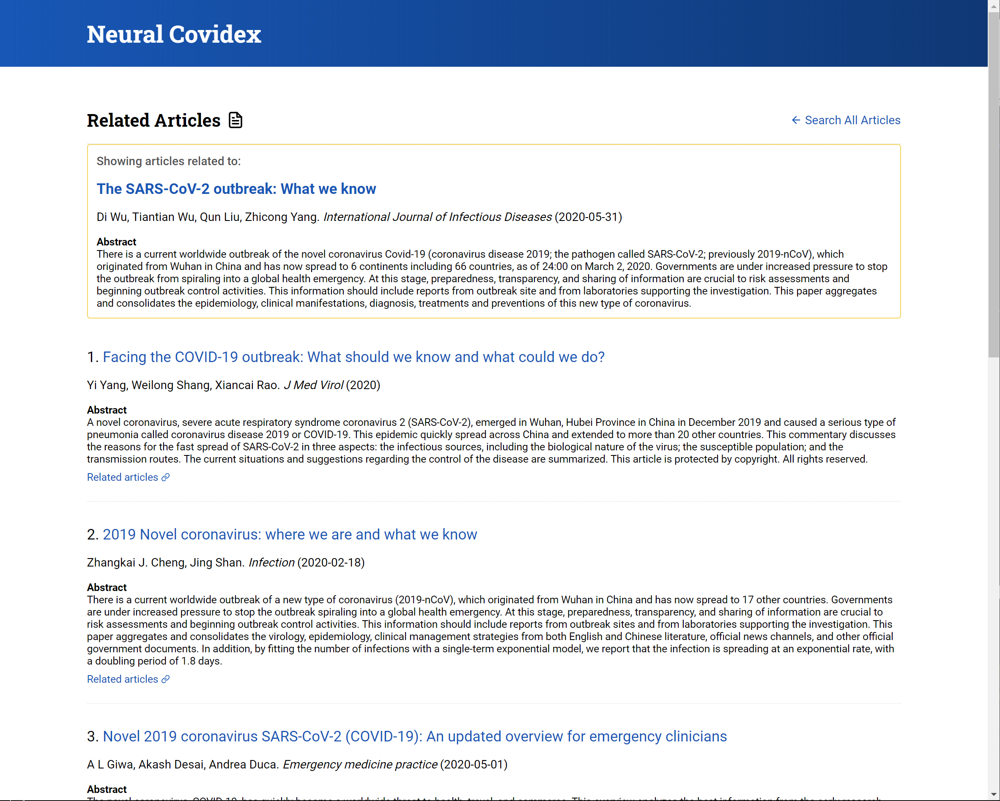

# COVID-19 文章检索

该系统用于用于检索 [COVID-19 开放数据集](https://pages.semanticscholar.org/coronavirus-research)，参考了 [covidex](https://github.com/castorini/covidex) 并提供了API接口、UI 界面。我们使用 Milvus 来查找最相近的文章，让我们一起学习怎么搭建系统吧。


## 系统部署

### 环境要求

- 安装 [CUDA 10.1](https://developer.nvidia.com/cuda-10.1-download-archive-update2)

+ 安装 [Anaconda](https://docs.anaconda.com/anaconda/install/linux/)

  ```bash
  $ wget https://repo.anaconda.com/archive/Anaconda3-2020.02-Linux-x86_64.sh
  $ bash Anaconda3-2020.02-Linux-x86_64.sh
  ```

- 安装 Java 11

    ```bash
    $ sudo apt-get install openjdk-11-jre openjdk-11-jdk
    ```

### 启动系统服务

#### 1. 启动 Milvus 服务

安装 [Milvus0.10.0](https://milvus.io/cn/docs/v0.10.0/install_milvus.md)。

```bash
$ docker run -d --name milvus_cpu_0.10.0 \
-p 19530:19530 \
-p 19121:19121 \
-v /home/$USER/milvus/db:/var/lib/milvus/db \
-v /home/$USER/milvus/conf:/var/lib/milvus/conf \
-v /home/$USER/milvus/logs:/var/lib/milvus/logs \
-v /home/$USER/milvus/wal:/var/lib/milvus/wal \
milvusdb/milvus:0.10.0-cpu-d061620-5f3c00
```

> 请根据自己的环境修改 **api/app/settings.py** 文件中的 Milvus 相关参数。

#### 2. Anaconda 环境

```bash
# Create an Anaconda environment named covdiex for Python 3.7
$ conda create -n covidex python=3.7
# Activate the covdiex environment
$ conda activate covidex
# Install Python dependencies
$ pip install -r api/requirements.txt
```

#### 3. 启动 [Anserini indices](https://github.com/castorini/anserini/blob/master/docs/experiments-cord19.md) 并建立索引

```bash
# updated all indices at api/index/
$ sh scripts/update-index.sh
# load all data to Milvus and build HNSW index
$ python milvus/index_milvus_hnsw.py --port=19530 --host=127.0.0.1
```

> 该命令中的 **port** 和 **host** 参数请根据自己环境中的 Milvus 地址和端口进行修改。

#### 4. 启动服务

```bash
# make sure you are in the api folder
$ cd api
$ uvicorn app.main:app --reload --port=8000
```

系统服务启动成功 [localhost:8000](http://localhost:8000)，API 文档可以参考 [/docs](http://localhost:8000/docs)。


### 启动 UI 服务

- 安装 [Node.js 12+](https://nodejs.org/en/download/) 、 [Yarn](https://classic.yarnpkg.com/en/docs/install/)

- 安装依赖

    ```bash
    # make sure you are in the client folder
    $ cd client
    $ yarn install
    ```

    > 如果你在启动系统服务时修改了地址和端口, 请在 src/shared/Constants.ts 文件中的17 行修改相关参数。

- 启动服务

    ```bash
    $ yarn start
    ```

UI 服务启动成功，你可以在浏览器中输入 [localhost:3000](http://localhost:3000) 查看。

- 搜索 COVID-19 文章

  

- 获取相关的文章

  

