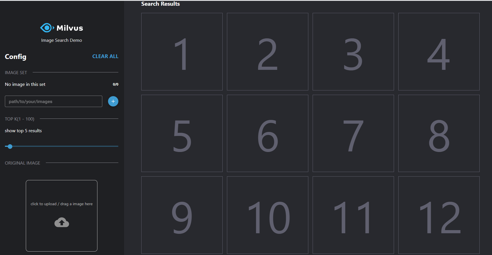
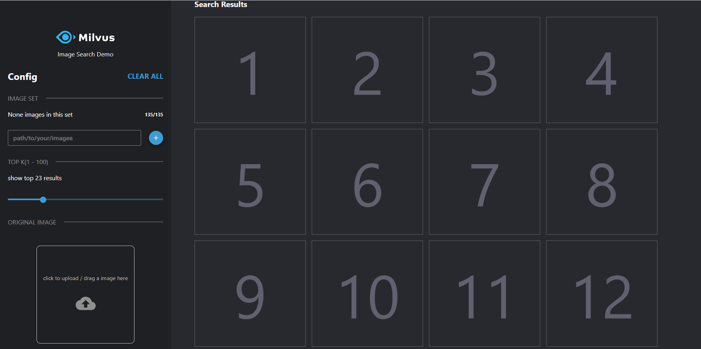
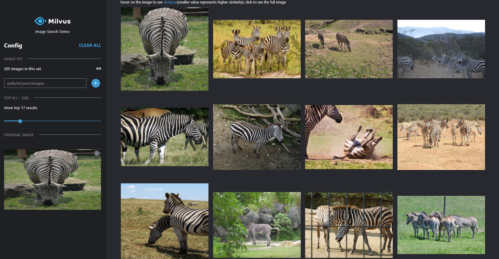

# Image Similarity Search with object detection

This demo uses the YOLOv3 model to detect objects in images and the ResNet-50 model to extract feature vectors of images, and then uses Milvus to build an image similarity search system.

The following is the system diagram.


### Data source

This demo uses the PASCAL VOC image set, which contains 17125 images with 20 categories: human; animals (birds, cats, cows, dogs, horses, sheep); transportation (planes, bikes,boats, buses, cars, motorcycles, trains); household (bottles, chairs, tables, pot plants, sofas, TVs)

Dataset size: ~ 2 GB.

Download: http://host.robots.ox.ac.uk/pascal/VOC/voc2012/VOCtrainval_11-May-2012.tar

> Note: You can also use your own images. This demo supports images in formats of .jpg and .png.

### How to deploy the system

#### 1. Run Milvus Docker

Refer to the [Install Milvus v1.1.0](https://milvus.io/docs/v1.1.0/milvus_docker-cpu.md) for how to run Milvus docker.

#### **2. Install the Python packages**

```bash
$ cd webserver
$ pip install -r requirements.txt
```
#### 3. Set configuration

```bash
$ vim  webserver/src/common/config.py
```
Please modify the parameters according to your own environment.
| Parameter        | Description                        | Default setting                       |
| ---------------- | ---------------------------------- | ------------------------------------- |
| MILVUS_HOST      | milvus IP address                  | 127.0.0.1                             |
| MILVUS_PORT      | milvus service port                | 19512                                 |
| VECTOR_DIMENSION | Dimensionality of the vectors      | 2048                                  |
| DATA_PATH        | Path to save images                | /data/jpegimages                      |
| DEFAULT_TABLE    | The milvus default collection      | milvus_od                             |
| UPLOAD_PATH      | Path to uploaded the target images | /data/search-images                   |
| COCO_MODEL_PATH  | Path to the YOLO detection model   | ./yolov3_detector/data/yolov3_darknet |

> Note that you need to create the folder named DATA_PATH and UPLOAD_PATH.

#### 4. Start search service

```bash
$ cd webserver/src
$ python app.py
```
>  If the YOLO model is not downloaded automatically, you should switch to the **webserver/src/yolov3_detector/data/** path and run the `./paprepare_model.sh` commend.

#### 5. Run pic-search-webclient docker

```bash
$ docker run -d -p 8001:80 \
-e API_URL=http://127.0.0.1:5000 \
milvusbootcamp/pic-search-webclient:0.2.0
```

> In this command, `API_URL` means the query service address.

### How to perform reverse image search

After deployment, enter ` 127.0.0.1:8001` in the browser to open the interface for image search. 



Enter t he folder directory of images to be loaded, e.g. /data/images. Click **"+"** to load the images. The following screenshot shows the loading process.



> Note: After clicking the Load button, you need to wait for a while for the system to respond. Please do not make mulitple clicks.

It may take several minutes to load the images. The following screenshot shows the interface when image loading is successful.


Search for the image.



