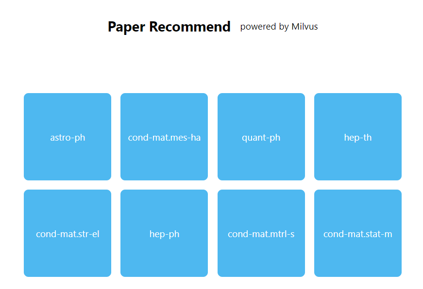
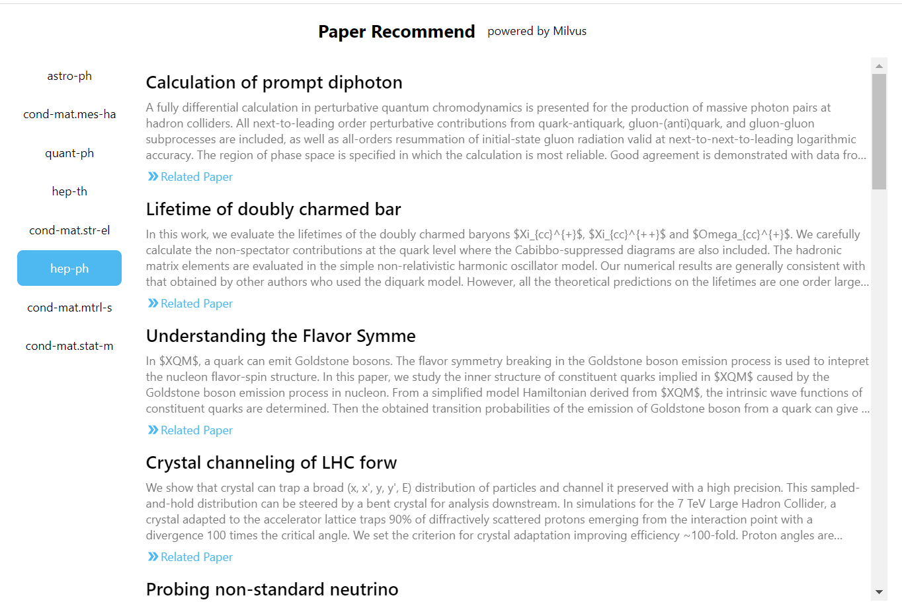

# README

本项目结合 milvus 和 bert 实现了一个基于 item 的文本推荐系统。

## 数据说明

**数据说明**

在本项目中选取的是来自 [ArXiv](https://arxiv.org/) 的公共数据集，我们一共下载了 300 多万条数据，该数据集是一个 json 格式的元数据文件。该文件仅包含每篇论文的条目：

- `id`：ArXiv ID（可用于访问原始论文）
- `submitter`：论文提交者
- `authors`：论文作者
- `title`：论文标题
- `comments`：其他信息（例如页数和图形）
- `journal-ref`：有关该论文发表的期刊的信息
- `doi`：[数字对象标识符](https://www.doi.org/)
- `abstract`：论文摘要
- `categories`：ArXiv 系统中的类别/标签
- `versions`：版本历史记录

您可以使用以下链接直接在 ArXiv 上访问每篇论文：

- `https://arxiv.org/abs/{id}`：本文页面，包括摘要和其他链接
- `https://arxiv.org/pdf/{id}`：直接链接下载PDF

**数据下载**

原始数据下载方式请参考 [arxiv-public-datasets](https://github.com/mattbierbaum/arxiv-public-datasets) .

> 在本项目中仅下载项目 arxiv-public-datasets 中的 Article metadata 这一部分数据。


## 脚本说明

本项目中包含了 service 和 data 两部分.

service 提供了后端服务的代码。data 提供了测试用的数据。

service 中的配置文件 config.py 说明：

| Parameter        | Description                           | Default   |
| ---------------- | ------------------------------------- | --------- |
| MILVUS_HOST      | Milvus 服务所在的地址                 | 127.0.0.1 |
| MILVUS_PORT      | Milvus 服务的端口号                   | 19530     |
| BERT_HOST        | Bert 服务所在的地址                   | 127.0.0.1 |
| BERT_PORT        | Bert 服务的端口号                     | 5555      |
| MYSQL_HOST       | MySql 服务所在的地址                  | 127.0.0.1 |
| MYSQL_PORT       | MySql 服务的端口号                    | 3306      |
| MYSQL_USER       | MySql 的用户名                        | root      |
| MYSQL_PASSWORD   | MySql 的密码                          | 123456    |
| MYSQL_DATABASE   | MySql 的 database 名                  | mysql     |
| TABLE_NAME       | 在 Milvus 中的集合名以及 MySql 的表名 | recommend |
| batch_size       | 每次处理的数据批量大小                | 10000     |
| temp_file_path   | 生成导入 MySql 的数据的临时文本       | temp.csv  |
| categories_num   | 首页显示的类别数                      | 50        |
| texts_num        | 点开每个分类首页显示的文章数量        | 100       |
| collection_param | Milvus 创建集合时的参数               | default   |
| search_param     | Milvus 查询时的参数                   | 16        |
| top_k            | 最终推荐相似文章的数目                | 30        |


## 搭建步骤

1. 安装 Milvus，参考  [Milvus安装](https://milvus.io/cn/docs/v0.10.2/milvus_docker-cpu.md)。

2. 安装 MySql.

3. 拉取项目

```shell
git clone https://github.com/milvus-io/bootcamp.git
#进入本项目的目录下
cd bootcanp/solution/item_based_recommend
```

4. 安装依赖

```shell
pip3 install -r requirement.txt
```

5. 安装并启动 Bert 服务

```
#下载模型
mkdir model
cd model
wget https://storage.googleapis.com/bert_models/2018_10_18/uncased_L-12_H-768_A-12.zip
unzip uncased_L-12_H-768_A-12.zip
#启动服务
bert-serving-start -model_dir uncased_L-12_H-768_A-12 -num_worker=12
```

6. 数据导入

```shell
python load.py -p ../data/test.json
```

7. 启动系统服务

```shell
cd service
uvicorn main:app
```


8. 启动前端界面

```
docker run -d -p 9999:80 -e API_URL=http://127.0.0.1:8000 tumao/paper-recommend-demo:latest
```

> `API_URL` 该值后应填写服务端所在的 `IP` 和 `port`

## 结果展示

显示分类



查看分类下的文章



相似文章

