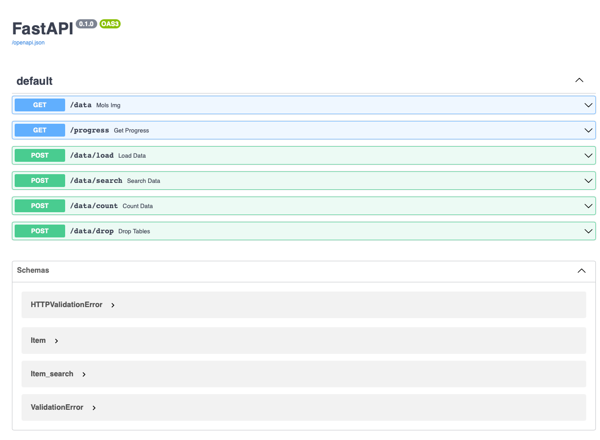
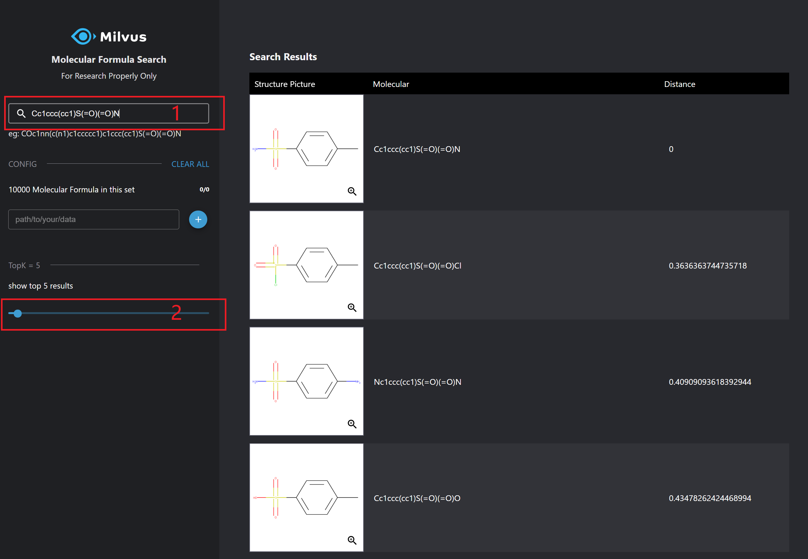

# Molecular Similarity Search

   * [Overview](#overview)
   * [Data source](#data-source)
   * [Deploy the system with Docker Compose](#deploy-the-system-with-docker-compose)
   * [Deploy the system with source code](#deploy-the-system-with-source-code)
      * [Run webserver](#run-webserver)
      * [Run Webclient](#run-webclient)
   * [How to use](#how-to-use)
   * [Conclusion](#conclusion)

## Overview

This demo uses RDKit, a cheminformatics software, and Milvus to build a system that can perform similarity searches on molecular compounds. 


## Data source

This demo uses data that comes in the form of SMILES files. The main data source needs to be converted to SMILES from SDF, so in order to show how the program works, we have provided a subset of the data preconverted to SMILES. This subset comes in two forms, 100 values and 10,000, and can be found in the smiles-data directory.

Download location: [https://ftp.ncbi.nlm.nih.gov/pubchem/Compound/CURRENT-Full/SDF/](https://ftp.ncbi.nlm.nih.gov/pubchem/Compound/CURRENT-Full/SDF/)

## Deploy the system with Docker Compose

The molecular similarity search system requires [**Milvus**](https://milvus.io/docs/v2.0.0/install_standalone-docker.md), MySQL, Webserver and Webclient services. We can start these containers with one click through [docker-compose.yaml](./molsearch-docker-compose.yaml), so please make sure you have  [installed Docker Engine](https://docs.docker.com/engine/install/) and [Docker Compose](https://docs.docker.com/compose/install/) before running.

```bash
$ git clone https://github.com/milvus-io/bootcamp.git
$ cd solutions/medical/molecular_similarity_search/quick_deploy
$ docker-compose -f molsearch-docker-compose.yaml up -d
```

Then you will see the that all containers are created.

```bash
Creating network "quick_deploy_app_net" with driver "bridge"
Creating milvus-minio        ... done
Creating milvus-etcd         ... done
Creating molsearch-webclient ... done
Creating molsearch-mysql     ... done
Creating milvus-standalone   ... done
Creating molsearch-webserver ... done
```

And show all containers with `docker ps`, and you can use `docker logs molsearch-webserver` to get the logs of **webserver** container.

```bash
CONTAINER ID   IMAGE                                         COMMAND                  CREATED         STATUS                     PORTS                                                  NAMES
9e47f3239c05   milvusbootcamp/mols-search-webserver:2.0      "/bin/sh -c 'python3…"   2 minutes ago   Up 2 minutes               0.0.0.0:5000->5000/tcp, :::5000->5000/tcp              molsearch-webserver
e1782cf73606   milvusdb/milvus:v2.0.0-rc8-20211104-d1f4106   "/tini -- milvus run…"   2 minutes ago   Up 2 minutes               0.0.0.0:19530->19530/tcp, :::19530->19530/tcp          milvus-standalone
74e51c7c27c0   minio/minio:RELEASE.2020-12-03T00-03-10Z      "/usr/bin/docker-ent…"   2 minutes ago   Up 2 minutes (healthy)     9000/tcp                                               milvus-minio
2df1375da43e   quay.io/coreos/etcd:v3.5.0                    "etcd -advertise-cli…"   2 minutes ago   Up 2 minutes               2379-2380/tcp                                          milvus-etcd
cc76e7bc542e   mysql:5.7                                     "docker-entrypoint.s…"   2 minutes ago   Up 2 minutes               0.0.0.0:3306->3306/tcp, :::3306->3306/tcp, 33060/tcp   molsearch-mysql
6dfda3a3cc3d   milvusbootcamp/mols-search-webclient:2.0      "/bin/bash -c '/usr/…"   2 minutes ago   Up 2 minutes (unhealthy)   0.0.0.0:801->80/tcp, :::801->80/tcp                    molsearch-webclient
```

## Deploy the system with source code

Actually we recommend using Docker Compose to deploy the molecular similarity search system. If you want to run from source code, you must manually start [Milvus](https://milvus.io/docs/v2.0.0/install_standalone-docker.md) and [Mysql](https://dev.mysql.com/doc/mysql-installation-excerpt/5.7/en/docker-mysql-getting-started.html). Next show you how to run the Webserver and Webclient.

### Run webserver

Before running the code, please install the packages and modify your own environment parameters. Then run `main.py`, and finally get the API with **fastapi**.

- **Install the Python packages**

```bash
$ git clone https://github.com/milvus-io/bootcamp.git
$ cd solutions/molecular_similarity_search/quick_deploy/server
$ conda install -c rdkit rdkit -y
$ pip install -r requirements.txt
```

- **Set configuration**

```bash
$ vim src/config.py
```

Please modify the parameters according to your own environment. Here listing some parameters that need to be set, for more information please refer to [config.py](./server/src/config.py).

| **Parameter**    | **Description**                                       | **Default setting** |
| ---------------- | ----------------------------------------------------- | ------------------- |
| MILVUS_HOST      | The IP address of Milvus, you can get it by ifconfig. If running everything on one machine, most likely 127.0.0.1 | 127.0.0.1           |
| MILVUS_PORT      | Port of Milvus.                                       | 19530               |
| VECTOR_DIMENSION | Dimension of the vectors.                             | 2048                |
| MYSQL_HOST       | The IP address of Mysql.                              | 127.0.0.1           |
| MYSQL_PORT       | Port of Milvus.                                       | 3306                |
| DEFAULT_TABLE    | The milvus and mysql default collection name.         | milvus_img_search   |

- **Run the code**

Then start the server with Fastapi.

```bash
$ python src/main.py
```

- **API docs**

Vist **127.0.0.1:5000/docs** in your browser to use all the APIs.



> /data
>
> Return the images of the molecule formula.
>
> /progress
>
> Check the progress when loading.
>
> /data/load
>
> Load the molecules with a specified path.
>
> /data/search
>
> Pass in a molecule to search for similar molecules in the system.
> 
>  /data/count
> 
>Return the number of data in Milvus.

- **Code  structure**

If you are interested in our code or would like to contribute code, feel free to learn more about our code structure.

```bash
└───server
│   │   Dockerfile
│   │   requirements.txt
│   └───src
│       │   main.py  # File for starting the program.
│       │   test_main.py  # File to test the program with Pytest.
│       │   config.py  # Configuration file.
│       │   encode.py  # Covert image/video/questions/... to embeddings.
│       └───operations # Call methods to insert/query/delete objects.
│               │   insert.py
│               │   query.py
│               │   delete.py
│               │   count.py
│       └───helpers # The code to run milvus and mysql server.
│               │   milvus_helpers.py
│               │   mysql_helpers.py
```

### Run Webclient

Finally to start the front-end service.

```bash
# Modify API_URL to the IP address and port of the server.
$ export API_URL='http://127.0.0.1:5000'
$ docker run -d -p 801:80 \
-e API_URL=${API_URL} \
milvusbootcamp/mols-search-webclient:2.0
```

## How to use

The system provides front-end services. You can enter `127.0.0.1:801` in the browser to insert and search molecular data.


- Load chemical structures
  1. In `path/to/your/data`, enter the location of the smi file. For example, `/mols_data/test_1w.smi`, if you run the service from source code, you need to fill in [the path of the molecule file](../smiles-data/test_100.smi).
  2. Click `+` to load.
  3. You can see the number of chemical structures have changed: 10000 Molecular Formula in this set

  > The [directory](../smiles-data/test_100.smi) is the path where the data is locally mounted to the webserver docker, and **/mols_data/test_1w.smi** is the path inside the docker, so we are supposed to fill in the path in the docker, namely `/mols_data/test_1w.smi`.


- Search chemical structures
  1. Enter the chemical structure to search, such as `Cc1ccc(cc1)S(=O)(=O)N`, and press \<ENTER\>.
  2. Set the value of topk. This demo returns topk most similar chemical structures.



- Clear chemical structure data

  Click `CLEAR ALL` to remove all chemical structure data.


## Conclusion

This demo shows a system about molecular similarity search with Milvus. You can also use your own SMILES data.

We have built the demo system (https://milvus.io/scenarios), and we also have an open source projects on substructure and superstructure search in [MolSearch](https://github.com/zilliztech/MolSearch), so you are welcome to try it yourself and search your own molecular.
