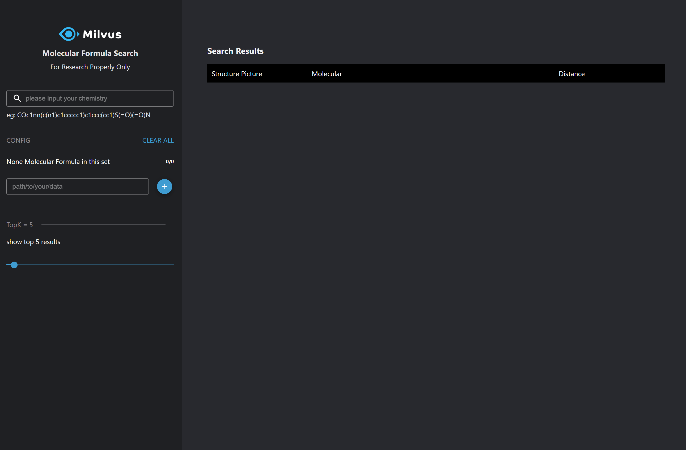
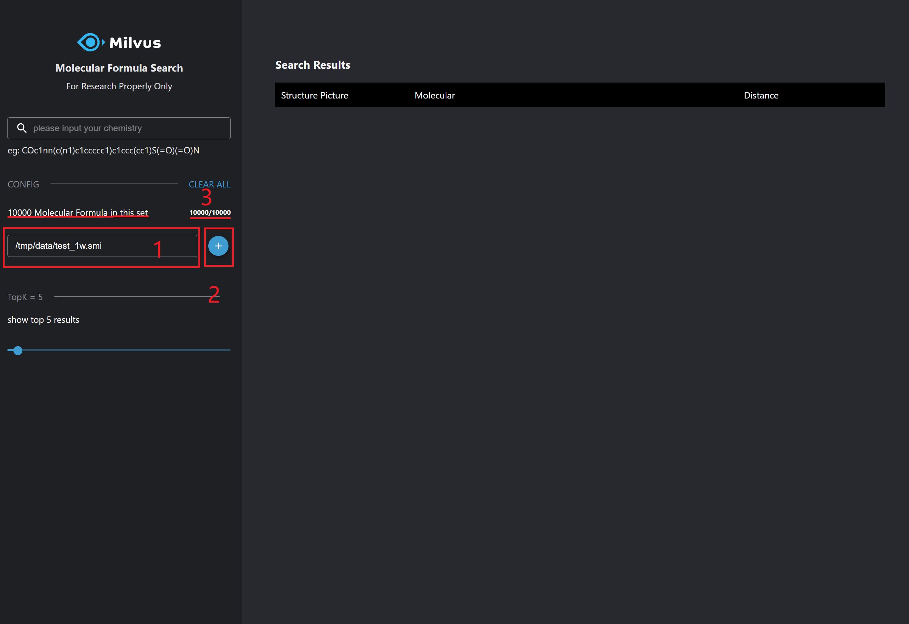
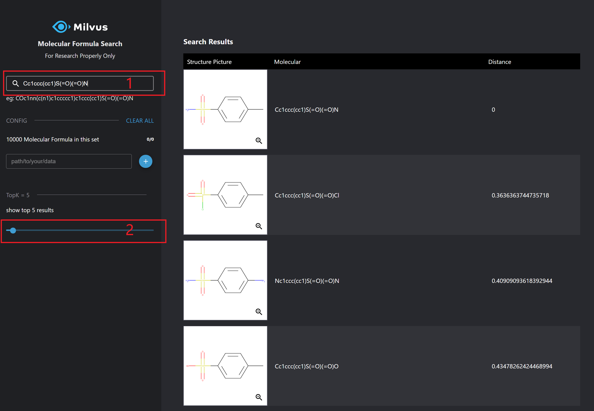
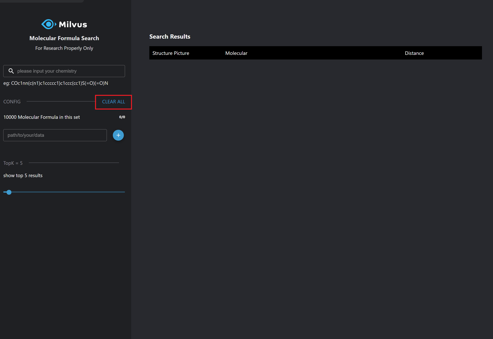

# Molecular Similarity Search

## Overview

This demo uses RDKit, a cheminformatics software, and Milvus to build a system that can perform similarity searches on molecular compounds. 


## Data source

This demo uses data that comes in the form of SMILES files. The main data source needs to be converted to SMILES from SDF, so in order to show how the program works, we have provided a subset of the data preconverted to SMILES. This subset comes in two forms, 100 values and 10,000, and can be found in the smiles-data directory.

Download location: [https://ftp.ncbi.nlm.nih.gov/pubchem/Compound/CURRENT-Full/SDF/](https://ftp.ncbi.nlm.nih.gov/pubchem/Compound/CURRENT-Full/SDF/)


## How to deploy the system

### 1. Start Milvus and MySQL

The system will use Milvus to store and search the vector data, and Mysql is used to store the correspondence between the ids returned by Milvus and the molecule structures.

- **Start Milvus**
With Milvus v2.0 currently available, please take a look [here](https://milvus.io/docs/v2.0.0/install_standalone-docker.md) on how to start the Milvus instance.

- **Start MySQL**

```bash
$ docker run -p 3306:3306 -e MYSQL_ROOT_PASSWORD=123456 -d mysql:5.7
```

### 2. Start Server

The next step is to start the system server. It provides HTTP backend services, and there are two ways to start: running with Docker or source code.

#### 2.1 Run server with Docker

- **Set parameters**

Modify the parameters according to your own environment. Below are the main parameters that you will need to setup, for more information please refer to [config.py](./server/src/config.py).

| **Parameter**   | **Description**                                       | **example**      |
| --------------- | ----------------------------------------------------- | ---------------- |
| **EXTERNAL_DATAPATH**   | The directory of the SMILES data.                     | /data/image_path |
| **INTERNAL_DATAPATH**   | The mount locaiton of the data within the docker container.                     | /mols_data |
| **MILVUS_HOST** | The IP address of Milvus. Due to containers not being able to access localhost, please use the IP address of the host, you can get it by ifconfig. | 172.16.20.10     |
| **MILVUS_PORT** | The port of Milvus.                                   | 19530            |
| **MYSQL_HOST**  | The IP address of MySQL, can be the same as MILVUS_HOST if running on the same system.                               | 172.16.20.10     |

```bash
$ export EXTERNAL_DATAPATH='/data/image_path'
$ export INTERNAL_DATAPATH='/mols_data'
$ export MILVUS_HOST='172.16.20.10'
$ export MILVUS_PORT='19530'
$ export MYSQL_HOST='172.16.20.10'
```

- **Run Docker**

```bash
$ docker run -d \
-v ${EXTERNAL_DATAPATH}:${INTERNAL_DATAPATH} \
-p 5000:5000 \
-e "MILVUS_HOST=${MILVUS_HOST}" \
-e "MILVUS_PORT=${MILVUS_PORT}" \
-e "MYSQL_HOST=${MYSQL_HOST}" \
milvusbootcamp/mols-search-webserver:2.0.0
```
#### 2.2 Run source code

- **Install the Python packages**

```bash
$ cd server
$ conda install -c rdkit rdkit -y
$ pip install -r requirements.txt
$ pip install --extra-index-url https://test.pypi.org/simple/  pymilvus-orm==2.0a1.dev43
```

- **Set configuration**

```bash
$ vim server/src/config.py
```

Please modify the parameters according to your own environment. Here listing some parameters that need to be set, for more information please refer to [config.py](./server/src/config.py).

| **Parameter**    | **Description**                                       | **Default setting** |
| ---------------- | ----------------------------------------------------- | ------------------- |
| MILVUS_HOST      | The IP address of Milvus, you can get it by ifconfig. If running everything on one machine, most likely 127.0.0.1 | 127.0.0.1           |
| MILVUS_PORT      | Port of Milvus.                                       | 19530               |
| VECTOR_DIMENSION | Dimension of the vectors.                             | 2048                |
| MYSQL_HOST       | The IP address of Mysql.                              | 127.0.0.1           |
| MYSQL_PORT       | Port of Milvus.                                       | 3306                |
| DEFAULT_TABLE    | The milvus and mysql default collection name.         | milvus_img_search   |

- **Run the code** 

Then start the server with Fastapi. 

```bash
$ python main.py
```

- **API docs**


Vist 127.0.0.1:5000/docs in your browser to use all the APIs.


> /data
>
> Return the molecules.
>
> /progress
>
> Check the progress when loading.
>
> /data/load
>
> Load the molecules in the specified file.
>
> /data/search
>
> Pass in a molecule to search for similar molecules 
> in the system.
>  
> /data/count
>
> Return the number of vectors in Milvus.


- **Code  structure**

If you are interested in our code or would like to contribute code, feel free to learn more about our code structure.

```
└───server
│   │   Dockerfile
│   │   requirements.txt
│   │   main.py  # File for starting the program.
│   │
│   └───src
│       │   config.py  # Configuration file.
│       │   encode.py  # Covert image/video/questions/... to embeddings.
│       │   milvus.py  # Connect to Milvus server and insert/drop/query vectors in Milvus.
│       │   mysql.py   # Connect to MySQL server, and add/delete/query IDs and object information.
│       │   
│       └───operations # Call methods in milvus.py and mysql.py to insert/query/delete objects.
│               │   insert.py
│               │   query.py
│               │   delete.py
│               │   count.py
```

### 3. Start Client

- **Start the front-end**

```bash
# Modify API_URL to the IP address and port of the server.
$ export API_URL='http://172.16.20.10:5000'
$ docker run -d -p 8001:80 \
-e API_URL=${API_URL} \
milvusbootcamp/mols-search-webclient:1.0
```

- **How to use**



- Load chemical structures
  1. In `path/to/your/data`, enter the location of the smi file. For example, `${INTERNAL_DATAPATH/test_1w.smi`.
  2. Click `+` to load.
  3. You can see the number of chemical structures have changed: 10000 Molecular Formula in this set



- Search chemical structures
  1. Enter the chemical structure to search, such as `Cc1ccc(cc1)S(=O)(=O)N`, and press \<ENTER\>.
  2. Set the value of topk. This demo returns topk most similar chemical structures.



- Clear chemical structure data

  Click `CLEAR ALL` to remove all chemical structure data.




## Conclusion

This demo shows a system about molecular similarity search with Milvus. You can also use your own SMILES data.

We have built the demo system (https://milvus.io/scenarios), and we also have an open source projects on substructure and superstructure search in [MolSearch](https://github.com/zilliztech/MolSearch), so you are welcome to try it yourself and search your own molecular.
