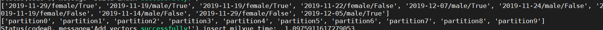
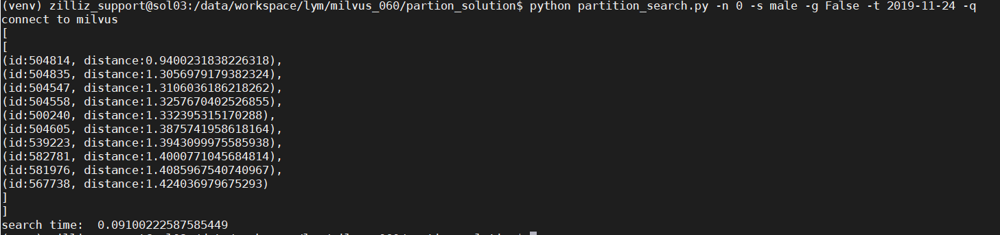

# 基于 Milvus 分区的向量数据和结构化数据混合查询方案

本方案是基于 Milvus 的分区功能，实现向量数据和结构化数据混合查询的一个示例。

在以下示例中，使用特征向量和结构数据模拟人脸属性，展示了如何进行结构化数据和非结构化数据的混合查询。示例中，针对一个给定向量（可以看做是一个给定的人脸图片提取的特征向量）和其对应的属性，将该向量按其属性进行分区，各属性值相同的向量为同一个分区。在进行查询时，根据给定的属性（获取时间、性别、是否戴眼镜）和特征向量在底库中对应的分区里搜索与给定向量相似度 top 10的向量。

## 运行要求

- [安装 Milvus](https://github.com/milvus-io/docs/blob/0.6.0/zh-CN/userguide/install_milvus.md)
- pip3 install numpy
- pip3 install faker

## 数据来源

本次测试所使用的数据为 ANN_SIFT1B

- 下载地址：[http://corpus-texmex.irisa.fr/](http://corpus-texmex.irisa.fr/)
- 基础数据集：ANN_SIFT1B Base_set
- 查询数据集：ANN_SIFIT1B Query_set

> 说明：您也可以使用其它 `bvecs` 格式的数据文件。

## 脚本使用说明

本示例包含了两个脚本：`partition_import.py` 和 `partition_query.py`。`partition_import.py` 定义好数据数据的属性并按分区导入 Milvus 中，`partition_query.py` 实现自定义条件的混合查询。

### partition_import.py

给定的原始数据为1,000,000条人脸提取的特征向量，在该示例代码中将随机生成相应的属性值（获取时间、性别、是否戴眼镜）赋给这些向量。设定每十万条向量给定同样的属性值，因此导入 Milvus 的表中，将会有十个不同的分区，每个分区包含十万条向量。（各分区的向量数可以不同，该示例只是提供一个简单的解决方案供参考）各个区有其对应的 `partition_name` 和 `partition_tag`，`partition_tag` 是由各区属性组成的一个字符串。

在执行该脚本之前，需要查看脚本里的一些变量，根据运行环境和数据进行修改，以保证代码的正常运行。

**变量说明**

| 变量名         | 说明                                           |
| -------------- | ---------------------------------------------- |
| `MILVUS_TABLE` | 在 Milvus 中创建的表的名字。                     |
| `FILE_PATH`    | 待导入表中向量集在本地存放的位置。               |
| `VEC_NUM`      | 表中的向量总数，应小于本地向量集总数。   |
| `BASE_LEN`     | 每次批量导入表中的数据，也是一个分区的数据量。   |
| `VEC_DIM`      | 在 Milvus 中建表的维度，根据导入的向量维度设置。 |
| `SERVER_ADDR`  | Milvus server 的地址。                           |
| `SERVER_PORT`  | Milvus server 的端口。                           |

**运行**

```shell
$ python3 partition_import.py
```



如图所示，导入 Milvus 中的1,000,000条向量分成了10个区，`partition_tag` 是例如'2019-11-20'这样的字符串，partition0 到 partition9 是相应分区的 `partition_name`。（`partition_tag` 和 `partition_name` 均是自定义的）

### partition_query.py

**变量说明**

| 变量名         | 说明                                                         |
| -------------- | ------------------------------------------------------------ |
| `MILVUS_TABLE` | Milvus 中待查询的表的名字，应与上述导入数据时建立的表名一样。 |
| `QUERY_PATH`   | 待查询的向量集在本地存放的位置。                               |
| `SERVER_ADDR`  | Milvus server 的地址。                                         |
| `SERVER_PORT`  | Milvus server 的端口。                                         |
| `TOP_K`        | 查询时取与原始向量相似度最高的向量数量。                    |

**参数说明**

| 参数 |             | 说明                                      |
| ---- | ----------- | ----------------------------------------- |
| `-n` | `--num`     | 选择要查询的向量在查询向量集中的位置。      |
| `-s` | `--sex`     | 指定查询条件人脸性别：`male` 或 `female`。  |
| `-t` | `--time`    | 指定查询条件获取时间。例如 `2019-04-05`。     |
| `-g` | `--glasses` | 指定查询条件是否戴眼镜：`True` 或 `False`。 |
| `-q` | `--query`   | 执行查询，无需对此参数赋值。                          |

**运行示例**

查询与向量集中第0条向量相似 top10的向量，且性别为男、没戴眼镜、图片获取时间2019-11-24：

```shell
$ python3 partition_query.py -n 0 -s male -g False -t 2019-11-24 -q
```



上图查询结果中，id表示插入表中的第几条向量，distance 是被检索向量与检索出的向量间的欧氏距离。

查询与向量集中第10条向量相似 top 10的向量，且性别为男、图片获取时间2019-12-07：

```shell
$ python3 partition_query.py -n 10 -s male -t 2019-12-07 -q
```

查询与向量集中第50条向量相似 top 10的向量，且没有戴眼镜、图片获取时间2019-11-29：

```shell
$ python3 partition_query.py -n 50 -g False -t 2019-11-29 -q
```

查询与向量集中第306条向量相似 top 10的向量，且性别为女、戴眼镜：

```shell
$ python3 partition_query.py -n 306 -s female -g True -q
```

查询与向量集中第255条向量相似 top 10的向量，且性别为男：

```shell
$ python3 partition_query.py -n 255 -s male -q
```

查询与向量集中第3450条向量相似 top 10的向量：

```shell
$ python3 partition_query.py -n 3450 -q
```

