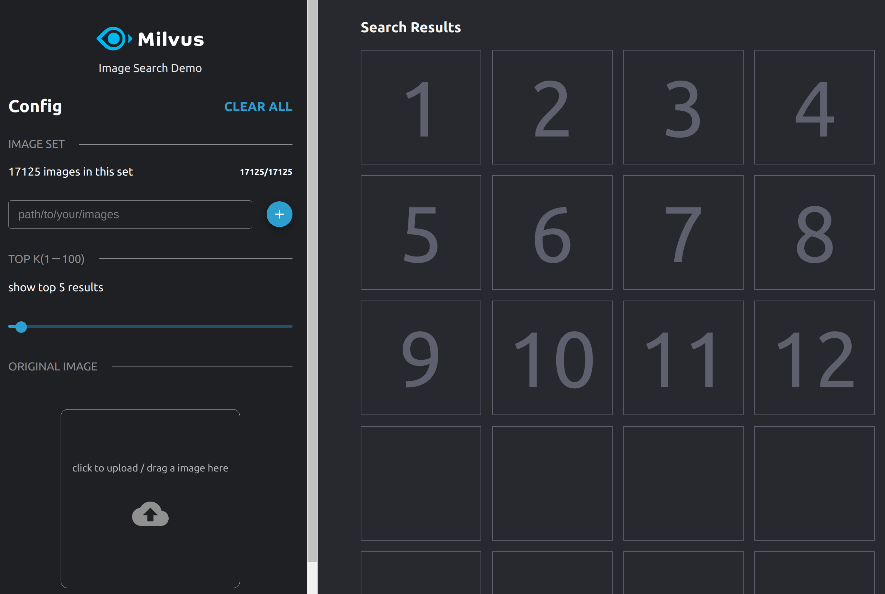

# 基于 Milvus 和 VGG 实现以图搜图

本文展示如何利用图片特征提取模型 VGG 和向量搜索引擎 Milvus 搭建一个以图搜图系统。

系统架构图如下所示：


本文将介绍GPU部署和CPU部署两种方案，用户可以自行选择。使用GPU部署，性能会优于CPU部署方案。

### 环境要求

下表列出了搭建以图搜图系统的推荐配置，这些配置已经经过测试。

#### GPU部署

| 组件     | 推荐配置                                                     |
| -------- | ------------------------------------------------------------ |
| CPU      | Intel(R) Core(TM) i7-7700K CPU @ 4.20GHz                     |
| GPU      | GeForce GTX 1050 Ti 4GB                                      |
| Memory   | 32GB                                                         |
| OS       | Ubuntu 18.04                                                 |
| Software | Milvus 0.6.0(GPU版）<br />pic_search_demo 0.5.0<br />pic_search_demo_web 0.2.0 |

#### CPU部署
| 组件     | 推荐配置                                                     |
| -------- | ------------------------------------------------------------ |
| CPU      | Intel(R) Core(TM) i7-7700K CPU @ 4.20GHz                     |
| Memory   | 32GB                                                         |
| OS       | Ubuntu 18.04                                                 |
| Software | Milvus 0.6.0(CPU版）<br />pic_search_demo 0.5.1<br />pic_search_demo_web 0.2.0 |


### 数据来源

本次测试使用的图片数据集为 PASCAL VOC 图片集，包含 17125 张图片，涵盖 20 个目录：人类；动物（鸟、猫、牛、狗、马、羊）；交通工具（飞机、自行车、船、公共汽车、小轿车、摩托车、火车）；室内（瓶子、椅子、餐桌、盆栽植物、沙发、电视）。

数据集大小：~2GB

下载地址：http://host.robots.ox.ac.uk/pascal/VOC/voc2012/VOCtrainval_11-May-2012.tar

> 说明：您也可以使用其他的图片数据进行测试。经过测试，可以进行加载的图片格式有.jpg格式、.png格式。

### 部署流程

#### GPU部署

##### 1、启动 Milvus docker

本实验使用 Milvus0.6.0 GPU 版本，启动方法参考链接：https://github.com/milvus-io/docs/blob/0.6.0/userguide/install_milvus.md

##### 2、启动 pic_search_demo docker

```bash
$ docker run -d --name zilliz_search_images_demo \
-v IMAGE_PATH1:/tmp/pic1 \
-v IMAGE_PATH2:/tmp/pic2 \
-p 35000:5000 \
-e "DATA_PATH=/tmp/images-data" \
-e "MILVUS_HOST=192.168.1.123" \
milvusbootcamp/pic-search-webserver:0.1.0
```

上述启动命令中，“ IMAGE_PATH1 ” 、“ IMAGE_PATH2” 表示你存放图片数据的目录。启动时将这些路径映射到 docker 容器里面，系统搭建好以后，可以直接在前端界面上输入 docker 容器中的图片路径 “ /tmp/pic1 ” 、“ /tmp/pic2” 去加载图片。“ MILVUS_HOST “ 表示启动 Milvus docker 的服务器地址，注意不要使用回环地址 “127.0.0.1” 。命令其他部分保持不变即可。

##### 3、启动 pic_search_demo_web docker

```bash
$ docker run --name zilliz_search_images_demo_web -d --rm -p 8001:80 \
-e API_URL=http://192.168.1.123:35000 \
milvusbootcamp/pic-search-webclient:0.1.0
```

上述启动命令中，" 192.168.1.123 " 表示启动 Milvus docker 的服务器地址。

#### CPU部署

##### 1、启动 Milvus docker

本实验使用 Milvus0.6.0 CPU 版本，启动方法参考链接：https://github.com/milvus-io/docs/blob/0.6.0/userguide/install_milvus.md

##### 2、启动 pic_search_demo docker

```bash
$ docker run -d --name zilliz_search_images_demo \
-v IMAGE_PATH1:/tmp/pic1 \
-v IMAGE_PATH2:/tmp/pic2 \
-p 35000:5000 \
-e "DATA_PATH=/tmp/images-data" \
-e "MILVUS_HOST=192.168.1.123" \
chenglong555/pic_search_demo:0.5.1
```

上述启动命令中，“ IMAGE_PATH1 ” 、“ IMAGE_PATH2” 表示你存放图片数据的目录。启动时将这些路径映射到 docker 容器里面，系统搭建好以后，可以直接在前端界面上输入 docker 容器中的图片路径 “ /tmp/pic1 ” 、“ /tmp/pic2” 去加载图片。“ MILVUS_HOST “ 表示启动 Milvus docker 的服务器地址，注意不要使用回环地址 “127.0.0.1” 。命令其他部分保持不变即可。

##### 3、启动 pic_search_demo_web docker

```bash
$ docker run --name zilliz_search_images_demo_web -d --rm -p 8001:80 \
-e API_URL=http://192.168.1.123:35000 \
chenglong555/pic_search_demo_web:0.2.0
```

上述启动命令中，" 192.168.1.123 " 表示启动 Milvus docker 的服务器地址。


### 界面展示

按照上述部署流程部署完成之后，在浏览器输入 " localhost:8001 " 就可以访问以图搜图的界面了。


首先，我们在界面路径框中输入一个 pic_search_demo docker 容器中存放图片的路径，比如，/tmp/pic1。然后点击右边的加载按钮进行图片加载。加载过程中的界面下图所示：


> 注意：点击加载按钮之后约有1到2秒的响应延迟，请勿重复点击。

等待几分钟后，可以看到图片加载完成后的界面如下图所示：



接着选择一张图片进行搜索：


经实测，在推荐机器配置下，整个以图搜图系统的端到端查询时间可以达到 1 秒以内。如果你想加载 pic_search_demo docker 容器中其他路径下的图片，可以继续在路径框中输入图片数据的路径。

