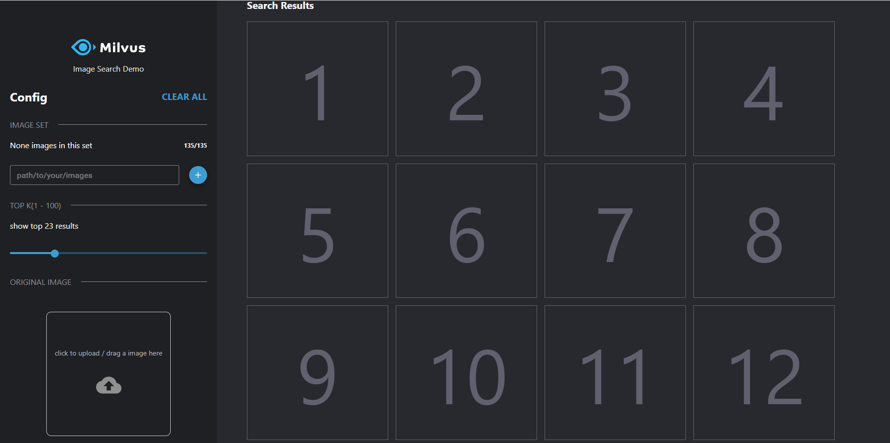
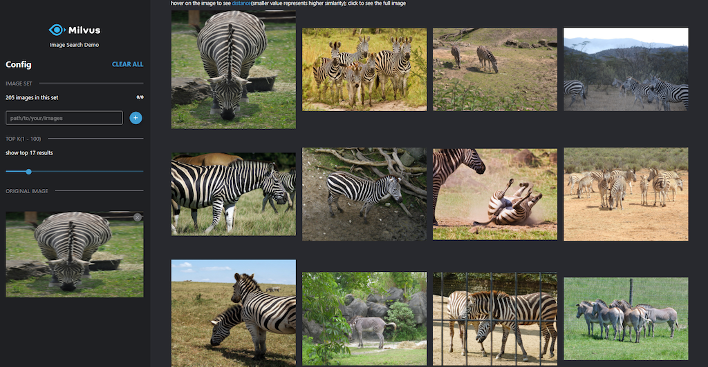

# Image Similarity Search with object detection

## Overview

This demo uses the YOLOv3 model to detect objects in images and the ResNet-50 model to extract feature vectors of images, and then uses Milvus to build an image similarity search system.

The following is the system diagram.


## Data source

This demo uses the PASCAL VOC image set, which contains 17125 images with 20 categories: human; animals (birds, cats, cows, dogs, horses, sheep); transportation (planes, bikes,boats, buses, cars, motorcycles, trains); household (bottles, chairs, tables, pot plants, sofas, TVs)

Dataset size: ~ 2 GB.

Download: https://drive.google.com/file/d/1n_370-5Stk4t0uDV1QqvYkcvyV8rbw0O/view?usp=sharing

> Note: You can also use your own images, **and needs to be an object in the image**. This demo supports images in formats of .jpg and .png.

## How to deploy the system

### 1. Start Milvus and MySQL

As shown in the architecture diagram, the system will use Milvus to store and search the feature vector data, and Mysql is used to store the correspondence between the ids returned by Milvus and the image paths, then you need to start Milvus and Mysql first.

- **Start Milvus v2.0**

  First, you are supposed to refer to the Install [Milvus v2.0-rc5](milvus.io) for how to run Milvus docker.

> Note the version of Milvus.

- **Start MySQL**

```bash
$ docker run -p 3306:3306 -e MYSQL_ROOT_PASSWORD=123456 -d mysql:5.7
```

### 2. Start Server

The next step is to start the system server. It provides HTTP backend services, and there are two ways to start: running with Docker or source code.

#### 2.1 Run server with Docker

- **Set parameters**

Modify the parameters according to your own environment. Here listing some parameters that need to be set, for more information please refer to [config.py](./server/src/config.py).

| **Parameter**   | **Description**                                       | **example**      |
| --------------- | ----------------------------------------------------- | ---------------- |
| **DATAPATH1**   | The dictionary of the image path.                     | /data/image_path |
| **MILVUS_HOST** | The IP address of Milvus, you can get it by ifconfig. | 172.16.20.10     |
| **MILVUS_PORT** | The port of Milvus.                                   | 19530            |
| **MYSQL_HOST**  | The IP address of MySQL                               | 172.16.20.10     |

```shell
$ export DATAPATH1='/data/image_path'
$ export Milvus_HOST='172.16.20.10'
$ export Milvus_PORT='19530'
$ export Mysql_HOST='172.16.20.10'
```

- **Run Docker**

```bash
$ docker run -d \
-v ${DATAPATH1}:${DATAPATH1} \
-p 5010:5010 \
-e "MILVUS_HOST=${Milvus_HOST}" \
-e "MILVUS_PORT=${Milvus_PORT}" \
-e "MYSQL_HOST=${Mysql_HOST}" \
milvusbootcamp/imgsearch-with-objdet:2.0
```

> **Note:** -v ${DATAPATH1}:${DATAPATH1} means that you can mount the directory into the container. If needed, you can load the parent directory or more directories.

#### 2.2 Run source code

- **Install the Python packages**

```bash
$ cd server
$ pip install -r requirements.txt
```

- **Set configuration**

```bash
$ vim server/src/config.py
```

Please modify the parameters according to your own environment. Here listing some parameters that need to be set, for more information please refer to [config.py](./server/src/config.py).

> If the YOLO model is not downloaded automatically, you should switch to the **server/src/yolov3_detector/data/** path and **run the `./prepare_model.sh` command.**

| Parameter        | Description                                   | Default setting                       |
| ---------------- | --------------------------------------------- | ------------------------------------- |
| MILVUS_HOST      | milvus IP address                             | 127.0.0.1                             |
| MILVUS_PORT      | milvus service port                           | 19530                                 |
| VECTOR_DIMENSION | Dimensionality of the vectors                 | 2048                                  |
| MYSQL_HOST       | The IP address of Mysql.                      | 127.0.0.1                             |
| MYSQL_PORT       | Port of Milvus.                               | 3306                                  |
| DEFAULT_TABLE    | The milvus and mysql default collection name. | milvus_obj_det                        |
| COCO_MODEL_PATH  | Path to the YOLO detection model              | ./yolov3_detector/data/yolov3_darknet |

- **Run the code**

```bash
$ cd src
$ python main.py
```
- **API docs**

Vist 127.0.0.1:5010/docs in your browser to use all the APIs.


- **Code  structure**

If you are interested in our code or would like to contribute code, feel free to learn more about our code structure.

```
└───server
│   │   Dockerfile
│   │   requirements.txt
│   │   main.py  # File for starting the program.
│   │
│   └───src
│       │   config.py  # Configuration file.
│       │   encode.py  # Covert image/video/questions/... to embeddings.
│       │   milvus.py  # Connect to Milvus server and insert/drop/query vectors in Milvus.
│       │   mysql.py   # Connect to MySQL server, and add/delete/query IDs and object information.
│       │   
│       └───operations # Call methods in milvus.py and mysql.py to insert/query/delete objects.
│               │   insert.py
│               │   query.py
│               │   delete.py
│               │   count.py
```

### 3. Start Client

- **Start the front-end**

```bash
# Modify API_URL to the IP address and port of the server.
$ export API_URL='http://172.16.20.10:5010'
$ docker run -d -p 8001:80 \
-e API_URL=${API_URL} \
milvusbootcamp/img-search-client:1.0
```

> In this command, `API_URL` means the query service address.

- **How to use**

Visit  ` WEBCLIENT_IP:8001`  in the browser to open the interface for reverse image search. 

>  `WEBCLIENT_IP `specifies the IP address that runs pic-search-webclient docker.


Enter the path of an image folder in the pic_search_webserver docker container with `${DATAPATH1}`, then click `+` to load the pictures. The following screenshot shows the loading process:

>  Note: After clicking the Load button, it will take 1 to 2 seconds for the system to response. Please do not click again.



The loading process may take several minutes. The following screenshot shows the interface with images loaded.

> Only support **jpg** pictures.


Select an image to search.



