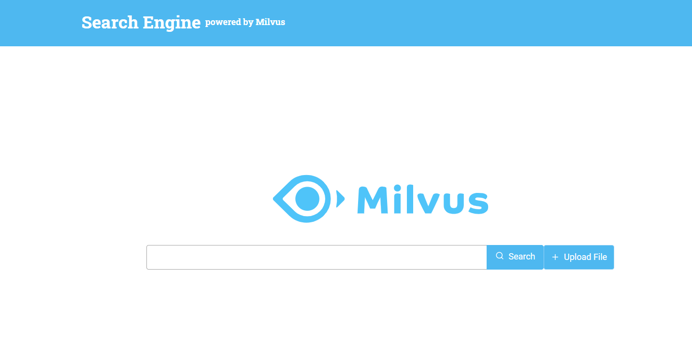

## README

This project uses Milvus and Bert to build a Text Search Engine. In this project, Bert is used to convert the text into a fixed-length vector and store it in Milvus, and then combine Milvus to search for similar text in the text entered by the user.

### Data source

The dataset needed for this system is a **CSV** format file which needs to contain a column of titles and a column of texts.

## Option 1: Deploy with Docker Compose

The text search engine with Milvus, MySQL, WebServer and WebClient services. We can start these containers with one click through [docker-compose.yaml](./docker-compose.yaml).

- Modify docker-compose.yaml to map your data directory to the docker container of WebServer
```bash
$ git clone https://github.com/milvus-io/bootcamp.git
$ cd solutions/text_search_engine/quick_deploy/
$ vim docker-compose.yaml
```

- Create containers & start servers with docker-compose.yaml
```bash
$ docker-compose up -d
```

Then you will see the that all containers are created.

```bash
Creating network "host" with driver "bridge"
Creating milvus-etcd           ... done
Creating text-search-mysql     ... done
Creating text-search-webclient ... done
Creating milvus-minio          ... done
Creating milvus-standalone     ... done
Creating text-search-webserver ... done
```

And show all containers with `docker ps`, and you can use `docker logs text-search-webserver` to get the logs of **server** container.

```bash
CONTAINER ID   IMAGE                                         COMMAND                  CREATED          STATUS                             PORTS                               NAMES
4cc6e60eb295   milvusbootcamp/text-search-webserver:new   "/bin/sh -c 'python3…"   56 seconds ago   Up 55 seconds                      0.0.0.0:5010->5010/tcp                 text-search-webserver
40f4ea99fd22   milvusdb/milvus:v2.0.0-rc8-20211104-d1f4106   "/tini -- milvus run…"   57 seconds ago   Up 55 seconds                      0.0.0.0:19530->19530/tcp  milvus-standalone
60ed080afac1   minio/minio:RELEASE.2020-12-03T00-03-10Z      "/usr/bin/docker-ent…"   57 seconds ago   Up 56 seconds (healthy)            9000/tcp                            milvus-minio
5d9cdfba872b   mysql:5.7                                     "docker-entrypoint.s…"   57 seconds ago   Up 56 seconds                      0.0.0.0:3306->3306/tcp, 33060/tcp   text-search-mysql
56a2922b5c00   milvusbootcamp/text-search-webclient:2.0          "/bin/bash -c '/usr/…"   57 seconds ago   Up 56 seconds (health: starting)   0.0.0.0:8001->80/tcp     text-search-webclient
647d848989e4   quay.io/coreos/etcd:v3.5.0                    "etcd -advertise-cli…"   57 seconds ago   Up 56 seconds                      2379-2380/tcp                       milvus-etcd
```


## Option 2: Deploy with Source code

### 1. Start Milvus and MySQL

The system will use Milvus to store and search the feature vector data, and Mysql is used to store the correspondence between the ids returned by Milvus and the text data  , then you need to start Milvus and Mysql first.

- **Start Milvus v2.0**

First, you are supposed to refer to the Install Milvus v2.0 for how to run Milvus docker.

```
$ wget https://raw.githubusercontent.com/milvus-io/milvus/master/deployments/docker/standalone/docker-compose.yml -O docker-compose.yml
$ sudo docker-compose up -d
Docker Compose is now in the Docker CLI, try `docker compose up`
Creating milvus-etcd  ... done
Creating milvus-minio ... done
Creating milvus-standalone ... done

```

> Note the version of Milvus.

- **Start MySQL**

```
$ docker run -p 3306:3306 -e MYSQL_ROOT_PASSWORD=123456 -d mysql:5.7
```

### 2. Start Server

The next step is to start the system server. It provides HTTP backend services, and there are two ways to start: running with Docker or source code.

#### 2.2 Run source code

- **Install the Python packages**

```
$ cd server
$ pip install -r requirements.txt
```

- **Download the model**

Install the sentence-transformers model as follows

```
# Download model
$ cd server/src/model
$ wget https://public.ukp.informatik.tu-darmstadt.de/reimers/sentence-transformers/v0.2/paraphrase-mpnet-base-v2.zip
$ unzip paraphrase-mpnet-base-v2.zip -d paraphrase-mpnet-base-v2/

```

- **Set configuration**

```
$ vim server/src/config.py
```

Please modify the parameters according to your own environment. Here listing some parameters that need to be set, for more information please refer to [config.py](https://github.com/miia12/bootcamp/blob/master/solutions/reverse_image_search/quick_deploy/server/src/config.py).

| **Parameter**    | **Description**                                       | **Default setting** |
| ---------------- | ----------------------------------------------------- | ------------------- |
| MILVUS_HOST      | The IP address of Milvus, you can get it by ifconfig. | 127.0.0.1           |
| MILVUS_PORT      | Port of Milvus.                                       | 19530               |
| VECTOR_DIMENSION | Dimension of the vectors.                             | 2048                |
| MYSQL_HOST       | The IP address of Mysql.                              | 127.0.0.1           |
| MYSQL_PORT       | Port of Milvus.                                       | 3306                |
| DEFAULT_TABLE    | The milvus and mysql default collection name.         | text_search         |

```
$ export Milvus_HOST='127.0.0.1'
$ export Milvus_PORT='19530'
$ export Mysql_HOST='127.0.0.1'
```

- **Run the code**

Then start the server with Fastapi.

```
$ cd src
$ python main.py
```
- **Code  structure**

  If you are interested in our code or would like to contribute code, feel free to learn more about our code structure.

  ```
  └───server
  │   │   Dockerfile
  │   │   requirement.txt # Related dependent environment
  │   │   main.py  # File for starting the program.
  │   │
  │   └───src
  │       │   config.py  # Configuration file.
  │       │   encode.py  # Convert image/video/questions/... to embeddings.
  │       │   milvus_helpers.py  # Connect to Milvus server and insert/drop/query vectors in Milvus.
  │       │   mysql_helpers.py   # Connect to MySQL server, and add/delete/query IDs and object information.
  │       │   
  │       └───operations # Call methods in milvus.py and mysql.py to insert/query/delete objects.
  │               │   load.py
  │               │   query.py
  │               │   delete.py
  │               │   count.py
  ```


- **API docs** 

Vist 127.0.0.1:5001/docs in your browser to use all the APIs.


**/text/load_data**

This API is used to import datasets into the system.

**/text/search**

This API is used to get similar texts in the system.

**/text/count**

This API is used to get the number of the titles in the system.

**/text/drop**

This API is used to delete a specified collection.


3、Start the UI client
----------------------  
Install  [Node.js 12+](https://nodejs.org/en/download/) and [Yarn](https://classic.yarnpkg.com/en/docs/install/).

```
$ cd client 
# Install dependencies
$ yarn install 
#start yarn 
$ yarn start   
open localhost:3000
```


4、The interface display
---------------------- 

Enter 127.0.0.1:3000 in the browser to open the search page and enter the search text.Upload a **csv** file of the title and text



Get the search results of the input text, as shown in the figure


