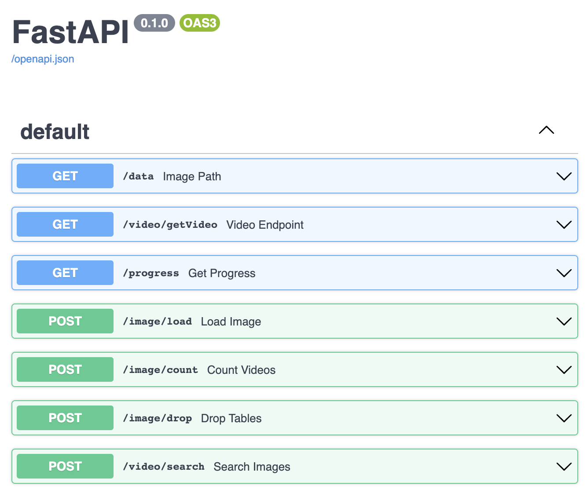
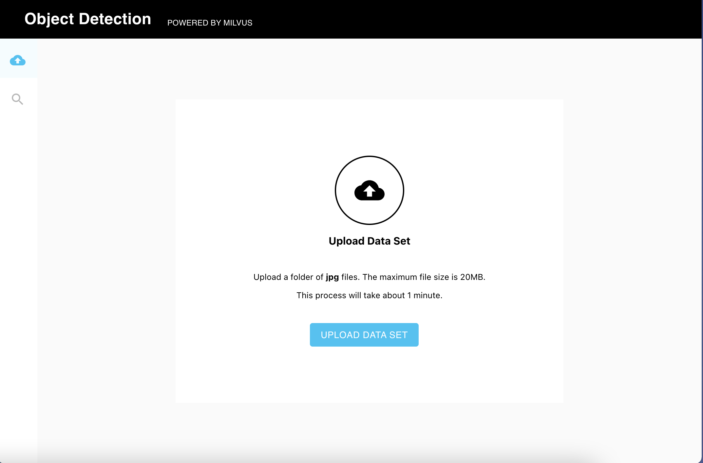
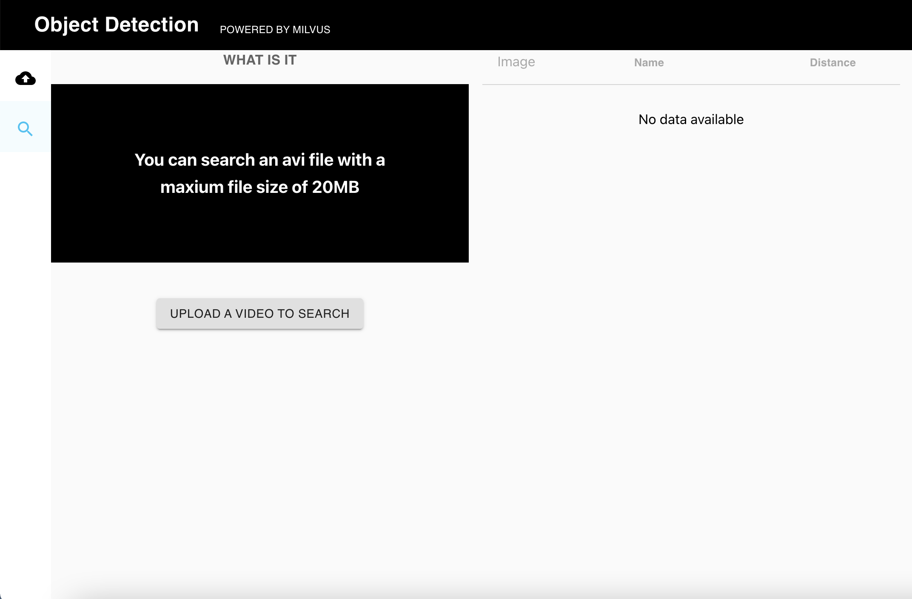
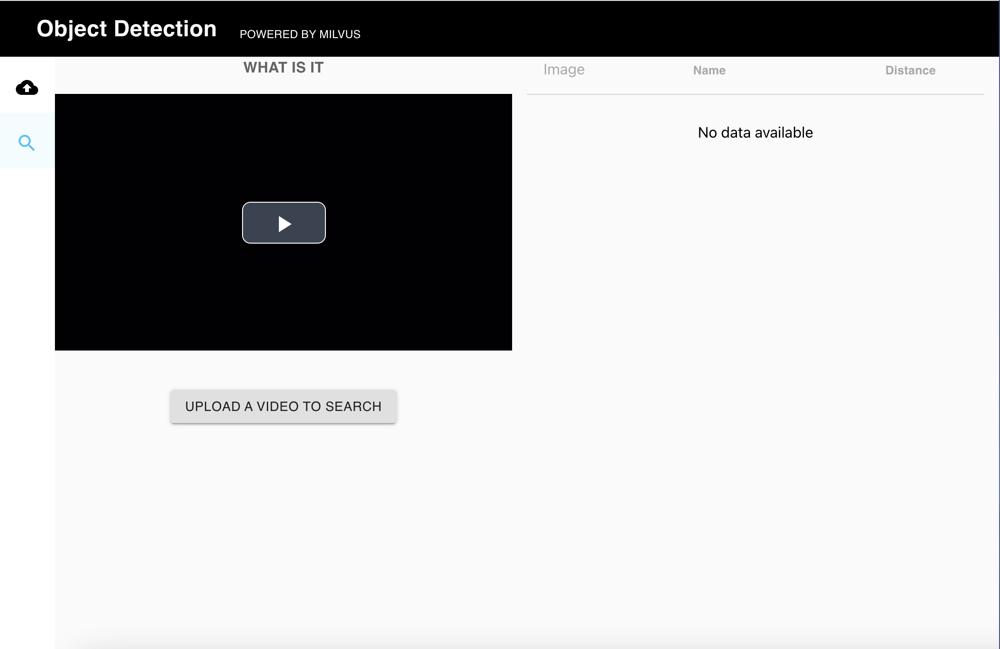

# Video Object Dection System

## Overview

This demo uses **Milvus** to detect objects in a video based on a dataset of object images with known information. To get images of objects in videos, it uses OpenCV to extract video frames and then uses Yolov3 to detect objects in each frame. It uses ResNet50 to get feature vectors of images for both known objects in dataset and objects detected in video. Finally, it can detect object and get object information easily by similarity search in Milvus. Let's have fun playing with it!


## How to deploy the system

### 1. Start Milvus and MySQL

The video object detection system will use Milvus to store and search the feature vector data. Mysql is used to store the correspondence between the ids returned by Milvus and the object information (name & image path). So you need to start Milvus and Mysql first.

- **Start Milvus v2.0**

  First, you are supposed to refer to the Install [Milvus V2.0](https://milvus.io/docs/v2.0.0/install_standalone-docker.md) for how to run Milvus docker.
  
  > Note the version of Milvus.
  
- **Start MySQL**

  ```bash
  $ docker run -p 3306:3306 -e MYSQL_ROOT_PASSWORD=123456 -d mysql:5.7
  ```

### 2. Start Server
The next step is to start the system server. It provides HTTP backend services, you can run source code to start.

#### Prepare

- **Install the Python packages**

  ```bash
  $ cd server
  $ pip install -r requirements.txt
  ```
  
- **Install addition package if using MacOS**
  ```bash
  $ brew install ffmpeg
  ```
  
- **Download Yolov3 Model**
  ```bash
  $ cd server/src/yolov3_detector/data
  $ ./prepare_model.sh
  ```
  You will get a folder yolov3_darknet containing 3 files:
  ```
  ├── yolov3_darknet
  │   ├── __model__
  │   ├── __params__
  │   └── yolo.yml
  ```

#### Run source code
  
- **Set configuration**

  ```bash
  $ vim server/src/config.py
  ```

  Please modify the parameters according to your own environment. Here listing some parameters that need to be set, for more information please refer to [config.py](./server/src/config.py).

  | **Parameter**    | **Description**                                       | **Default setting** |
  | ---------------- | ----------------------------------------------------- | ------------------- |
  | MILVUS_HOST      | The IP address of Milvus, you can get it by ifconfig. | localhost           |
  | MILVUS_PORT      | Port of Milvus.                                       | 19530               |
  | VECTOR_DIMENSION | Dimension of the vectors.                             | 2048                |
  | MYSQL_HOST       | The IP address of Mysql.                              | localhost           |
  | MYSQL_PORT       | Port of Milvus.                                       | 3306                |
  | DEFAULT_TABLE    | The milvus and mysql default collection name.         | video_obj_det       |
  | DATA_PATH        | The folder path of known object images to insert.     | data/example_object |
  | UPLOAD_PATH      | The folder path of the video and will temporarily keep frames & object images from video. | data/example_video |
  | DISTANCE_LIMIT   | Maximum distance to return object information. If no result with smaller distance, then return Null as object information. | None |
  
  - DATA_PATH & UPLOAD_PATH: modify to your own ABSOLUTE paths for object images & video respectively
  - DISTANCE_LIMIT: change to some number so that results with larger distances will not be shown in response

- **Run the code** 

  Then start the server with Fastapi. 

  ```bash
  $ cd src
  $ python main.py
  ```

- **The API docs**

  Type localhost:5000/docs in your browser to see all the APIs.

  

  > /data
  >
  > Return the object image by path.
  >
  > /video/getVideo
  > 
  > Return the video by path.
  >
  > /progress
  >
  > Check the progress when loading.
  >
  > /image/count
  >
  > Return the number of vectors in Milvus.
  > 
  > /image/load
  >
  > Load images of known objects by the folder path.
  >
  >
  > /video/search
  >
  > Pass in an video to search for similar images of objects detected.
  

- **Code structure**

  If you are interested in our code or would like to contribute code, feel free to learn more about our code structure.

  ```
  └───server
  │   │   Dockerfile
  │   │   requirements.txt
  │   │   main.py  # File for starting the program.
  │   │
  │   └───src
  │       │   config.py   # Configuration file.
  │       │   encode.py   # Covert image/video/questions/... to embeddings.
  │       │   milvus_helpers.py   # Connect to Milvus server and insert/drop/query vectors in Milvus.
  │       │   mysql_helpers.py    # Connect to MySQL server, and add/delete/query IDs and object information.
  │       │   
  │       └───operations    # Call methods in milvus_helpers.py and mysql_helperes.py to insert/search/delete objects.
  │               │   insert.py
  │               │   search.py
  │               │   delete.py
  │               │   count.py
  ```

### 3. Start Client

- **Start the front-end**

```bash
# Modify API_URL to the IP address and port of the server.
$ export API_URL='http://xxx.xx.xx.xx:5000' # change xxx.xx.xx.xx to your own IP address
$ docker run -d -p 8001:80 \
-e API_URL=${API_URL} \
milvusbootcamp/video_object_detection
```

> In this command, `API_URL` means the query service address.

- **How to use**

Visit  ` WEBCLIENT_IP:8001`  in the browser to open the interface for reverse image search. 

>  `WEBCLIENT_IP `specifies the IP address that runs video_object_detection client docker.



Click `UPLOAD DATA SET` & enter the folder path of object images, then click `CONFIRM` to load the pictures. The following screenshot shows the loading process:

>  Note: The path entered should be consistent with DATA_PATH in [config.py](./server/src/config.py)


The loading process may take a while depending on data size. The following screenshot shows the interface with images loading in progress.

> Only support **jpg** pictures.


Then click `UPLOAD A VIDEO TO SEARCH` to upload a video to detect objects.

>  Note: The video should under the UPLOAD_PATH in [config.py](./server/src/config.py)

> Only support **avi** video.



The loading process may take a while. After video is successfully loaded, click Play button to play video and detected objects will be displayed on the right with its image, name, distance (A lower distance means more similarity between the object detected in video & object image stored in Milvus).


