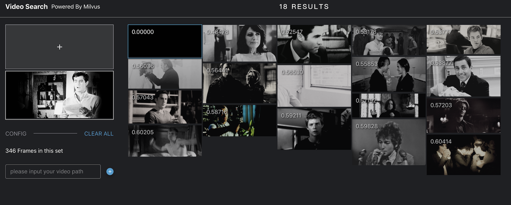

# Building a video search system based on Milvus

## Overview

This demo uses OpenCV to extract the video frames and use ResNet50 to get the feature vector of each frame, and finally use **Milvus** to save and search the data, which makes it very easy to build a system for video similarity search. So let's have fun playing with it!


## Data source

This article uses Tumblr's approximately 100 animated gifs as an example to build an end-to-end solution that uses video search video. Readers can use their own video files to build the system.

You can download the data in google drive: https://drive.google.com/file/d/1CAt-LsF-2gpAMnw5BM75OjCxiR2daulU/view?usp=sharing, then please unzip it.


## How to deploy the system

### 1. Start Milvus and MySQL

The video similarity system will use Milvus to store and search the feature vector data, and Mysql is used to store the correspondence between the ids returned by Milvus and the image paths, then you need to start Milvus and Mysql first.

- **Start Milvus v2.0**

  First, you are supposed to refer to the Install [Milvus v2.0](https://milvus.io/docs/v2.0.0/install_standalone-docker.md) for how to run Milvus docker.
  
  > Note the version of Milvus.
  
- **Start MySQL**

  ```bash
  $ docker run -p 3306:3306 -e MYSQL_ROOT_PASSWORD=123456 -d mysql:5.7
  ```

### 2. Start Server
The next step is to start the system server. It provides HTTP backend services, and there are two ways to start, such as Docker and source code.

#### 2.1 Run server with Docker

- **Set parameters**

  Please modify the parameters according to your own environment. Here listing some parameters that need to be set, for more information please refer to [config.py](./server/src/config.py).

  | **Parameter**   | **Description**                                       | **example**      |
  | --------------- | ----------------------------------------------------- | ---------------- |
  | **DATAPATH1**   | The dictionary of the image path.                     | /data/image_path |
  | **MILVUS_HOST** | The IP address of Milvus, you can get it by ifconfig. | 192.168.1.85     |
  | **MILVUS_PORT** | The port of Milvus.                                   | 19530            |
  | **MYSQL_HOST** | The IP address of MySQL.                               | 192.168.1.85     |

  ```bash
  $ export DATAPATH1='/data/video_path'
  $ export Milvus_HOST='192.168.1.85'
  $ export Milvus_PORT='19530'
  $ export Mysql_HOST='192.168.1.85'
  ```

- **Run Docker**

  ```bash
  $ docker run -d \
  -v ${DATAPATH1}:${DATAPATH1} \
  -p 5000:5000 \
  -e "MILVUS_HOST=${Milvus_HOST}" \
  -e "MILVUS_PORT=${Milvus_PORT}" \
  -e "MYSQL_HOST=${Mysql_HOST}" \
  milvusbootcamp/video-search-server:2.0
  ```

  > **Note:** -v ${DATAPATH1}:${DATAPATH1} means that you can mount the directory into the container. If needed, you can load the parent directory or more directories.

#### 2.2 Run source code
- **Install the Python packages**

  ```bash
  $ cd server
  $ pip install -r requirements.txt
  ```
  
- **Set configuration**

  ```bash
  $ vim server/src/config.py
  ```

  Please modify the parameters according to your own environment. Here listing some parameters that need to be set, for more information please refer to [config.py](./server/src/config.py).

  | **Parameter**    | **Description**                                       | **Default setting** |
  | ---------------- | ----------------------------------------------------- | ------------------- |
  | MILVUS_HOST      | The IP address of Milvus, you can get it by ifconfig. | 127.0.0.1           |
  | MILVUS_PORT      | Port of Milvus.                                       | 19530               |
  | VECTOR_DIMENSION | Dimension of the vectors.                             | 2048                |
  | MYSQL_HOST       | The IP address of Mysql.                              | 127.0.0.1           |
  | MYSQL_PORT       | Port of Milvus.                                       | 3306                |
  | DEFAULT_TABLE    | The milvus and mysql default collection name.         | milvus_img_search   |

- **Run the code** 

  Then start the server with Fastapi. 

  ```bash
  $ cd src
  $ python main.py
  ```

- **The API docs**

  Type 127.0.0.1:5000/docs in your browser to see all the APIs.

  

  

- **Code  structure**

  If you are interested in our code or would like to contribute code, feel free to learn more about our code structure.

  ```
  └───server
  │   │   Dockerfile
  │   │   requirements.txt
  │   │   main.py  # File for starting the program.
  │   │
  │   └───src
  │       │   config.py  # Configuration file.
  │       │   encode.py  # Covert image/video/questions/... to embeddings.
  │       │   milvus.py  # Connect to Milvus server and insert/drop/query vectors in Milvus.
  │       │   mysql.py   # Connect to MySQL server, and add/delete/query IDs and object information.
  │       │   
  │       └───operations # Call methods in milvus.py and mysql.py to insert/query/delete objects.
  │               │   insert.py
  │               │   query.py
  │               │   delete.py
  │               │   count.py
  ```

### 3. Start Client

- **Start the front-end**

  ```
  # Please modify API_URL to the IP address and port of the server.
  $ export API_URL='http://192.168.1.85:5000'
  $ docker run -d -p 8001:80 \
  -e API_URL=${API_URL} \
  milvusbootcamp/video-search-client:1.0
  ```

- **How to use**

  Enter `WEBCLIENT_IP:8001`  in the browser to open the interface for reverse image search. 

  > `WEBCLIENT_IP`specifies the IP address that runs pic-search-webclient docker.


  

  1. **Load data**
  Enter the path of an image folder in the pic_search_webserver docker container with `${DATAPATH1}`, then click `+` to load the pictures. The following screenshot shows the loading process:

  


  > Note: After clicking the Load button, it will take 1 to 2 seconds for the system to response. Please do not click again.

  2. **Search data**
  The loading process may take several minutes. The following screenshot shows the interface with images loaded.

  
  

  

  
