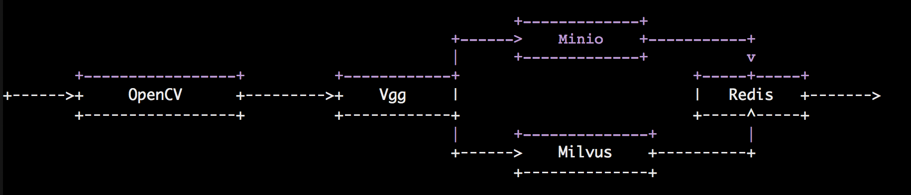

# How to run
	make all
	mkdir -p /mnt/redis/data /mnt/minio/data /mnt/milvus/db
	docker-compose up -d

## Docker compose 
| name | default | detail|
|--|--|--|
|MINIO_ADDR |192.168.1.38| Can't use 127.0.0.1 or localhost|
|UPLOAD_FOLDER|/tmp|Upload tmp file|
|MILVUS_ADDR|| Can't use 127.0.0.1 or localhost|
|VIDEO_REDIS_ADDR||Can't use 127.0.0.1 or localhost|
|MILVUS_PORT|19530||
|MINIO_BUCKET_NUM|20|The larger the amount of data, the more buckets are needed|
# How it works

# How to build

    make all

# Backup and restore
If you want backup your file, you need backup

`/mnt/redis/data  /mnt/minio/data /mnt/milvus/db`

If you want restore, just replace folder with your backup file

# Known issue
	multiprocess works with tensorflow session will cause process hang up,
	so when a process start,it will load model once
